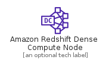
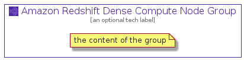

# AmazonRedshiftDenseComputeNode


```text
aws-20210131/Resource/Analytics/AmazonRedshiftDenseComputeNode
```

```text
include('aws-20210131/Resource/Analytics/AmazonRedshiftDenseComputeNode')
```


| Illustration | AmazonRedshiftDenseComputeNode | AmazonRedshiftDenseComputeNodeCard | AmazonRedshiftDenseComputeNodeGroup |
| :---: | :---: | :---: | :---: |
|  |  |  |  |


## AmazonRedshiftDenseComputeNode

### Load remotely
```plantuml
@startuml
' configures the library
!global $LIB_BASE_LOCATION="https://github.com/tmorin/plantuml-libs/distribution"

' loads the library's bootstrap
!include $LIB_BASE_LOCATION/bootstrap.puml

' loads the package bootstrap
include('aws-20210131/bootstrap')

' loads the Item which embeds the element AmazonRedshiftDenseComputeNode
include('aws-20210131/Resource/Analytics/AmazonRedshiftDenseComputeNode')

' renders the element
AmazonRedshiftDenseComputeNode('AmazonRedshiftDenseComputeNode', 'Amazon Redshift Dense Compute Node', 'an optional tech label')
@enduml
```

### Load locally
```plantuml
@startuml
' configures the library
!global $INCLUSION_MODE="local"
!global $LIB_BASE_LOCATION="../../.."

' loads the library's bootstrap
!include $LIB_BASE_LOCATION/bootstrap.puml

' loads the package bootstrap
include('aws-20210131/bootstrap')

' loads the Item which embeds the element AmazonRedshiftDenseComputeNode
include('aws-20210131/Resource/Analytics/AmazonRedshiftDenseComputeNode')

' renders the element
AmazonRedshiftDenseComputeNode('AmazonRedshiftDenseComputeNode', 'Amazon Redshift Dense Compute Node', 'an optional tech label')
@enduml
```

## AmazonRedshiftDenseComputeNodeCard

### Load remotely
```plantuml
@startuml
' configures the library
!global $LIB_BASE_LOCATION="https://github.com/tmorin/plantuml-libs/distribution"

' loads the library's bootstrap
!include $LIB_BASE_LOCATION/bootstrap.puml

' loads the package bootstrap
include('aws-20210131/bootstrap')

' loads the Item which embeds the element AmazonRedshiftDenseComputeNodeCard
include('aws-20210131/Resource/Analytics/AmazonRedshiftDenseComputeNode')

' renders the element
AmazonRedshiftDenseComputeNodeCard('AmazonRedshiftDenseComputeNodeCard', 'Amazon Redshift Dense Compute Node Card', 'an optional description')
@enduml
```

### Load locally
```plantuml
@startuml
' configures the library
!global $INCLUSION_MODE="local"
!global $LIB_BASE_LOCATION="../../.."

' loads the library's bootstrap
!include $LIB_BASE_LOCATION/bootstrap.puml

' loads the package bootstrap
include('aws-20210131/bootstrap')

' loads the Item which embeds the element AmazonRedshiftDenseComputeNodeCard
include('aws-20210131/Resource/Analytics/AmazonRedshiftDenseComputeNode')

' renders the element
AmazonRedshiftDenseComputeNodeCard('AmazonRedshiftDenseComputeNodeCard', 'Amazon Redshift Dense Compute Node Card', 'an optional description')
@enduml
```

## AmazonRedshiftDenseComputeNodeGroup

### Load remotely
```plantuml
@startuml
' configures the library
!global $LIB_BASE_LOCATION="https://github.com/tmorin/plantuml-libs/distribution"

' loads the library's bootstrap
!include $LIB_BASE_LOCATION/bootstrap.puml

' loads the package bootstrap
include('aws-20210131/bootstrap')

' loads the Item which embeds the element AmazonRedshiftDenseComputeNodeGroup
include('aws-20210131/Resource/Analytics/AmazonRedshiftDenseComputeNode')

' renders the element
AmazonRedshiftDenseComputeNodeGroup('AmazonRedshiftDenseComputeNodeGroup', 'Amazon Redshift Dense Compute Node Group', 'an optional tech label') {
    note as note
        the content of the group
    end note
}
@enduml
```

### Load locally
```plantuml
@startuml
' configures the library
!global $INCLUSION_MODE="local"
!global $LIB_BASE_LOCATION="../../.."

' loads the library's bootstrap
!include $LIB_BASE_LOCATION/bootstrap.puml

' loads the package bootstrap
include('aws-20210131/bootstrap')

' loads the Item which embeds the element AmazonRedshiftDenseComputeNodeGroup
include('aws-20210131/Resource/Analytics/AmazonRedshiftDenseComputeNode')

' renders the element
AmazonRedshiftDenseComputeNodeGroup('AmazonRedshiftDenseComputeNodeGroup', 'Amazon Redshift Dense Compute Node Group', 'an optional tech label') {
    note as note
        the content of the group
    end note
}
@enduml
```

