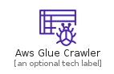
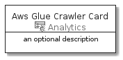
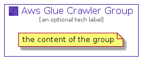

# AwsGlueCrawler


```text
aws-20210131/Resource/Analytics/AwsGlueCrawler
```

```text
include('aws-20210131/Resource/Analytics/AwsGlueCrawler')
```


| Illustration | AwsGlueCrawler | AwsGlueCrawlerCard | AwsGlueCrawlerGroup |
| :---: | :---: | :---: | :---: |
|  |  |  |  |


## AwsGlueCrawler

### Load remotely
```plantuml
@startuml
' configures the library
!global $LIB_BASE_LOCATION="https://github.com/tmorin/plantuml-libs/distribution"

' loads the library's bootstrap
!include $LIB_BASE_LOCATION/bootstrap.puml

' loads the package bootstrap
include('aws-20210131/bootstrap')

' loads the Item which embeds the element AwsGlueCrawler
include('aws-20210131/Resource/Analytics/AwsGlueCrawler')

' renders the element
AwsGlueCrawler('AwsGlueCrawler', 'Aws Glue Crawler', 'an optional tech label')
@enduml
```

### Load locally
```plantuml
@startuml
' configures the library
!global $INCLUSION_MODE="local"
!global $LIB_BASE_LOCATION="../../.."

' loads the library's bootstrap
!include $LIB_BASE_LOCATION/bootstrap.puml

' loads the package bootstrap
include('aws-20210131/bootstrap')

' loads the Item which embeds the element AwsGlueCrawler
include('aws-20210131/Resource/Analytics/AwsGlueCrawler')

' renders the element
AwsGlueCrawler('AwsGlueCrawler', 'Aws Glue Crawler', 'an optional tech label')
@enduml
```

## AwsGlueCrawlerCard

### Load remotely
```plantuml
@startuml
' configures the library
!global $LIB_BASE_LOCATION="https://github.com/tmorin/plantuml-libs/distribution"

' loads the library's bootstrap
!include $LIB_BASE_LOCATION/bootstrap.puml

' loads the package bootstrap
include('aws-20210131/bootstrap')

' loads the Item which embeds the element AwsGlueCrawlerCard
include('aws-20210131/Resource/Analytics/AwsGlueCrawler')

' renders the element
AwsGlueCrawlerCard('AwsGlueCrawlerCard', 'Aws Glue Crawler Card', 'an optional description')
@enduml
```

### Load locally
```plantuml
@startuml
' configures the library
!global $INCLUSION_MODE="local"
!global $LIB_BASE_LOCATION="../../.."

' loads the library's bootstrap
!include $LIB_BASE_LOCATION/bootstrap.puml

' loads the package bootstrap
include('aws-20210131/bootstrap')

' loads the Item which embeds the element AwsGlueCrawlerCard
include('aws-20210131/Resource/Analytics/AwsGlueCrawler')

' renders the element
AwsGlueCrawlerCard('AwsGlueCrawlerCard', 'Aws Glue Crawler Card', 'an optional description')
@enduml
```

## AwsGlueCrawlerGroup

### Load remotely
```plantuml
@startuml
' configures the library
!global $LIB_BASE_LOCATION="https://github.com/tmorin/plantuml-libs/distribution"

' loads the library's bootstrap
!include $LIB_BASE_LOCATION/bootstrap.puml

' loads the package bootstrap
include('aws-20210131/bootstrap')

' loads the Item which embeds the element AwsGlueCrawlerGroup
include('aws-20210131/Resource/Analytics/AwsGlueCrawler')

' renders the element
AwsGlueCrawlerGroup('AwsGlueCrawlerGroup', 'Aws Glue Crawler Group', 'an optional tech label') {
    note as note
        the content of the group
    end note
}
@enduml
```

### Load locally
```plantuml
@startuml
' configures the library
!global $INCLUSION_MODE="local"
!global $LIB_BASE_LOCATION="../../.."

' loads the library's bootstrap
!include $LIB_BASE_LOCATION/bootstrap.puml

' loads the package bootstrap
include('aws-20210131/bootstrap')

' loads the Item which embeds the element AwsGlueCrawlerGroup
include('aws-20210131/Resource/Analytics/AwsGlueCrawler')

' renders the element
AwsGlueCrawlerGroup('AwsGlueCrawlerGroup', 'Aws Glue Crawler Group', 'an optional tech label') {
    note as note
        the content of the group
    end note
}
@enduml
```

