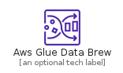
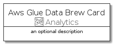
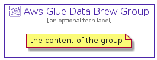

# AwsGlueDataBrew


```text
aws-20210131/Resource/Analytics/AwsGlueDataBrew
```

```text
include('aws-20210131/Resource/Analytics/AwsGlueDataBrew')
```


| Illustration | AwsGlueDataBrew | AwsGlueDataBrewCard | AwsGlueDataBrewGroup |
| :---: | :---: | :---: | :---: |
|  |  |  |  |


## AwsGlueDataBrew

### Load remotely
```plantuml
@startuml
' configures the library
!global $LIB_BASE_LOCATION="https://github.com/tmorin/plantuml-libs/distribution"

' loads the library's bootstrap
!include $LIB_BASE_LOCATION/bootstrap.puml

' loads the package bootstrap
include('aws-20210131/bootstrap')

' loads the Item which embeds the element AwsGlueDataBrew
include('aws-20210131/Resource/Analytics/AwsGlueDataBrew')

' renders the element
AwsGlueDataBrew('AwsGlueDataBrew', 'Aws Glue Data Brew', 'an optional tech label')
@enduml
```

### Load locally
```plantuml
@startuml
' configures the library
!global $INCLUSION_MODE="local"
!global $LIB_BASE_LOCATION="../../.."

' loads the library's bootstrap
!include $LIB_BASE_LOCATION/bootstrap.puml

' loads the package bootstrap
include('aws-20210131/bootstrap')

' loads the Item which embeds the element AwsGlueDataBrew
include('aws-20210131/Resource/Analytics/AwsGlueDataBrew')

' renders the element
AwsGlueDataBrew('AwsGlueDataBrew', 'Aws Glue Data Brew', 'an optional tech label')
@enduml
```

## AwsGlueDataBrewCard

### Load remotely
```plantuml
@startuml
' configures the library
!global $LIB_BASE_LOCATION="https://github.com/tmorin/plantuml-libs/distribution"

' loads the library's bootstrap
!include $LIB_BASE_LOCATION/bootstrap.puml

' loads the package bootstrap
include('aws-20210131/bootstrap')

' loads the Item which embeds the element AwsGlueDataBrewCard
include('aws-20210131/Resource/Analytics/AwsGlueDataBrew')

' renders the element
AwsGlueDataBrewCard('AwsGlueDataBrewCard', 'Aws Glue Data Brew Card', 'an optional description')
@enduml
```

### Load locally
```plantuml
@startuml
' configures the library
!global $INCLUSION_MODE="local"
!global $LIB_BASE_LOCATION="../../.."

' loads the library's bootstrap
!include $LIB_BASE_LOCATION/bootstrap.puml

' loads the package bootstrap
include('aws-20210131/bootstrap')

' loads the Item which embeds the element AwsGlueDataBrewCard
include('aws-20210131/Resource/Analytics/AwsGlueDataBrew')

' renders the element
AwsGlueDataBrewCard('AwsGlueDataBrewCard', 'Aws Glue Data Brew Card', 'an optional description')
@enduml
```

## AwsGlueDataBrewGroup

### Load remotely
```plantuml
@startuml
' configures the library
!global $LIB_BASE_LOCATION="https://github.com/tmorin/plantuml-libs/distribution"

' loads the library's bootstrap
!include $LIB_BASE_LOCATION/bootstrap.puml

' loads the package bootstrap
include('aws-20210131/bootstrap')

' loads the Item which embeds the element AwsGlueDataBrewGroup
include('aws-20210131/Resource/Analytics/AwsGlueDataBrew')

' renders the element
AwsGlueDataBrewGroup('AwsGlueDataBrewGroup', 'Aws Glue Data Brew Group', 'an optional tech label') {
    note as note
        the content of the group
    end note
}
@enduml
```

### Load locally
```plantuml
@startuml
' configures the library
!global $INCLUSION_MODE="local"
!global $LIB_BASE_LOCATION="../../.."

' loads the library's bootstrap
!include $LIB_BASE_LOCATION/bootstrap.puml

' loads the package bootstrap
include('aws-20210131/bootstrap')

' loads the Item which embeds the element AwsGlueDataBrewGroup
include('aws-20210131/Resource/Analytics/AwsGlueDataBrew')

' renders the element
AwsGlueDataBrewGroup('AwsGlueDataBrewGroup', 'Aws Glue Data Brew Group', 'an optional tech label') {
    note as note
        the content of the group
    end note
}
@enduml
```

