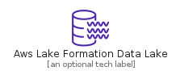
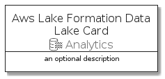
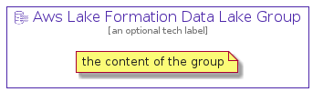

# AwsLakeFormationDataLake


```text
aws-20210131/Resource/Analytics/AwsLakeFormationDataLake
```

```text
include('aws-20210131/Resource/Analytics/AwsLakeFormationDataLake')
```


| Illustration | AwsLakeFormationDataLake | AwsLakeFormationDataLakeCard | AwsLakeFormationDataLakeGroup |
| :---: | :---: | :---: | :---: |
|  |  |  |  |


## AwsLakeFormationDataLake

### Load remotely
```plantuml
@startuml
' configures the library
!global $LIB_BASE_LOCATION="https://github.com/tmorin/plantuml-libs/distribution"

' loads the library's bootstrap
!include $LIB_BASE_LOCATION/bootstrap.puml

' loads the package bootstrap
include('aws-20210131/bootstrap')

' loads the Item which embeds the element AwsLakeFormationDataLake
include('aws-20210131/Resource/Analytics/AwsLakeFormationDataLake')

' renders the element
AwsLakeFormationDataLake('AwsLakeFormationDataLake', 'Aws Lake Formation Data Lake', 'an optional tech label')
@enduml
```

### Load locally
```plantuml
@startuml
' configures the library
!global $INCLUSION_MODE="local"
!global $LIB_BASE_LOCATION="../../.."

' loads the library's bootstrap
!include $LIB_BASE_LOCATION/bootstrap.puml

' loads the package bootstrap
include('aws-20210131/bootstrap')

' loads the Item which embeds the element AwsLakeFormationDataLake
include('aws-20210131/Resource/Analytics/AwsLakeFormationDataLake')

' renders the element
AwsLakeFormationDataLake('AwsLakeFormationDataLake', 'Aws Lake Formation Data Lake', 'an optional tech label')
@enduml
```

## AwsLakeFormationDataLakeCard

### Load remotely
```plantuml
@startuml
' configures the library
!global $LIB_BASE_LOCATION="https://github.com/tmorin/plantuml-libs/distribution"

' loads the library's bootstrap
!include $LIB_BASE_LOCATION/bootstrap.puml

' loads the package bootstrap
include('aws-20210131/bootstrap')

' loads the Item which embeds the element AwsLakeFormationDataLakeCard
include('aws-20210131/Resource/Analytics/AwsLakeFormationDataLake')

' renders the element
AwsLakeFormationDataLakeCard('AwsLakeFormationDataLakeCard', 'Aws Lake Formation Data Lake Card', 'an optional description')
@enduml
```

### Load locally
```plantuml
@startuml
' configures the library
!global $INCLUSION_MODE="local"
!global $LIB_BASE_LOCATION="../../.."

' loads the library's bootstrap
!include $LIB_BASE_LOCATION/bootstrap.puml

' loads the package bootstrap
include('aws-20210131/bootstrap')

' loads the Item which embeds the element AwsLakeFormationDataLakeCard
include('aws-20210131/Resource/Analytics/AwsLakeFormationDataLake')

' renders the element
AwsLakeFormationDataLakeCard('AwsLakeFormationDataLakeCard', 'Aws Lake Formation Data Lake Card', 'an optional description')
@enduml
```

## AwsLakeFormationDataLakeGroup

### Load remotely
```plantuml
@startuml
' configures the library
!global $LIB_BASE_LOCATION="https://github.com/tmorin/plantuml-libs/distribution"

' loads the library's bootstrap
!include $LIB_BASE_LOCATION/bootstrap.puml

' loads the package bootstrap
include('aws-20210131/bootstrap')

' loads the Item which embeds the element AwsLakeFormationDataLakeGroup
include('aws-20210131/Resource/Analytics/AwsLakeFormationDataLake')

' renders the element
AwsLakeFormationDataLakeGroup('AwsLakeFormationDataLakeGroup', 'Aws Lake Formation Data Lake Group', 'an optional tech label') {
    note as note
        the content of the group
    end note
}
@enduml
```

### Load locally
```plantuml
@startuml
' configures the library
!global $INCLUSION_MODE="local"
!global $LIB_BASE_LOCATION="../../.."

' loads the library's bootstrap
!include $LIB_BASE_LOCATION/bootstrap.puml

' loads the package bootstrap
include('aws-20210131/bootstrap')

' loads the Item which embeds the element AwsLakeFormationDataLakeGroup
include('aws-20210131/Resource/Analytics/AwsLakeFormationDataLake')

' renders the element
AwsLakeFormationDataLakeGroup('AwsLakeFormationDataLakeGroup', 'Aws Lake Formation Data Lake Group', 'an optional tech label') {
    note as note
        the content of the group
    end note
}
@enduml
```

