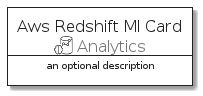
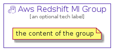

# AwsRedshiftMl


```text
aws-20210131/Resource/Analytics/AwsRedshiftMl
```

```text
include('aws-20210131/Resource/Analytics/AwsRedshiftMl')
```


| Illustration | AwsRedshiftMl | AwsRedshiftMlCard | AwsRedshiftMlGroup |
| :---: | :---: | :---: | :---: |
|  |  |  |  |


## AwsRedshiftMl

### Load remotely
```plantuml
@startuml
' configures the library
!global $LIB_BASE_LOCATION="https://github.com/tmorin/plantuml-libs/distribution"

' loads the library's bootstrap
!include $LIB_BASE_LOCATION/bootstrap.puml

' loads the package bootstrap
include('aws-20210131/bootstrap')

' loads the Item which embeds the element AwsRedshiftMl
include('aws-20210131/Resource/Analytics/AwsRedshiftMl')

' renders the element
AwsRedshiftMl('AwsRedshiftMl', 'Aws Redshift Ml', 'an optional tech label')
@enduml
```

### Load locally
```plantuml
@startuml
' configures the library
!global $INCLUSION_MODE="local"
!global $LIB_BASE_LOCATION="../../.."

' loads the library's bootstrap
!include $LIB_BASE_LOCATION/bootstrap.puml

' loads the package bootstrap
include('aws-20210131/bootstrap')

' loads the Item which embeds the element AwsRedshiftMl
include('aws-20210131/Resource/Analytics/AwsRedshiftMl')

' renders the element
AwsRedshiftMl('AwsRedshiftMl', 'Aws Redshift Ml', 'an optional tech label')
@enduml
```

## AwsRedshiftMlCard

### Load remotely
```plantuml
@startuml
' configures the library
!global $LIB_BASE_LOCATION="https://github.com/tmorin/plantuml-libs/distribution"

' loads the library's bootstrap
!include $LIB_BASE_LOCATION/bootstrap.puml

' loads the package bootstrap
include('aws-20210131/bootstrap')

' loads the Item which embeds the element AwsRedshiftMlCard
include('aws-20210131/Resource/Analytics/AwsRedshiftMl')

' renders the element
AwsRedshiftMlCard('AwsRedshiftMlCard', 'Aws Redshift Ml Card', 'an optional description')
@enduml
```

### Load locally
```plantuml
@startuml
' configures the library
!global $INCLUSION_MODE="local"
!global $LIB_BASE_LOCATION="../../.."

' loads the library's bootstrap
!include $LIB_BASE_LOCATION/bootstrap.puml

' loads the package bootstrap
include('aws-20210131/bootstrap')

' loads the Item which embeds the element AwsRedshiftMlCard
include('aws-20210131/Resource/Analytics/AwsRedshiftMl')

' renders the element
AwsRedshiftMlCard('AwsRedshiftMlCard', 'Aws Redshift Ml Card', 'an optional description')
@enduml
```

## AwsRedshiftMlGroup

### Load remotely
```plantuml
@startuml
' configures the library
!global $LIB_BASE_LOCATION="https://github.com/tmorin/plantuml-libs/distribution"

' loads the library's bootstrap
!include $LIB_BASE_LOCATION/bootstrap.puml

' loads the package bootstrap
include('aws-20210131/bootstrap')

' loads the Item which embeds the element AwsRedshiftMlGroup
include('aws-20210131/Resource/Analytics/AwsRedshiftMl')

' renders the element
AwsRedshiftMlGroup('AwsRedshiftMlGroup', 'Aws Redshift Ml Group', 'an optional tech label') {
    note as note
        the content of the group
    end note
}
@enduml
```

### Load locally
```plantuml
@startuml
' configures the library
!global $INCLUSION_MODE="local"
!global $LIB_BASE_LOCATION="../../.."

' loads the library's bootstrap
!include $LIB_BASE_LOCATION/bootstrap.puml

' loads the package bootstrap
include('aws-20210131/bootstrap')

' loads the Item which embeds the element AwsRedshiftMlGroup
include('aws-20210131/Resource/Analytics/AwsRedshiftMl')

' renders the element
AwsRedshiftMlGroup('AwsRedshiftMlGroup', 'Aws Redshift Ml Group', 'an optional tech label') {
    note as note
        the content of the group
    end note
}
@enduml
```

