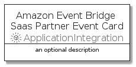

# AmazonEventBridgeSaasPartnerEvent


```text
aws-20210131/Resource/ApplicationIntegration/AmazonEventBridgeSaasPartnerEvent
```

```text
include('aws-20210131/Resource/ApplicationIntegration/AmazonEventBridgeSaasPartnerEvent')
```


| Illustration | AmazonEventBridgeSaasPartnerEvent | AmazonEventBridgeSaasPartnerEventCard | AmazonEventBridgeSaasPartnerEventGroup |
| :---: | :---: | :---: | :---: |
|  |  |  |  |


## AmazonEventBridgeSaasPartnerEvent

### Load remotely
```plantuml
@startuml
' configures the library
!global $LIB_BASE_LOCATION="https://github.com/tmorin/plantuml-libs/distribution"

' loads the library's bootstrap
!include $LIB_BASE_LOCATION/bootstrap.puml

' loads the package bootstrap
include('aws-20210131/bootstrap')

' loads the Item which embeds the element AmazonEventBridgeSaasPartnerEvent
include('aws-20210131/Resource/ApplicationIntegration/AmazonEventBridgeSaasPartnerEvent')

' renders the element
AmazonEventBridgeSaasPartnerEvent('AmazonEventBridgeSaasPartnerEvent', 'Amazon Event Bridge Saas Partner Event', 'an optional tech label')
@enduml
```

### Load locally
```plantuml
@startuml
' configures the library
!global $INCLUSION_MODE="local"
!global $LIB_BASE_LOCATION="../../.."

' loads the library's bootstrap
!include $LIB_BASE_LOCATION/bootstrap.puml

' loads the package bootstrap
include('aws-20210131/bootstrap')

' loads the Item which embeds the element AmazonEventBridgeSaasPartnerEvent
include('aws-20210131/Resource/ApplicationIntegration/AmazonEventBridgeSaasPartnerEvent')

' renders the element
AmazonEventBridgeSaasPartnerEvent('AmazonEventBridgeSaasPartnerEvent', 'Amazon Event Bridge Saas Partner Event', 'an optional tech label')
@enduml
```

## AmazonEventBridgeSaasPartnerEventCard

### Load remotely
```plantuml
@startuml
' configures the library
!global $LIB_BASE_LOCATION="https://github.com/tmorin/plantuml-libs/distribution"

' loads the library's bootstrap
!include $LIB_BASE_LOCATION/bootstrap.puml

' loads the package bootstrap
include('aws-20210131/bootstrap')

' loads the Item which embeds the element AmazonEventBridgeSaasPartnerEventCard
include('aws-20210131/Resource/ApplicationIntegration/AmazonEventBridgeSaasPartnerEvent')

' renders the element
AmazonEventBridgeSaasPartnerEventCard('AmazonEventBridgeSaasPartnerEventCard', 'Amazon Event Bridge Saas Partner Event Card', 'an optional description')
@enduml
```

### Load locally
```plantuml
@startuml
' configures the library
!global $INCLUSION_MODE="local"
!global $LIB_BASE_LOCATION="../../.."

' loads the library's bootstrap
!include $LIB_BASE_LOCATION/bootstrap.puml

' loads the package bootstrap
include('aws-20210131/bootstrap')

' loads the Item which embeds the element AmazonEventBridgeSaasPartnerEventCard
include('aws-20210131/Resource/ApplicationIntegration/AmazonEventBridgeSaasPartnerEvent')

' renders the element
AmazonEventBridgeSaasPartnerEventCard('AmazonEventBridgeSaasPartnerEventCard', 'Amazon Event Bridge Saas Partner Event Card', 'an optional description')
@enduml
```

## AmazonEventBridgeSaasPartnerEventGroup

### Load remotely
```plantuml
@startuml
' configures the library
!global $LIB_BASE_LOCATION="https://github.com/tmorin/plantuml-libs/distribution"

' loads the library's bootstrap
!include $LIB_BASE_LOCATION/bootstrap.puml

' loads the package bootstrap
include('aws-20210131/bootstrap')

' loads the Item which embeds the element AmazonEventBridgeSaasPartnerEventGroup
include('aws-20210131/Resource/ApplicationIntegration/AmazonEventBridgeSaasPartnerEvent')

' renders the element
AmazonEventBridgeSaasPartnerEventGroup('AmazonEventBridgeSaasPartnerEventGroup', 'Amazon Event Bridge Saas Partner Event Group', 'an optional tech label') {
    note as note
        the content of the group
    end note
}
@enduml
```

### Load locally
```plantuml
@startuml
' configures the library
!global $INCLUSION_MODE="local"
!global $LIB_BASE_LOCATION="../../.."

' loads the library's bootstrap
!include $LIB_BASE_LOCATION/bootstrap.puml

' loads the package bootstrap
include('aws-20210131/bootstrap')

' loads the Item which embeds the element AmazonEventBridgeSaasPartnerEventGroup
include('aws-20210131/Resource/ApplicationIntegration/AmazonEventBridgeSaasPartnerEvent')

' renders the element
AmazonEventBridgeSaasPartnerEventGroup('AmazonEventBridgeSaasPartnerEventGroup', 'Amazon Event Bridge Saas Partner Event Group', 'an optional tech label') {
    note as note
        the content of the group
    end note
}
@enduml
```

