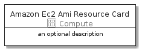
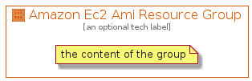

# AmazonEc2AmiResource


```text
aws-20210131/Resource/Compute/AmazonEc2AmiResource
```

```text
include('aws-20210131/Resource/Compute/AmazonEc2AmiResource')
```


| Illustration | AmazonEc2AmiResource | AmazonEc2AmiResourceCard | AmazonEc2AmiResourceGroup |
| :---: | :---: | :---: | :---: |
|  |  |  |  |


## AmazonEc2AmiResource

### Load remotely
```plantuml
@startuml
' configures the library
!global $LIB_BASE_LOCATION="https://github.com/tmorin/plantuml-libs/distribution"

' loads the library's bootstrap
!include $LIB_BASE_LOCATION/bootstrap.puml

' loads the package bootstrap
include('aws-20210131/bootstrap')

' loads the Item which embeds the element AmazonEc2AmiResource
include('aws-20210131/Resource/Compute/AmazonEc2AmiResource')

' renders the element
AmazonEc2AmiResource('AmazonEc2AmiResource', 'Amazon Ec2 Ami Resource', 'an optional tech label')
@enduml
```

### Load locally
```plantuml
@startuml
' configures the library
!global $INCLUSION_MODE="local"
!global $LIB_BASE_LOCATION="../../.."

' loads the library's bootstrap
!include $LIB_BASE_LOCATION/bootstrap.puml

' loads the package bootstrap
include('aws-20210131/bootstrap')

' loads the Item which embeds the element AmazonEc2AmiResource
include('aws-20210131/Resource/Compute/AmazonEc2AmiResource')

' renders the element
AmazonEc2AmiResource('AmazonEc2AmiResource', 'Amazon Ec2 Ami Resource', 'an optional tech label')
@enduml
```

## AmazonEc2AmiResourceCard

### Load remotely
```plantuml
@startuml
' configures the library
!global $LIB_BASE_LOCATION="https://github.com/tmorin/plantuml-libs/distribution"

' loads the library's bootstrap
!include $LIB_BASE_LOCATION/bootstrap.puml

' loads the package bootstrap
include('aws-20210131/bootstrap')

' loads the Item which embeds the element AmazonEc2AmiResourceCard
include('aws-20210131/Resource/Compute/AmazonEc2AmiResource')

' renders the element
AmazonEc2AmiResourceCard('AmazonEc2AmiResourceCard', 'Amazon Ec2 Ami Resource Card', 'an optional description')
@enduml
```

### Load locally
```plantuml
@startuml
' configures the library
!global $INCLUSION_MODE="local"
!global $LIB_BASE_LOCATION="../../.."

' loads the library's bootstrap
!include $LIB_BASE_LOCATION/bootstrap.puml

' loads the package bootstrap
include('aws-20210131/bootstrap')

' loads the Item which embeds the element AmazonEc2AmiResourceCard
include('aws-20210131/Resource/Compute/AmazonEc2AmiResource')

' renders the element
AmazonEc2AmiResourceCard('AmazonEc2AmiResourceCard', 'Amazon Ec2 Ami Resource Card', 'an optional description')
@enduml
```

## AmazonEc2AmiResourceGroup

### Load remotely
```plantuml
@startuml
' configures the library
!global $LIB_BASE_LOCATION="https://github.com/tmorin/plantuml-libs/distribution"

' loads the library's bootstrap
!include $LIB_BASE_LOCATION/bootstrap.puml

' loads the package bootstrap
include('aws-20210131/bootstrap')

' loads the Item which embeds the element AmazonEc2AmiResourceGroup
include('aws-20210131/Resource/Compute/AmazonEc2AmiResource')

' renders the element
AmazonEc2AmiResourceGroup('AmazonEc2AmiResourceGroup', 'Amazon Ec2 Ami Resource Group', 'an optional tech label') {
    note as note
        the content of the group
    end note
}
@enduml
```

### Load locally
```plantuml
@startuml
' configures the library
!global $INCLUSION_MODE="local"
!global $LIB_BASE_LOCATION="../../.."

' loads the library's bootstrap
!include $LIB_BASE_LOCATION/bootstrap.puml

' loads the package bootstrap
include('aws-20210131/bootstrap')

' loads the Item which embeds the element AmazonEc2AmiResourceGroup
include('aws-20210131/Resource/Compute/AmazonEc2AmiResource')

' renders the element
AmazonEc2AmiResourceGroup('AmazonEc2AmiResourceGroup', 'Amazon Ec2 Ami Resource Group', 'an optional tech label') {
    note as note
        the content of the group
    end note
}
@enduml
```

