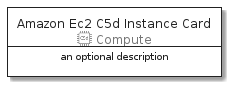

# AmazonEc2C5DInstance


```text
aws-20210131/Resource/Compute/AmazonEc2C5DInstance
```

```text
include('aws-20210131/Resource/Compute/AmazonEc2C5DInstance')
```


| Illustration | AmazonEc2C5DInstance | AmazonEc2C5DInstanceCard | AmazonEc2C5DInstanceGroup |
| :---: | :---: | :---: | :---: |
|  |  |  |  |


## AmazonEc2C5DInstance

### Load remotely
```plantuml
@startuml
' configures the library
!global $LIB_BASE_LOCATION="https://github.com/tmorin/plantuml-libs/distribution"

' loads the library's bootstrap
!include $LIB_BASE_LOCATION/bootstrap.puml

' loads the package bootstrap
include('aws-20210131/bootstrap')

' loads the Item which embeds the element AmazonEc2C5DInstance
include('aws-20210131/Resource/Compute/AmazonEc2C5DInstance')

' renders the element
AmazonEc2C5DInstance('AmazonEc2C5dInstance', 'Amazon Ec2 C5d Instance', 'an optional tech label')
@enduml
```

### Load locally
```plantuml
@startuml
' configures the library
!global $INCLUSION_MODE="local"
!global $LIB_BASE_LOCATION="../../.."

' loads the library's bootstrap
!include $LIB_BASE_LOCATION/bootstrap.puml

' loads the package bootstrap
include('aws-20210131/bootstrap')

' loads the Item which embeds the element AmazonEc2C5DInstance
include('aws-20210131/Resource/Compute/AmazonEc2C5DInstance')

' renders the element
AmazonEc2C5DInstance('AmazonEc2C5dInstance', 'Amazon Ec2 C5d Instance', 'an optional tech label')
@enduml
```

## AmazonEc2C5DInstanceCard

### Load remotely
```plantuml
@startuml
' configures the library
!global $LIB_BASE_LOCATION="https://github.com/tmorin/plantuml-libs/distribution"

' loads the library's bootstrap
!include $LIB_BASE_LOCATION/bootstrap.puml

' loads the package bootstrap
include('aws-20210131/bootstrap')

' loads the Item which embeds the element AmazonEc2C5DInstanceCard
include('aws-20210131/Resource/Compute/AmazonEc2C5DInstance')

' renders the element
AmazonEc2C5DInstanceCard('AmazonEc2C5dInstanceCard', 'Amazon Ec2 C5d Instance Card', 'an optional description')
@enduml
```

### Load locally
```plantuml
@startuml
' configures the library
!global $INCLUSION_MODE="local"
!global $LIB_BASE_LOCATION="../../.."

' loads the library's bootstrap
!include $LIB_BASE_LOCATION/bootstrap.puml

' loads the package bootstrap
include('aws-20210131/bootstrap')

' loads the Item which embeds the element AmazonEc2C5DInstanceCard
include('aws-20210131/Resource/Compute/AmazonEc2C5DInstance')

' renders the element
AmazonEc2C5DInstanceCard('AmazonEc2C5dInstanceCard', 'Amazon Ec2 C5d Instance Card', 'an optional description')
@enduml
```

## AmazonEc2C5DInstanceGroup

### Load remotely
```plantuml
@startuml
' configures the library
!global $LIB_BASE_LOCATION="https://github.com/tmorin/plantuml-libs/distribution"

' loads the library's bootstrap
!include $LIB_BASE_LOCATION/bootstrap.puml

' loads the package bootstrap
include('aws-20210131/bootstrap')

' loads the Item which embeds the element AmazonEc2C5DInstanceGroup
include('aws-20210131/Resource/Compute/AmazonEc2C5DInstance')

' renders the element
AmazonEc2C5DInstanceGroup('AmazonEc2C5dInstanceGroup', 'Amazon Ec2 C5d Instance Group', 'an optional tech label') {
    note as note
        the content of the group
    end note
}
@enduml
```

### Load locally
```plantuml
@startuml
' configures the library
!global $INCLUSION_MODE="local"
!global $LIB_BASE_LOCATION="../../.."

' loads the library's bootstrap
!include $LIB_BASE_LOCATION/bootstrap.puml

' loads the package bootstrap
include('aws-20210131/bootstrap')

' loads the Item which embeds the element AmazonEc2C5DInstanceGroup
include('aws-20210131/Resource/Compute/AmazonEc2C5DInstance')

' renders the element
AmazonEc2C5DInstanceGroup('AmazonEc2C5dInstanceGroup', 'Amazon Ec2 C5d Instance Group', 'an optional tech label') {
    note as note
        the content of the group
    end note
}
@enduml
```

