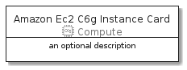
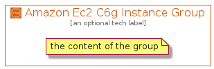

# AmazonEc2C6GInstance


```text
aws-20210131/Resource/Compute/AmazonEc2C6GInstance
```

```text
include('aws-20210131/Resource/Compute/AmazonEc2C6GInstance')
```


| Illustration | AmazonEc2C6GInstance | AmazonEc2C6GInstanceCard | AmazonEc2C6GInstanceGroup |
| :---: | :---: | :---: | :---: |
|  |  |  |  |


## AmazonEc2C6GInstance

### Load remotely
```plantuml
@startuml
' configures the library
!global $LIB_BASE_LOCATION="https://github.com/tmorin/plantuml-libs/distribution"

' loads the library's bootstrap
!include $LIB_BASE_LOCATION/bootstrap.puml

' loads the package bootstrap
include('aws-20210131/bootstrap')

' loads the Item which embeds the element AmazonEc2C6GInstance
include('aws-20210131/Resource/Compute/AmazonEc2C6GInstance')

' renders the element
AmazonEc2C6GInstance('AmazonEc2C6gInstance', 'Amazon Ec2 C6g Instance', 'an optional tech label')
@enduml
```

### Load locally
```plantuml
@startuml
' configures the library
!global $INCLUSION_MODE="local"
!global $LIB_BASE_LOCATION="../../.."

' loads the library's bootstrap
!include $LIB_BASE_LOCATION/bootstrap.puml

' loads the package bootstrap
include('aws-20210131/bootstrap')

' loads the Item which embeds the element AmazonEc2C6GInstance
include('aws-20210131/Resource/Compute/AmazonEc2C6GInstance')

' renders the element
AmazonEc2C6GInstance('AmazonEc2C6gInstance', 'Amazon Ec2 C6g Instance', 'an optional tech label')
@enduml
```

## AmazonEc2C6GInstanceCard

### Load remotely
```plantuml
@startuml
' configures the library
!global $LIB_BASE_LOCATION="https://github.com/tmorin/plantuml-libs/distribution"

' loads the library's bootstrap
!include $LIB_BASE_LOCATION/bootstrap.puml

' loads the package bootstrap
include('aws-20210131/bootstrap')

' loads the Item which embeds the element AmazonEc2C6GInstanceCard
include('aws-20210131/Resource/Compute/AmazonEc2C6GInstance')

' renders the element
AmazonEc2C6GInstanceCard('AmazonEc2C6gInstanceCard', 'Amazon Ec2 C6g Instance Card', 'an optional description')
@enduml
```

### Load locally
```plantuml
@startuml
' configures the library
!global $INCLUSION_MODE="local"
!global $LIB_BASE_LOCATION="../../.."

' loads the library's bootstrap
!include $LIB_BASE_LOCATION/bootstrap.puml

' loads the package bootstrap
include('aws-20210131/bootstrap')

' loads the Item which embeds the element AmazonEc2C6GInstanceCard
include('aws-20210131/Resource/Compute/AmazonEc2C6GInstance')

' renders the element
AmazonEc2C6GInstanceCard('AmazonEc2C6gInstanceCard', 'Amazon Ec2 C6g Instance Card', 'an optional description')
@enduml
```

## AmazonEc2C6GInstanceGroup

### Load remotely
```plantuml
@startuml
' configures the library
!global $LIB_BASE_LOCATION="https://github.com/tmorin/plantuml-libs/distribution"

' loads the library's bootstrap
!include $LIB_BASE_LOCATION/bootstrap.puml

' loads the package bootstrap
include('aws-20210131/bootstrap')

' loads the Item which embeds the element AmazonEc2C6GInstanceGroup
include('aws-20210131/Resource/Compute/AmazonEc2C6GInstance')

' renders the element
AmazonEc2C6GInstanceGroup('AmazonEc2C6gInstanceGroup', 'Amazon Ec2 C6g Instance Group', 'an optional tech label') {
    note as note
        the content of the group
    end note
}
@enduml
```

### Load locally
```plantuml
@startuml
' configures the library
!global $INCLUSION_MODE="local"
!global $LIB_BASE_LOCATION="../../.."

' loads the library's bootstrap
!include $LIB_BASE_LOCATION/bootstrap.puml

' loads the package bootstrap
include('aws-20210131/bootstrap')

' loads the Item which embeds the element AmazonEc2C6GInstanceGroup
include('aws-20210131/Resource/Compute/AmazonEc2C6GInstance')

' renders the element
AmazonEc2C6GInstanceGroup('AmazonEc2C6gInstanceGroup', 'Amazon Ec2 C6g Instance Group', 'an optional tech label') {
    note as note
        the content of the group
    end note
}
@enduml
```

