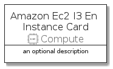
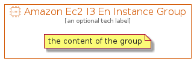

# AmazonEc2I3EnInstance


```text
aws-20210131/Resource/Compute/AmazonEc2I3EnInstance
```

```text
include('aws-20210131/Resource/Compute/AmazonEc2I3EnInstance')
```


| Illustration | AmazonEc2I3EnInstance | AmazonEc2I3EnInstanceCard | AmazonEc2I3EnInstanceGroup |
| :---: | :---: | :---: | :---: |
|  |  |  |  |


## AmazonEc2I3EnInstance

### Load remotely
```plantuml
@startuml
' configures the library
!global $LIB_BASE_LOCATION="https://github.com/tmorin/plantuml-libs/distribution"

' loads the library's bootstrap
!include $LIB_BASE_LOCATION/bootstrap.puml

' loads the package bootstrap
include('aws-20210131/bootstrap')

' loads the Item which embeds the element AmazonEc2I3EnInstance
include('aws-20210131/Resource/Compute/AmazonEc2I3EnInstance')

' renders the element
AmazonEc2I3EnInstance('AmazonEc2I3EnInstance', 'Amazon Ec2 I3 En Instance', 'an optional tech label')
@enduml
```

### Load locally
```plantuml
@startuml
' configures the library
!global $INCLUSION_MODE="local"
!global $LIB_BASE_LOCATION="../../.."

' loads the library's bootstrap
!include $LIB_BASE_LOCATION/bootstrap.puml

' loads the package bootstrap
include('aws-20210131/bootstrap')

' loads the Item which embeds the element AmazonEc2I3EnInstance
include('aws-20210131/Resource/Compute/AmazonEc2I3EnInstance')

' renders the element
AmazonEc2I3EnInstance('AmazonEc2I3EnInstance', 'Amazon Ec2 I3 En Instance', 'an optional tech label')
@enduml
```

## AmazonEc2I3EnInstanceCard

### Load remotely
```plantuml
@startuml
' configures the library
!global $LIB_BASE_LOCATION="https://github.com/tmorin/plantuml-libs/distribution"

' loads the library's bootstrap
!include $LIB_BASE_LOCATION/bootstrap.puml

' loads the package bootstrap
include('aws-20210131/bootstrap')

' loads the Item which embeds the element AmazonEc2I3EnInstanceCard
include('aws-20210131/Resource/Compute/AmazonEc2I3EnInstance')

' renders the element
AmazonEc2I3EnInstanceCard('AmazonEc2I3EnInstanceCard', 'Amazon Ec2 I3 En Instance Card', 'an optional description')
@enduml
```

### Load locally
```plantuml
@startuml
' configures the library
!global $INCLUSION_MODE="local"
!global $LIB_BASE_LOCATION="../../.."

' loads the library's bootstrap
!include $LIB_BASE_LOCATION/bootstrap.puml

' loads the package bootstrap
include('aws-20210131/bootstrap')

' loads the Item which embeds the element AmazonEc2I3EnInstanceCard
include('aws-20210131/Resource/Compute/AmazonEc2I3EnInstance')

' renders the element
AmazonEc2I3EnInstanceCard('AmazonEc2I3EnInstanceCard', 'Amazon Ec2 I3 En Instance Card', 'an optional description')
@enduml
```

## AmazonEc2I3EnInstanceGroup

### Load remotely
```plantuml
@startuml
' configures the library
!global $LIB_BASE_LOCATION="https://github.com/tmorin/plantuml-libs/distribution"

' loads the library's bootstrap
!include $LIB_BASE_LOCATION/bootstrap.puml

' loads the package bootstrap
include('aws-20210131/bootstrap')

' loads the Item which embeds the element AmazonEc2I3EnInstanceGroup
include('aws-20210131/Resource/Compute/AmazonEc2I3EnInstance')

' renders the element
AmazonEc2I3EnInstanceGroup('AmazonEc2I3EnInstanceGroup', 'Amazon Ec2 I3 En Instance Group', 'an optional tech label') {
    note as note
        the content of the group
    end note
}
@enduml
```

### Load locally
```plantuml
@startuml
' configures the library
!global $INCLUSION_MODE="local"
!global $LIB_BASE_LOCATION="../../.."

' loads the library's bootstrap
!include $LIB_BASE_LOCATION/bootstrap.puml

' loads the package bootstrap
include('aws-20210131/bootstrap')

' loads the Item which embeds the element AmazonEc2I3EnInstanceGroup
include('aws-20210131/Resource/Compute/AmazonEc2I3EnInstance')

' renders the element
AmazonEc2I3EnInstanceGroup('AmazonEc2I3EnInstanceGroup', 'Amazon Ec2 I3 En Instance Group', 'an optional tech label') {
    note as note
        the content of the group
    end note
}
@enduml
```

