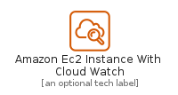
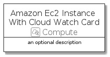

# AmazonEc2InstanceWithCloudWatch


```text
aws-20210131/Resource/Compute/AmazonEc2InstanceWithCloudWatch
```

```text
include('aws-20210131/Resource/Compute/AmazonEc2InstanceWithCloudWatch')
```


| Illustration | AmazonEc2InstanceWithCloudWatch | AmazonEc2InstanceWithCloudWatchCard | AmazonEc2InstanceWithCloudWatchGroup |
| :---: | :---: | :---: | :---: |
|  |  |  |  |


## AmazonEc2InstanceWithCloudWatch

### Load remotely
```plantuml
@startuml
' configures the library
!global $LIB_BASE_LOCATION="https://github.com/tmorin/plantuml-libs/distribution"

' loads the library's bootstrap
!include $LIB_BASE_LOCATION/bootstrap.puml

' loads the package bootstrap
include('aws-20210131/bootstrap')

' loads the Item which embeds the element AmazonEc2InstanceWithCloudWatch
include('aws-20210131/Resource/Compute/AmazonEc2InstanceWithCloudWatch')

' renders the element
AmazonEc2InstanceWithCloudWatch('AmazonEc2InstanceWithCloudWatch', 'Amazon Ec2 Instance With Cloud Watch', 'an optional tech label')
@enduml
```

### Load locally
```plantuml
@startuml
' configures the library
!global $INCLUSION_MODE="local"
!global $LIB_BASE_LOCATION="../../.."

' loads the library's bootstrap
!include $LIB_BASE_LOCATION/bootstrap.puml

' loads the package bootstrap
include('aws-20210131/bootstrap')

' loads the Item which embeds the element AmazonEc2InstanceWithCloudWatch
include('aws-20210131/Resource/Compute/AmazonEc2InstanceWithCloudWatch')

' renders the element
AmazonEc2InstanceWithCloudWatch('AmazonEc2InstanceWithCloudWatch', 'Amazon Ec2 Instance With Cloud Watch', 'an optional tech label')
@enduml
```

## AmazonEc2InstanceWithCloudWatchCard

### Load remotely
```plantuml
@startuml
' configures the library
!global $LIB_BASE_LOCATION="https://github.com/tmorin/plantuml-libs/distribution"

' loads the library's bootstrap
!include $LIB_BASE_LOCATION/bootstrap.puml

' loads the package bootstrap
include('aws-20210131/bootstrap')

' loads the Item which embeds the element AmazonEc2InstanceWithCloudWatchCard
include('aws-20210131/Resource/Compute/AmazonEc2InstanceWithCloudWatch')

' renders the element
AmazonEc2InstanceWithCloudWatchCard('AmazonEc2InstanceWithCloudWatchCard', 'Amazon Ec2 Instance With Cloud Watch Card', 'an optional description')
@enduml
```

### Load locally
```plantuml
@startuml
' configures the library
!global $INCLUSION_MODE="local"
!global $LIB_BASE_LOCATION="../../.."

' loads the library's bootstrap
!include $LIB_BASE_LOCATION/bootstrap.puml

' loads the package bootstrap
include('aws-20210131/bootstrap')

' loads the Item which embeds the element AmazonEc2InstanceWithCloudWatchCard
include('aws-20210131/Resource/Compute/AmazonEc2InstanceWithCloudWatch')

' renders the element
AmazonEc2InstanceWithCloudWatchCard('AmazonEc2InstanceWithCloudWatchCard', 'Amazon Ec2 Instance With Cloud Watch Card', 'an optional description')
@enduml
```

## AmazonEc2InstanceWithCloudWatchGroup

### Load remotely
```plantuml
@startuml
' configures the library
!global $LIB_BASE_LOCATION="https://github.com/tmorin/plantuml-libs/distribution"

' loads the library's bootstrap
!include $LIB_BASE_LOCATION/bootstrap.puml

' loads the package bootstrap
include('aws-20210131/bootstrap')

' loads the Item which embeds the element AmazonEc2InstanceWithCloudWatchGroup
include('aws-20210131/Resource/Compute/AmazonEc2InstanceWithCloudWatch')

' renders the element
AmazonEc2InstanceWithCloudWatchGroup('AmazonEc2InstanceWithCloudWatchGroup', 'Amazon Ec2 Instance With Cloud Watch Group', 'an optional tech label') {
    note as note
        the content of the group
    end note
}
@enduml
```

### Load locally
```plantuml
@startuml
' configures the library
!global $INCLUSION_MODE="local"
!global $LIB_BASE_LOCATION="../../.."

' loads the library's bootstrap
!include $LIB_BASE_LOCATION/bootstrap.puml

' loads the package bootstrap
include('aws-20210131/bootstrap')

' loads the Item which embeds the element AmazonEc2InstanceWithCloudWatchGroup
include('aws-20210131/Resource/Compute/AmazonEc2InstanceWithCloudWatch')

' renders the element
AmazonEc2InstanceWithCloudWatchGroup('AmazonEc2InstanceWithCloudWatchGroup', 'Amazon Ec2 Instance With Cloud Watch Group', 'an optional tech label') {
    note as note
        the content of the group
    end note
}
@enduml
```

