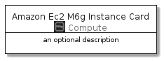
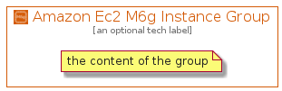

# AmazonEc2M6GInstance


```text
aws-20210131/Resource/Compute/AmazonEc2M6GInstance
```

```text
include('aws-20210131/Resource/Compute/AmazonEc2M6GInstance')
```


| Illustration | AmazonEc2M6GInstance | AmazonEc2M6GInstanceCard | AmazonEc2M6GInstanceGroup |
| :---: | :---: | :---: | :---: |
|  |  |  |  |


## AmazonEc2M6GInstance

### Load remotely
```plantuml
@startuml
' configures the library
!global $LIB_BASE_LOCATION="https://github.com/tmorin/plantuml-libs/distribution"

' loads the library's bootstrap
!include $LIB_BASE_LOCATION/bootstrap.puml

' loads the package bootstrap
include('aws-20210131/bootstrap')

' loads the Item which embeds the element AmazonEc2M6GInstance
include('aws-20210131/Resource/Compute/AmazonEc2M6GInstance')

' renders the element
AmazonEc2M6GInstance('AmazonEc2M6gInstance', 'Amazon Ec2 M6g Instance', 'an optional tech label')
@enduml
```

### Load locally
```plantuml
@startuml
' configures the library
!global $INCLUSION_MODE="local"
!global $LIB_BASE_LOCATION="../../.."

' loads the library's bootstrap
!include $LIB_BASE_LOCATION/bootstrap.puml

' loads the package bootstrap
include('aws-20210131/bootstrap')

' loads the Item which embeds the element AmazonEc2M6GInstance
include('aws-20210131/Resource/Compute/AmazonEc2M6GInstance')

' renders the element
AmazonEc2M6GInstance('AmazonEc2M6gInstance', 'Amazon Ec2 M6g Instance', 'an optional tech label')
@enduml
```

## AmazonEc2M6GInstanceCard

### Load remotely
```plantuml
@startuml
' configures the library
!global $LIB_BASE_LOCATION="https://github.com/tmorin/plantuml-libs/distribution"

' loads the library's bootstrap
!include $LIB_BASE_LOCATION/bootstrap.puml

' loads the package bootstrap
include('aws-20210131/bootstrap')

' loads the Item which embeds the element AmazonEc2M6GInstanceCard
include('aws-20210131/Resource/Compute/AmazonEc2M6GInstance')

' renders the element
AmazonEc2M6GInstanceCard('AmazonEc2M6gInstanceCard', 'Amazon Ec2 M6g Instance Card', 'an optional description')
@enduml
```

### Load locally
```plantuml
@startuml
' configures the library
!global $INCLUSION_MODE="local"
!global $LIB_BASE_LOCATION="../../.."

' loads the library's bootstrap
!include $LIB_BASE_LOCATION/bootstrap.puml

' loads the package bootstrap
include('aws-20210131/bootstrap')

' loads the Item which embeds the element AmazonEc2M6GInstanceCard
include('aws-20210131/Resource/Compute/AmazonEc2M6GInstance')

' renders the element
AmazonEc2M6GInstanceCard('AmazonEc2M6gInstanceCard', 'Amazon Ec2 M6g Instance Card', 'an optional description')
@enduml
```

## AmazonEc2M6GInstanceGroup

### Load remotely
```plantuml
@startuml
' configures the library
!global $LIB_BASE_LOCATION="https://github.com/tmorin/plantuml-libs/distribution"

' loads the library's bootstrap
!include $LIB_BASE_LOCATION/bootstrap.puml

' loads the package bootstrap
include('aws-20210131/bootstrap')

' loads the Item which embeds the element AmazonEc2M6GInstanceGroup
include('aws-20210131/Resource/Compute/AmazonEc2M6GInstance')

' renders the element
AmazonEc2M6GInstanceGroup('AmazonEc2M6gInstanceGroup', 'Amazon Ec2 M6g Instance Group', 'an optional tech label') {
    note as note
        the content of the group
    end note
}
@enduml
```

### Load locally
```plantuml
@startuml
' configures the library
!global $INCLUSION_MODE="local"
!global $LIB_BASE_LOCATION="../../.."

' loads the library's bootstrap
!include $LIB_BASE_LOCATION/bootstrap.puml

' loads the package bootstrap
include('aws-20210131/bootstrap')

' loads the Item which embeds the element AmazonEc2M6GInstanceGroup
include('aws-20210131/Resource/Compute/AmazonEc2M6GInstance')

' renders the element
AmazonEc2M6GInstanceGroup('AmazonEc2M6gInstanceGroup', 'Amazon Ec2 M6g Instance Group', 'an optional tech label') {
    note as note
        the content of the group
    end note
}
@enduml
```

