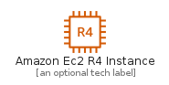
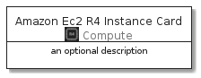

# AmazonEc2R4Instance


```text
aws-20210131/Resource/Compute/AmazonEc2R4Instance
```

```text
include('aws-20210131/Resource/Compute/AmazonEc2R4Instance')
```


| Illustration | AmazonEc2R4Instance | AmazonEc2R4InstanceCard | AmazonEc2R4InstanceGroup |
| :---: | :---: | :---: | :---: |
|  |  |  |  |


## AmazonEc2R4Instance

### Load remotely
```plantuml
@startuml
' configures the library
!global $LIB_BASE_LOCATION="https://github.com/tmorin/plantuml-libs/distribution"

' loads the library's bootstrap
!include $LIB_BASE_LOCATION/bootstrap.puml

' loads the package bootstrap
include('aws-20210131/bootstrap')

' loads the Item which embeds the element AmazonEc2R4Instance
include('aws-20210131/Resource/Compute/AmazonEc2R4Instance')

' renders the element
AmazonEc2R4Instance('AmazonEc2R4Instance', 'Amazon Ec2 R4 Instance', 'an optional tech label')
@enduml
```

### Load locally
```plantuml
@startuml
' configures the library
!global $INCLUSION_MODE="local"
!global $LIB_BASE_LOCATION="../../.."

' loads the library's bootstrap
!include $LIB_BASE_LOCATION/bootstrap.puml

' loads the package bootstrap
include('aws-20210131/bootstrap')

' loads the Item which embeds the element AmazonEc2R4Instance
include('aws-20210131/Resource/Compute/AmazonEc2R4Instance')

' renders the element
AmazonEc2R4Instance('AmazonEc2R4Instance', 'Amazon Ec2 R4 Instance', 'an optional tech label')
@enduml
```

## AmazonEc2R4InstanceCard

### Load remotely
```plantuml
@startuml
' configures the library
!global $LIB_BASE_LOCATION="https://github.com/tmorin/plantuml-libs/distribution"

' loads the library's bootstrap
!include $LIB_BASE_LOCATION/bootstrap.puml

' loads the package bootstrap
include('aws-20210131/bootstrap')

' loads the Item which embeds the element AmazonEc2R4InstanceCard
include('aws-20210131/Resource/Compute/AmazonEc2R4Instance')

' renders the element
AmazonEc2R4InstanceCard('AmazonEc2R4InstanceCard', 'Amazon Ec2 R4 Instance Card', 'an optional description')
@enduml
```

### Load locally
```plantuml
@startuml
' configures the library
!global $INCLUSION_MODE="local"
!global $LIB_BASE_LOCATION="../../.."

' loads the library's bootstrap
!include $LIB_BASE_LOCATION/bootstrap.puml

' loads the package bootstrap
include('aws-20210131/bootstrap')

' loads the Item which embeds the element AmazonEc2R4InstanceCard
include('aws-20210131/Resource/Compute/AmazonEc2R4Instance')

' renders the element
AmazonEc2R4InstanceCard('AmazonEc2R4InstanceCard', 'Amazon Ec2 R4 Instance Card', 'an optional description')
@enduml
```

## AmazonEc2R4InstanceGroup

### Load remotely
```plantuml
@startuml
' configures the library
!global $LIB_BASE_LOCATION="https://github.com/tmorin/plantuml-libs/distribution"

' loads the library's bootstrap
!include $LIB_BASE_LOCATION/bootstrap.puml

' loads the package bootstrap
include('aws-20210131/bootstrap')

' loads the Item which embeds the element AmazonEc2R4InstanceGroup
include('aws-20210131/Resource/Compute/AmazonEc2R4Instance')

' renders the element
AmazonEc2R4InstanceGroup('AmazonEc2R4InstanceGroup', 'Amazon Ec2 R4 Instance Group', 'an optional tech label') {
    note as note
        the content of the group
    end note
}
@enduml
```

### Load locally
```plantuml
@startuml
' configures the library
!global $INCLUSION_MODE="local"
!global $LIB_BASE_LOCATION="../../.."

' loads the library's bootstrap
!include $LIB_BASE_LOCATION/bootstrap.puml

' loads the package bootstrap
include('aws-20210131/bootstrap')

' loads the Item which embeds the element AmazonEc2R4InstanceGroup
include('aws-20210131/Resource/Compute/AmazonEc2R4Instance')

' renders the element
AmazonEc2R4InstanceGroup('AmazonEc2R4InstanceGroup', 'Amazon Ec2 R4 Instance Group', 'an optional tech label') {
    note as note
        the content of the group
    end note
}
@enduml
```

