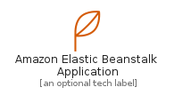
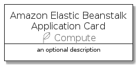

# AmazonElasticBeanstalkApplication


```text
aws-20210131/Resource/Compute/AmazonElasticBeanstalkApplication
```

```text
include('aws-20210131/Resource/Compute/AmazonElasticBeanstalkApplication')
```


| Illustration | AmazonElasticBeanstalkApplication | AmazonElasticBeanstalkApplicationCard | AmazonElasticBeanstalkApplicationGroup |
| :---: | :---: | :---: | :---: |
|  |  |  |  |


## AmazonElasticBeanstalkApplication

### Load remotely
```plantuml
@startuml
' configures the library
!global $LIB_BASE_LOCATION="https://github.com/tmorin/plantuml-libs/distribution"

' loads the library's bootstrap
!include $LIB_BASE_LOCATION/bootstrap.puml

' loads the package bootstrap
include('aws-20210131/bootstrap')

' loads the Item which embeds the element AmazonElasticBeanstalkApplication
include('aws-20210131/Resource/Compute/AmazonElasticBeanstalkApplication')

' renders the element
AmazonElasticBeanstalkApplication('AmazonElasticBeanstalkApplication', 'Amazon Elastic Beanstalk Application', 'an optional tech label')
@enduml
```

### Load locally
```plantuml
@startuml
' configures the library
!global $INCLUSION_MODE="local"
!global $LIB_BASE_LOCATION="../../.."

' loads the library's bootstrap
!include $LIB_BASE_LOCATION/bootstrap.puml

' loads the package bootstrap
include('aws-20210131/bootstrap')

' loads the Item which embeds the element AmazonElasticBeanstalkApplication
include('aws-20210131/Resource/Compute/AmazonElasticBeanstalkApplication')

' renders the element
AmazonElasticBeanstalkApplication('AmazonElasticBeanstalkApplication', 'Amazon Elastic Beanstalk Application', 'an optional tech label')
@enduml
```

## AmazonElasticBeanstalkApplicationCard

### Load remotely
```plantuml
@startuml
' configures the library
!global $LIB_BASE_LOCATION="https://github.com/tmorin/plantuml-libs/distribution"

' loads the library's bootstrap
!include $LIB_BASE_LOCATION/bootstrap.puml

' loads the package bootstrap
include('aws-20210131/bootstrap')

' loads the Item which embeds the element AmazonElasticBeanstalkApplicationCard
include('aws-20210131/Resource/Compute/AmazonElasticBeanstalkApplication')

' renders the element
AmazonElasticBeanstalkApplicationCard('AmazonElasticBeanstalkApplicationCard', 'Amazon Elastic Beanstalk Application Card', 'an optional description')
@enduml
```

### Load locally
```plantuml
@startuml
' configures the library
!global $INCLUSION_MODE="local"
!global $LIB_BASE_LOCATION="../../.."

' loads the library's bootstrap
!include $LIB_BASE_LOCATION/bootstrap.puml

' loads the package bootstrap
include('aws-20210131/bootstrap')

' loads the Item which embeds the element AmazonElasticBeanstalkApplicationCard
include('aws-20210131/Resource/Compute/AmazonElasticBeanstalkApplication')

' renders the element
AmazonElasticBeanstalkApplicationCard('AmazonElasticBeanstalkApplicationCard', 'Amazon Elastic Beanstalk Application Card', 'an optional description')
@enduml
```

## AmazonElasticBeanstalkApplicationGroup

### Load remotely
```plantuml
@startuml
' configures the library
!global $LIB_BASE_LOCATION="https://github.com/tmorin/plantuml-libs/distribution"

' loads the library's bootstrap
!include $LIB_BASE_LOCATION/bootstrap.puml

' loads the package bootstrap
include('aws-20210131/bootstrap')

' loads the Item which embeds the element AmazonElasticBeanstalkApplicationGroup
include('aws-20210131/Resource/Compute/AmazonElasticBeanstalkApplication')

' renders the element
AmazonElasticBeanstalkApplicationGroup('AmazonElasticBeanstalkApplicationGroup', 'Amazon Elastic Beanstalk Application Group', 'an optional tech label') {
    note as note
        the content of the group
    end note
}
@enduml
```

### Load locally
```plantuml
@startuml
' configures the library
!global $INCLUSION_MODE="local"
!global $LIB_BASE_LOCATION="../../.."

' loads the library's bootstrap
!include $LIB_BASE_LOCATION/bootstrap.puml

' loads the package bootstrap
include('aws-20210131/bootstrap')

' loads the Item which embeds the element AmazonElasticBeanstalkApplicationGroup
include('aws-20210131/Resource/Compute/AmazonElasticBeanstalkApplication')

' renders the element
AmazonElasticBeanstalkApplicationGroup('AmazonElasticBeanstalkApplicationGroup', 'Amazon Elastic Beanstalk Application Group', 'an optional tech label') {
    note as note
        the content of the group
    end note
}
@enduml
```

