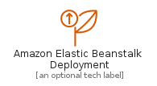
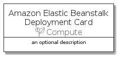

# AmazonElasticBeanstalkDeployment


```text
aws-20210131/Resource/Compute/AmazonElasticBeanstalkDeployment
```

```text
include('aws-20210131/Resource/Compute/AmazonElasticBeanstalkDeployment')
```


| Illustration | AmazonElasticBeanstalkDeployment | AmazonElasticBeanstalkDeploymentCard | AmazonElasticBeanstalkDeploymentGroup |
| :---: | :---: | :---: | :---: |
|  |  |  |  |


## AmazonElasticBeanstalkDeployment

### Load remotely
```plantuml
@startuml
' configures the library
!global $LIB_BASE_LOCATION="https://github.com/tmorin/plantuml-libs/distribution"

' loads the library's bootstrap
!include $LIB_BASE_LOCATION/bootstrap.puml

' loads the package bootstrap
include('aws-20210131/bootstrap')

' loads the Item which embeds the element AmazonElasticBeanstalkDeployment
include('aws-20210131/Resource/Compute/AmazonElasticBeanstalkDeployment')

' renders the element
AmazonElasticBeanstalkDeployment('AmazonElasticBeanstalkDeployment', 'Amazon Elastic Beanstalk Deployment', 'an optional tech label')
@enduml
```

### Load locally
```plantuml
@startuml
' configures the library
!global $INCLUSION_MODE="local"
!global $LIB_BASE_LOCATION="../../.."

' loads the library's bootstrap
!include $LIB_BASE_LOCATION/bootstrap.puml

' loads the package bootstrap
include('aws-20210131/bootstrap')

' loads the Item which embeds the element AmazonElasticBeanstalkDeployment
include('aws-20210131/Resource/Compute/AmazonElasticBeanstalkDeployment')

' renders the element
AmazonElasticBeanstalkDeployment('AmazonElasticBeanstalkDeployment', 'Amazon Elastic Beanstalk Deployment', 'an optional tech label')
@enduml
```

## AmazonElasticBeanstalkDeploymentCard

### Load remotely
```plantuml
@startuml
' configures the library
!global $LIB_BASE_LOCATION="https://github.com/tmorin/plantuml-libs/distribution"

' loads the library's bootstrap
!include $LIB_BASE_LOCATION/bootstrap.puml

' loads the package bootstrap
include('aws-20210131/bootstrap')

' loads the Item which embeds the element AmazonElasticBeanstalkDeploymentCard
include('aws-20210131/Resource/Compute/AmazonElasticBeanstalkDeployment')

' renders the element
AmazonElasticBeanstalkDeploymentCard('AmazonElasticBeanstalkDeploymentCard', 'Amazon Elastic Beanstalk Deployment Card', 'an optional description')
@enduml
```

### Load locally
```plantuml
@startuml
' configures the library
!global $INCLUSION_MODE="local"
!global $LIB_BASE_LOCATION="../../.."

' loads the library's bootstrap
!include $LIB_BASE_LOCATION/bootstrap.puml

' loads the package bootstrap
include('aws-20210131/bootstrap')

' loads the Item which embeds the element AmazonElasticBeanstalkDeploymentCard
include('aws-20210131/Resource/Compute/AmazonElasticBeanstalkDeployment')

' renders the element
AmazonElasticBeanstalkDeploymentCard('AmazonElasticBeanstalkDeploymentCard', 'Amazon Elastic Beanstalk Deployment Card', 'an optional description')
@enduml
```

## AmazonElasticBeanstalkDeploymentGroup

### Load remotely
```plantuml
@startuml
' configures the library
!global $LIB_BASE_LOCATION="https://github.com/tmorin/plantuml-libs/distribution"

' loads the library's bootstrap
!include $LIB_BASE_LOCATION/bootstrap.puml

' loads the package bootstrap
include('aws-20210131/bootstrap')

' loads the Item which embeds the element AmazonElasticBeanstalkDeploymentGroup
include('aws-20210131/Resource/Compute/AmazonElasticBeanstalkDeployment')

' renders the element
AmazonElasticBeanstalkDeploymentGroup('AmazonElasticBeanstalkDeploymentGroup', 'Amazon Elastic Beanstalk Deployment Group', 'an optional tech label') {
    note as note
        the content of the group
    end note
}
@enduml
```

### Load locally
```plantuml
@startuml
' configures the library
!global $INCLUSION_MODE="local"
!global $LIB_BASE_LOCATION="../../.."

' loads the library's bootstrap
!include $LIB_BASE_LOCATION/bootstrap.puml

' loads the package bootstrap
include('aws-20210131/bootstrap')

' loads the Item which embeds the element AmazonElasticBeanstalkDeploymentGroup
include('aws-20210131/Resource/Compute/AmazonElasticBeanstalkDeployment')

' renders the element
AmazonElasticBeanstalkDeploymentGroup('AmazonElasticBeanstalkDeploymentGroup', 'Amazon Elastic Beanstalk Deployment Group', 'an optional tech label') {
    note as note
        the content of the group
    end note
}
@enduml
```

