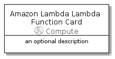

# AmazonLambdaLambdaFunction


```text
aws-20210131/Resource/Compute/AmazonLambdaLambdaFunction
```

```text
include('aws-20210131/Resource/Compute/AmazonLambdaLambdaFunction')
```


| Illustration | AmazonLambdaLambdaFunction | AmazonLambdaLambdaFunctionCard | AmazonLambdaLambdaFunctionGroup |
| :---: | :---: | :---: | :---: |
|  |  |  |  |


## AmazonLambdaLambdaFunction

### Load remotely
```plantuml
@startuml
' configures the library
!global $LIB_BASE_LOCATION="https://github.com/tmorin/plantuml-libs/distribution"

' loads the library's bootstrap
!include $LIB_BASE_LOCATION/bootstrap.puml

' loads the package bootstrap
include('aws-20210131/bootstrap')

' loads the Item which embeds the element AmazonLambdaLambdaFunction
include('aws-20210131/Resource/Compute/AmazonLambdaLambdaFunction')

' renders the element
AmazonLambdaLambdaFunction('AmazonLambdaLambdaFunction', 'Amazon Lambda Lambda Function', 'an optional tech label')
@enduml
```

### Load locally
```plantuml
@startuml
' configures the library
!global $INCLUSION_MODE="local"
!global $LIB_BASE_LOCATION="../../.."

' loads the library's bootstrap
!include $LIB_BASE_LOCATION/bootstrap.puml

' loads the package bootstrap
include('aws-20210131/bootstrap')

' loads the Item which embeds the element AmazonLambdaLambdaFunction
include('aws-20210131/Resource/Compute/AmazonLambdaLambdaFunction')

' renders the element
AmazonLambdaLambdaFunction('AmazonLambdaLambdaFunction', 'Amazon Lambda Lambda Function', 'an optional tech label')
@enduml
```

## AmazonLambdaLambdaFunctionCard

### Load remotely
```plantuml
@startuml
' configures the library
!global $LIB_BASE_LOCATION="https://github.com/tmorin/plantuml-libs/distribution"

' loads the library's bootstrap
!include $LIB_BASE_LOCATION/bootstrap.puml

' loads the package bootstrap
include('aws-20210131/bootstrap')

' loads the Item which embeds the element AmazonLambdaLambdaFunctionCard
include('aws-20210131/Resource/Compute/AmazonLambdaLambdaFunction')

' renders the element
AmazonLambdaLambdaFunctionCard('AmazonLambdaLambdaFunctionCard', 'Amazon Lambda Lambda Function Card', 'an optional description')
@enduml
```

### Load locally
```plantuml
@startuml
' configures the library
!global $INCLUSION_MODE="local"
!global $LIB_BASE_LOCATION="../../.."

' loads the library's bootstrap
!include $LIB_BASE_LOCATION/bootstrap.puml

' loads the package bootstrap
include('aws-20210131/bootstrap')

' loads the Item which embeds the element AmazonLambdaLambdaFunctionCard
include('aws-20210131/Resource/Compute/AmazonLambdaLambdaFunction')

' renders the element
AmazonLambdaLambdaFunctionCard('AmazonLambdaLambdaFunctionCard', 'Amazon Lambda Lambda Function Card', 'an optional description')
@enduml
```

## AmazonLambdaLambdaFunctionGroup

### Load remotely
```plantuml
@startuml
' configures the library
!global $LIB_BASE_LOCATION="https://github.com/tmorin/plantuml-libs/distribution"

' loads the library's bootstrap
!include $LIB_BASE_LOCATION/bootstrap.puml

' loads the package bootstrap
include('aws-20210131/bootstrap')

' loads the Item which embeds the element AmazonLambdaLambdaFunctionGroup
include('aws-20210131/Resource/Compute/AmazonLambdaLambdaFunction')

' renders the element
AmazonLambdaLambdaFunctionGroup('AmazonLambdaLambdaFunctionGroup', 'Amazon Lambda Lambda Function Group', 'an optional tech label') {
    note as note
        the content of the group
    end note
}
@enduml
```

### Load locally
```plantuml
@startuml
' configures the library
!global $INCLUSION_MODE="local"
!global $LIB_BASE_LOCATION="../../.."

' loads the library's bootstrap
!include $LIB_BASE_LOCATION/bootstrap.puml

' loads the package bootstrap
include('aws-20210131/bootstrap')

' loads the Item which embeds the element AmazonLambdaLambdaFunctionGroup
include('aws-20210131/Resource/Compute/AmazonLambdaLambdaFunction')

' renders the element
AmazonLambdaLambdaFunctionGroup('AmazonLambdaLambdaFunctionGroup', 'Amazon Lambda Lambda Function Group', 'an optional tech label') {
    note as note
        the content of the group
    end note
}
@enduml
```

