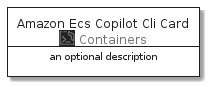

# AmazonEcsCopilotCli


```text
aws-20210131/Resource/Containers/AmazonEcsCopilotCli
```

```text
include('aws-20210131/Resource/Containers/AmazonEcsCopilotCli')
```


| Illustration | AmazonEcsCopilotCli | AmazonEcsCopilotCliCard | AmazonEcsCopilotCliGroup |
| :---: | :---: | :---: | :---: |
|  |  |  |  |


## AmazonEcsCopilotCli

### Load remotely
```plantuml
@startuml
' configures the library
!global $LIB_BASE_LOCATION="https://github.com/tmorin/plantuml-libs/distribution"

' loads the library's bootstrap
!include $LIB_BASE_LOCATION/bootstrap.puml

' loads the package bootstrap
include('aws-20210131/bootstrap')

' loads the Item which embeds the element AmazonEcsCopilotCli
include('aws-20210131/Resource/Containers/AmazonEcsCopilotCli')

' renders the element
AmazonEcsCopilotCli('AmazonEcsCopilotCli', 'Amazon Ecs Copilot Cli', 'an optional tech label')
@enduml
```

### Load locally
```plantuml
@startuml
' configures the library
!global $INCLUSION_MODE="local"
!global $LIB_BASE_LOCATION="../../.."

' loads the library's bootstrap
!include $LIB_BASE_LOCATION/bootstrap.puml

' loads the package bootstrap
include('aws-20210131/bootstrap')

' loads the Item which embeds the element AmazonEcsCopilotCli
include('aws-20210131/Resource/Containers/AmazonEcsCopilotCli')

' renders the element
AmazonEcsCopilotCli('AmazonEcsCopilotCli', 'Amazon Ecs Copilot Cli', 'an optional tech label')
@enduml
```

## AmazonEcsCopilotCliCard

### Load remotely
```plantuml
@startuml
' configures the library
!global $LIB_BASE_LOCATION="https://github.com/tmorin/plantuml-libs/distribution"

' loads the library's bootstrap
!include $LIB_BASE_LOCATION/bootstrap.puml

' loads the package bootstrap
include('aws-20210131/bootstrap')

' loads the Item which embeds the element AmazonEcsCopilotCliCard
include('aws-20210131/Resource/Containers/AmazonEcsCopilotCli')

' renders the element
AmazonEcsCopilotCliCard('AmazonEcsCopilotCliCard', 'Amazon Ecs Copilot Cli Card', 'an optional description')
@enduml
```

### Load locally
```plantuml
@startuml
' configures the library
!global $INCLUSION_MODE="local"
!global $LIB_BASE_LOCATION="../../.."

' loads the library's bootstrap
!include $LIB_BASE_LOCATION/bootstrap.puml

' loads the package bootstrap
include('aws-20210131/bootstrap')

' loads the Item which embeds the element AmazonEcsCopilotCliCard
include('aws-20210131/Resource/Containers/AmazonEcsCopilotCli')

' renders the element
AmazonEcsCopilotCliCard('AmazonEcsCopilotCliCard', 'Amazon Ecs Copilot Cli Card', 'an optional description')
@enduml
```

## AmazonEcsCopilotCliGroup

### Load remotely
```plantuml
@startuml
' configures the library
!global $LIB_BASE_LOCATION="https://github.com/tmorin/plantuml-libs/distribution"

' loads the library's bootstrap
!include $LIB_BASE_LOCATION/bootstrap.puml

' loads the package bootstrap
include('aws-20210131/bootstrap')

' loads the Item which embeds the element AmazonEcsCopilotCliGroup
include('aws-20210131/Resource/Containers/AmazonEcsCopilotCli')

' renders the element
AmazonEcsCopilotCliGroup('AmazonEcsCopilotCliGroup', 'Amazon Ecs Copilot Cli Group', 'an optional tech label') {
    note as note
        the content of the group
    end note
}
@enduml
```

### Load locally
```plantuml
@startuml
' configures the library
!global $INCLUSION_MODE="local"
!global $LIB_BASE_LOCATION="../../.."

' loads the library's bootstrap
!include $LIB_BASE_LOCATION/bootstrap.puml

' loads the package bootstrap
include('aws-20210131/bootstrap')

' loads the Item which embeds the element AmazonEcsCopilotCliGroup
include('aws-20210131/Resource/Containers/AmazonEcsCopilotCli')

' renders the element
AmazonEcsCopilotCliGroup('AmazonEcsCopilotCliGroup', 'Amazon Ecs Copilot Cli Group', 'an optional tech label') {
    note as note
        the content of the group
    end note
}
@enduml
```

