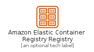
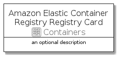

# AmazonElasticContainerRegistryRegistry


```text
aws-20210131/Resource/Containers/AmazonElasticContainerRegistryRegistry
```

```text
include('aws-20210131/Resource/Containers/AmazonElasticContainerRegistryRegistry')
```


| Illustration | AmazonElasticContainerRegistryRegistry | AmazonElasticContainerRegistryRegistryCard | AmazonElasticContainerRegistryRegistryGroup |
| :---: | :---: | :---: | :---: |
|  |  |  |  |


## AmazonElasticContainerRegistryRegistry

### Load remotely
```plantuml
@startuml
' configures the library
!global $LIB_BASE_LOCATION="https://github.com/tmorin/plantuml-libs/distribution"

' loads the library's bootstrap
!include $LIB_BASE_LOCATION/bootstrap.puml

' loads the package bootstrap
include('aws-20210131/bootstrap')

' loads the Item which embeds the element AmazonElasticContainerRegistryRegistry
include('aws-20210131/Resource/Containers/AmazonElasticContainerRegistryRegistry')

' renders the element
AmazonElasticContainerRegistryRegistry('AmazonElasticContainerRegistryRegistry', 'Amazon Elastic Container Registry Registry', 'an optional tech label')
@enduml
```

### Load locally
```plantuml
@startuml
' configures the library
!global $INCLUSION_MODE="local"
!global $LIB_BASE_LOCATION="../../.."

' loads the library's bootstrap
!include $LIB_BASE_LOCATION/bootstrap.puml

' loads the package bootstrap
include('aws-20210131/bootstrap')

' loads the Item which embeds the element AmazonElasticContainerRegistryRegistry
include('aws-20210131/Resource/Containers/AmazonElasticContainerRegistryRegistry')

' renders the element
AmazonElasticContainerRegistryRegistry('AmazonElasticContainerRegistryRegistry', 'Amazon Elastic Container Registry Registry', 'an optional tech label')
@enduml
```

## AmazonElasticContainerRegistryRegistryCard

### Load remotely
```plantuml
@startuml
' configures the library
!global $LIB_BASE_LOCATION="https://github.com/tmorin/plantuml-libs/distribution"

' loads the library's bootstrap
!include $LIB_BASE_LOCATION/bootstrap.puml

' loads the package bootstrap
include('aws-20210131/bootstrap')

' loads the Item which embeds the element AmazonElasticContainerRegistryRegistryCard
include('aws-20210131/Resource/Containers/AmazonElasticContainerRegistryRegistry')

' renders the element
AmazonElasticContainerRegistryRegistryCard('AmazonElasticContainerRegistryRegistryCard', 'Amazon Elastic Container Registry Registry Card', 'an optional description')
@enduml
```

### Load locally
```plantuml
@startuml
' configures the library
!global $INCLUSION_MODE="local"
!global $LIB_BASE_LOCATION="../../.."

' loads the library's bootstrap
!include $LIB_BASE_LOCATION/bootstrap.puml

' loads the package bootstrap
include('aws-20210131/bootstrap')

' loads the Item which embeds the element AmazonElasticContainerRegistryRegistryCard
include('aws-20210131/Resource/Containers/AmazonElasticContainerRegistryRegistry')

' renders the element
AmazonElasticContainerRegistryRegistryCard('AmazonElasticContainerRegistryRegistryCard', 'Amazon Elastic Container Registry Registry Card', 'an optional description')
@enduml
```

## AmazonElasticContainerRegistryRegistryGroup

### Load remotely
```plantuml
@startuml
' configures the library
!global $LIB_BASE_LOCATION="https://github.com/tmorin/plantuml-libs/distribution"

' loads the library's bootstrap
!include $LIB_BASE_LOCATION/bootstrap.puml

' loads the package bootstrap
include('aws-20210131/bootstrap')

' loads the Item which embeds the element AmazonElasticContainerRegistryRegistryGroup
include('aws-20210131/Resource/Containers/AmazonElasticContainerRegistryRegistry')

' renders the element
AmazonElasticContainerRegistryRegistryGroup('AmazonElasticContainerRegistryRegistryGroup', 'Amazon Elastic Container Registry Registry Group', 'an optional tech label') {
    note as note
        the content of the group
    end note
}
@enduml
```

### Load locally
```plantuml
@startuml
' configures the library
!global $INCLUSION_MODE="local"
!global $LIB_BASE_LOCATION="../../.."

' loads the library's bootstrap
!include $LIB_BASE_LOCATION/bootstrap.puml

' loads the package bootstrap
include('aws-20210131/bootstrap')

' loads the Item which embeds the element AmazonElasticContainerRegistryRegistryGroup
include('aws-20210131/Resource/Containers/AmazonElasticContainerRegistryRegistry')

' renders the element
AmazonElasticContainerRegistryRegistryGroup('AmazonElasticContainerRegistryRegistryGroup', 'Amazon Elastic Container Registry Registry Group', 'an optional tech label') {
    note as note
        the content of the group
    end note
}
@enduml
```

