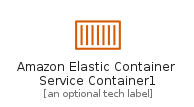
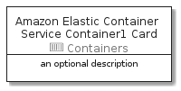

# AmazonElasticContainerServiceContainer1


```text
aws-20210131/Resource/Containers/AmazonElasticContainerServiceContainer1
```

```text
include('aws-20210131/Resource/Containers/AmazonElasticContainerServiceContainer1')
```


| Illustration | AmazonElasticContainerServiceContainer1 | AmazonElasticContainerServiceContainer1Card | AmazonElasticContainerServiceContainer1Group |
| :---: | :---: | :---: | :---: |
|  |  |  |  |


## AmazonElasticContainerServiceContainer1

### Load remotely
```plantuml
@startuml
' configures the library
!global $LIB_BASE_LOCATION="https://github.com/tmorin/plantuml-libs/distribution"

' loads the library's bootstrap
!include $LIB_BASE_LOCATION/bootstrap.puml

' loads the package bootstrap
include('aws-20210131/bootstrap')

' loads the Item which embeds the element AmazonElasticContainerServiceContainer1
include('aws-20210131/Resource/Containers/AmazonElasticContainerServiceContainer1')

' renders the element
AmazonElasticContainerServiceContainer1('AmazonElasticContainerServiceContainer1', 'Amazon Elastic Container Service Container1', 'an optional tech label')
@enduml
```

### Load locally
```plantuml
@startuml
' configures the library
!global $INCLUSION_MODE="local"
!global $LIB_BASE_LOCATION="../../.."

' loads the library's bootstrap
!include $LIB_BASE_LOCATION/bootstrap.puml

' loads the package bootstrap
include('aws-20210131/bootstrap')

' loads the Item which embeds the element AmazonElasticContainerServiceContainer1
include('aws-20210131/Resource/Containers/AmazonElasticContainerServiceContainer1')

' renders the element
AmazonElasticContainerServiceContainer1('AmazonElasticContainerServiceContainer1', 'Amazon Elastic Container Service Container1', 'an optional tech label')
@enduml
```

## AmazonElasticContainerServiceContainer1Card

### Load remotely
```plantuml
@startuml
' configures the library
!global $LIB_BASE_LOCATION="https://github.com/tmorin/plantuml-libs/distribution"

' loads the library's bootstrap
!include $LIB_BASE_LOCATION/bootstrap.puml

' loads the package bootstrap
include('aws-20210131/bootstrap')

' loads the Item which embeds the element AmazonElasticContainerServiceContainer1Card
include('aws-20210131/Resource/Containers/AmazonElasticContainerServiceContainer1')

' renders the element
AmazonElasticContainerServiceContainer1Card('AmazonElasticContainerServiceContainer1Card', 'Amazon Elastic Container Service Container1 Card', 'an optional description')
@enduml
```

### Load locally
```plantuml
@startuml
' configures the library
!global $INCLUSION_MODE="local"
!global $LIB_BASE_LOCATION="../../.."

' loads the library's bootstrap
!include $LIB_BASE_LOCATION/bootstrap.puml

' loads the package bootstrap
include('aws-20210131/bootstrap')

' loads the Item which embeds the element AmazonElasticContainerServiceContainer1Card
include('aws-20210131/Resource/Containers/AmazonElasticContainerServiceContainer1')

' renders the element
AmazonElasticContainerServiceContainer1Card('AmazonElasticContainerServiceContainer1Card', 'Amazon Elastic Container Service Container1 Card', 'an optional description')
@enduml
```

## AmazonElasticContainerServiceContainer1Group

### Load remotely
```plantuml
@startuml
' configures the library
!global $LIB_BASE_LOCATION="https://github.com/tmorin/plantuml-libs/distribution"

' loads the library's bootstrap
!include $LIB_BASE_LOCATION/bootstrap.puml

' loads the package bootstrap
include('aws-20210131/bootstrap')

' loads the Item which embeds the element AmazonElasticContainerServiceContainer1Group
include('aws-20210131/Resource/Containers/AmazonElasticContainerServiceContainer1')

' renders the element
AmazonElasticContainerServiceContainer1Group('AmazonElasticContainerServiceContainer1Group', 'Amazon Elastic Container Service Container1 Group', 'an optional tech label') {
    note as note
        the content of the group
    end note
}
@enduml
```

### Load locally
```plantuml
@startuml
' configures the library
!global $INCLUSION_MODE="local"
!global $LIB_BASE_LOCATION="../../.."

' loads the library's bootstrap
!include $LIB_BASE_LOCATION/bootstrap.puml

' loads the package bootstrap
include('aws-20210131/bootstrap')

' loads the Item which embeds the element AmazonElasticContainerServiceContainer1Group
include('aws-20210131/Resource/Containers/AmazonElasticContainerServiceContainer1')

' renders the element
AmazonElasticContainerServiceContainer1Group('AmazonElasticContainerServiceContainer1Group', 'Amazon Elastic Container Service Container1 Group', 'an optional tech label') {
    note as note
        the content of the group
    end note
}
@enduml
```

