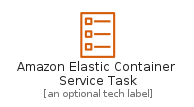
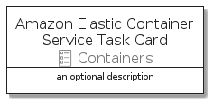

# AmazonElasticContainerServiceTask


```text
aws-20210131/Resource/Containers/AmazonElasticContainerServiceTask
```

```text
include('aws-20210131/Resource/Containers/AmazonElasticContainerServiceTask')
```


| Illustration | AmazonElasticContainerServiceTask | AmazonElasticContainerServiceTaskCard | AmazonElasticContainerServiceTaskGroup |
| :---: | :---: | :---: | :---: |
|  |  |  |  |


## AmazonElasticContainerServiceTask

### Load remotely
```plantuml
@startuml
' configures the library
!global $LIB_BASE_LOCATION="https://github.com/tmorin/plantuml-libs/distribution"

' loads the library's bootstrap
!include $LIB_BASE_LOCATION/bootstrap.puml

' loads the package bootstrap
include('aws-20210131/bootstrap')

' loads the Item which embeds the element AmazonElasticContainerServiceTask
include('aws-20210131/Resource/Containers/AmazonElasticContainerServiceTask')

' renders the element
AmazonElasticContainerServiceTask('AmazonElasticContainerServiceTask', 'Amazon Elastic Container Service Task', 'an optional tech label')
@enduml
```

### Load locally
```plantuml
@startuml
' configures the library
!global $INCLUSION_MODE="local"
!global $LIB_BASE_LOCATION="../../.."

' loads the library's bootstrap
!include $LIB_BASE_LOCATION/bootstrap.puml

' loads the package bootstrap
include('aws-20210131/bootstrap')

' loads the Item which embeds the element AmazonElasticContainerServiceTask
include('aws-20210131/Resource/Containers/AmazonElasticContainerServiceTask')

' renders the element
AmazonElasticContainerServiceTask('AmazonElasticContainerServiceTask', 'Amazon Elastic Container Service Task', 'an optional tech label')
@enduml
```

## AmazonElasticContainerServiceTaskCard

### Load remotely
```plantuml
@startuml
' configures the library
!global $LIB_BASE_LOCATION="https://github.com/tmorin/plantuml-libs/distribution"

' loads the library's bootstrap
!include $LIB_BASE_LOCATION/bootstrap.puml

' loads the package bootstrap
include('aws-20210131/bootstrap')

' loads the Item which embeds the element AmazonElasticContainerServiceTaskCard
include('aws-20210131/Resource/Containers/AmazonElasticContainerServiceTask')

' renders the element
AmazonElasticContainerServiceTaskCard('AmazonElasticContainerServiceTaskCard', 'Amazon Elastic Container Service Task Card', 'an optional description')
@enduml
```

### Load locally
```plantuml
@startuml
' configures the library
!global $INCLUSION_MODE="local"
!global $LIB_BASE_LOCATION="../../.."

' loads the library's bootstrap
!include $LIB_BASE_LOCATION/bootstrap.puml

' loads the package bootstrap
include('aws-20210131/bootstrap')

' loads the Item which embeds the element AmazonElasticContainerServiceTaskCard
include('aws-20210131/Resource/Containers/AmazonElasticContainerServiceTask')

' renders the element
AmazonElasticContainerServiceTaskCard('AmazonElasticContainerServiceTaskCard', 'Amazon Elastic Container Service Task Card', 'an optional description')
@enduml
```

## AmazonElasticContainerServiceTaskGroup

### Load remotely
```plantuml
@startuml
' configures the library
!global $LIB_BASE_LOCATION="https://github.com/tmorin/plantuml-libs/distribution"

' loads the library's bootstrap
!include $LIB_BASE_LOCATION/bootstrap.puml

' loads the package bootstrap
include('aws-20210131/bootstrap')

' loads the Item which embeds the element AmazonElasticContainerServiceTaskGroup
include('aws-20210131/Resource/Containers/AmazonElasticContainerServiceTask')

' renders the element
AmazonElasticContainerServiceTaskGroup('AmazonElasticContainerServiceTaskGroup', 'Amazon Elastic Container Service Task Group', 'an optional tech label') {
    note as note
        the content of the group
    end note
}
@enduml
```

### Load locally
```plantuml
@startuml
' configures the library
!global $INCLUSION_MODE="local"
!global $LIB_BASE_LOCATION="../../.."

' loads the library's bootstrap
!include $LIB_BASE_LOCATION/bootstrap.puml

' loads the package bootstrap
include('aws-20210131/bootstrap')

' loads the Item which embeds the element AmazonElasticContainerServiceTaskGroup
include('aws-20210131/Resource/Containers/AmazonElasticContainerServiceTask')

' renders the element
AmazonElasticContainerServiceTaskGroup('AmazonElasticContainerServiceTaskGroup', 'Amazon Elastic Container Service Task Group', 'an optional tech label') {
    note as note
        the content of the group
    end note
}
@enduml
```

