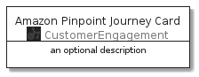
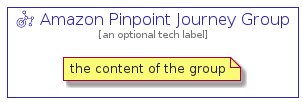

# AmazonPinpointJourney


```text
aws-20210131/Resource/CustomerEngagement/AmazonPinpointJourney
```

```text
include('aws-20210131/Resource/CustomerEngagement/AmazonPinpointJourney')
```


| Illustration | AmazonPinpointJourney | AmazonPinpointJourneyCard | AmazonPinpointJourneyGroup |
| :---: | :---: | :---: | :---: |
|  |  |  |  |


## AmazonPinpointJourney

### Load remotely
```plantuml
@startuml
' configures the library
!global $LIB_BASE_LOCATION="https://github.com/tmorin/plantuml-libs/distribution"

' loads the library's bootstrap
!include $LIB_BASE_LOCATION/bootstrap.puml

' loads the package bootstrap
include('aws-20210131/bootstrap')

' loads the Item which embeds the element AmazonPinpointJourney
include('aws-20210131/Resource/CustomerEngagement/AmazonPinpointJourney')

' renders the element
AmazonPinpointJourney('AmazonPinpointJourney', 'Amazon Pinpoint Journey', 'an optional tech label')
@enduml
```

### Load locally
```plantuml
@startuml
' configures the library
!global $INCLUSION_MODE="local"
!global $LIB_BASE_LOCATION="../../.."

' loads the library's bootstrap
!include $LIB_BASE_LOCATION/bootstrap.puml

' loads the package bootstrap
include('aws-20210131/bootstrap')

' loads the Item which embeds the element AmazonPinpointJourney
include('aws-20210131/Resource/CustomerEngagement/AmazonPinpointJourney')

' renders the element
AmazonPinpointJourney('AmazonPinpointJourney', 'Amazon Pinpoint Journey', 'an optional tech label')
@enduml
```

## AmazonPinpointJourneyCard

### Load remotely
```plantuml
@startuml
' configures the library
!global $LIB_BASE_LOCATION="https://github.com/tmorin/plantuml-libs/distribution"

' loads the library's bootstrap
!include $LIB_BASE_LOCATION/bootstrap.puml

' loads the package bootstrap
include('aws-20210131/bootstrap')

' loads the Item which embeds the element AmazonPinpointJourneyCard
include('aws-20210131/Resource/CustomerEngagement/AmazonPinpointJourney')

' renders the element
AmazonPinpointJourneyCard('AmazonPinpointJourneyCard', 'Amazon Pinpoint Journey Card', 'an optional description')
@enduml
```

### Load locally
```plantuml
@startuml
' configures the library
!global $INCLUSION_MODE="local"
!global $LIB_BASE_LOCATION="../../.."

' loads the library's bootstrap
!include $LIB_BASE_LOCATION/bootstrap.puml

' loads the package bootstrap
include('aws-20210131/bootstrap')

' loads the Item which embeds the element AmazonPinpointJourneyCard
include('aws-20210131/Resource/CustomerEngagement/AmazonPinpointJourney')

' renders the element
AmazonPinpointJourneyCard('AmazonPinpointJourneyCard', 'Amazon Pinpoint Journey Card', 'an optional description')
@enduml
```

## AmazonPinpointJourneyGroup

### Load remotely
```plantuml
@startuml
' configures the library
!global $LIB_BASE_LOCATION="https://github.com/tmorin/plantuml-libs/distribution"

' loads the library's bootstrap
!include $LIB_BASE_LOCATION/bootstrap.puml

' loads the package bootstrap
include('aws-20210131/bootstrap')

' loads the Item which embeds the element AmazonPinpointJourneyGroup
include('aws-20210131/Resource/CustomerEngagement/AmazonPinpointJourney')

' renders the element
AmazonPinpointJourneyGroup('AmazonPinpointJourneyGroup', 'Amazon Pinpoint Journey Group', 'an optional tech label') {
    note as note
        the content of the group
    end note
}
@enduml
```

### Load locally
```plantuml
@startuml
' configures the library
!global $INCLUSION_MODE="local"
!global $LIB_BASE_LOCATION="../../.."

' loads the library's bootstrap
!include $LIB_BASE_LOCATION/bootstrap.puml

' loads the package bootstrap
include('aws-20210131/bootstrap')

' loads the Item which embeds the element AmazonPinpointJourneyGroup
include('aws-20210131/Resource/CustomerEngagement/AmazonPinpointJourney')

' renders the element
AmazonPinpointJourneyGroup('AmazonPinpointJourneyGroup', 'Amazon Pinpoint Journey Group', 'an optional tech label') {
    note as note
        the content of the group
    end note
}
@enduml
```

