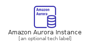
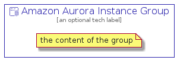

# AmazonAuroraInstance


```text
aws-20210131/Resource/Database/AmazonAuroraInstance
```

```text
include('aws-20210131/Resource/Database/AmazonAuroraInstance')
```


| Illustration | AmazonAuroraInstance | AmazonAuroraInstanceCard | AmazonAuroraInstanceGroup |
| :---: | :---: | :---: | :---: |
|  |  |  |  |


## AmazonAuroraInstance

### Load remotely
```plantuml
@startuml
' configures the library
!global $LIB_BASE_LOCATION="https://github.com/tmorin/plantuml-libs/distribution"

' loads the library's bootstrap
!include $LIB_BASE_LOCATION/bootstrap.puml

' loads the package bootstrap
include('aws-20210131/bootstrap')

' loads the Item which embeds the element AmazonAuroraInstance
include('aws-20210131/Resource/Database/AmazonAuroraInstance')

' renders the element
AmazonAuroraInstance('AmazonAuroraInstance', 'Amazon Aurora Instance', 'an optional tech label')
@enduml
```

### Load locally
```plantuml
@startuml
' configures the library
!global $INCLUSION_MODE="local"
!global $LIB_BASE_LOCATION="../../.."

' loads the library's bootstrap
!include $LIB_BASE_LOCATION/bootstrap.puml

' loads the package bootstrap
include('aws-20210131/bootstrap')

' loads the Item which embeds the element AmazonAuroraInstance
include('aws-20210131/Resource/Database/AmazonAuroraInstance')

' renders the element
AmazonAuroraInstance('AmazonAuroraInstance', 'Amazon Aurora Instance', 'an optional tech label')
@enduml
```

## AmazonAuroraInstanceCard

### Load remotely
```plantuml
@startuml
' configures the library
!global $LIB_BASE_LOCATION="https://github.com/tmorin/plantuml-libs/distribution"

' loads the library's bootstrap
!include $LIB_BASE_LOCATION/bootstrap.puml

' loads the package bootstrap
include('aws-20210131/bootstrap')

' loads the Item which embeds the element AmazonAuroraInstanceCard
include('aws-20210131/Resource/Database/AmazonAuroraInstance')

' renders the element
AmazonAuroraInstanceCard('AmazonAuroraInstanceCard', 'Amazon Aurora Instance Card', 'an optional description')
@enduml
```

### Load locally
```plantuml
@startuml
' configures the library
!global $INCLUSION_MODE="local"
!global $LIB_BASE_LOCATION="../../.."

' loads the library's bootstrap
!include $LIB_BASE_LOCATION/bootstrap.puml

' loads the package bootstrap
include('aws-20210131/bootstrap')

' loads the Item which embeds the element AmazonAuroraInstanceCard
include('aws-20210131/Resource/Database/AmazonAuroraInstance')

' renders the element
AmazonAuroraInstanceCard('AmazonAuroraInstanceCard', 'Amazon Aurora Instance Card', 'an optional description')
@enduml
```

## AmazonAuroraInstanceGroup

### Load remotely
```plantuml
@startuml
' configures the library
!global $LIB_BASE_LOCATION="https://github.com/tmorin/plantuml-libs/distribution"

' loads the library's bootstrap
!include $LIB_BASE_LOCATION/bootstrap.puml

' loads the package bootstrap
include('aws-20210131/bootstrap')

' loads the Item which embeds the element AmazonAuroraInstanceGroup
include('aws-20210131/Resource/Database/AmazonAuroraInstance')

' renders the element
AmazonAuroraInstanceGroup('AmazonAuroraInstanceGroup', 'Amazon Aurora Instance Group', 'an optional tech label') {
    note as note
        the content of the group
    end note
}
@enduml
```

### Load locally
```plantuml
@startuml
' configures the library
!global $INCLUSION_MODE="local"
!global $LIB_BASE_LOCATION="../../.."

' loads the library's bootstrap
!include $LIB_BASE_LOCATION/bootstrap.puml

' loads the package bootstrap
include('aws-20210131/bootstrap')

' loads the Item which embeds the element AmazonAuroraInstanceGroup
include('aws-20210131/Resource/Database/AmazonAuroraInstance')

' renders the element
AmazonAuroraInstanceGroup('AmazonAuroraInstanceGroup', 'Amazon Aurora Instance Group', 'an optional tech label') {
    note as note
        the content of the group
    end note
}
@enduml
```

