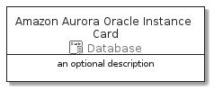

# AmazonAuroraOracleInstance


```text
aws-20210131/Resource/Database/AmazonAuroraOracleInstance
```

```text
include('aws-20210131/Resource/Database/AmazonAuroraOracleInstance')
```


| Illustration | AmazonAuroraOracleInstance | AmazonAuroraOracleInstanceCard | AmazonAuroraOracleInstanceGroup |
| :---: | :---: | :---: | :---: |
|  |  |  |  |


## AmazonAuroraOracleInstance

### Load remotely
```plantuml
@startuml
' configures the library
!global $LIB_BASE_LOCATION="https://github.com/tmorin/plantuml-libs/distribution"

' loads the library's bootstrap
!include $LIB_BASE_LOCATION/bootstrap.puml

' loads the package bootstrap
include('aws-20210131/bootstrap')

' loads the Item which embeds the element AmazonAuroraOracleInstance
include('aws-20210131/Resource/Database/AmazonAuroraOracleInstance')

' renders the element
AmazonAuroraOracleInstance('AmazonAuroraOracleInstance', 'Amazon Aurora Oracle Instance', 'an optional tech label')
@enduml
```

### Load locally
```plantuml
@startuml
' configures the library
!global $INCLUSION_MODE="local"
!global $LIB_BASE_LOCATION="../../.."

' loads the library's bootstrap
!include $LIB_BASE_LOCATION/bootstrap.puml

' loads the package bootstrap
include('aws-20210131/bootstrap')

' loads the Item which embeds the element AmazonAuroraOracleInstance
include('aws-20210131/Resource/Database/AmazonAuroraOracleInstance')

' renders the element
AmazonAuroraOracleInstance('AmazonAuroraOracleInstance', 'Amazon Aurora Oracle Instance', 'an optional tech label')
@enduml
```

## AmazonAuroraOracleInstanceCard

### Load remotely
```plantuml
@startuml
' configures the library
!global $LIB_BASE_LOCATION="https://github.com/tmorin/plantuml-libs/distribution"

' loads the library's bootstrap
!include $LIB_BASE_LOCATION/bootstrap.puml

' loads the package bootstrap
include('aws-20210131/bootstrap')

' loads the Item which embeds the element AmazonAuroraOracleInstanceCard
include('aws-20210131/Resource/Database/AmazonAuroraOracleInstance')

' renders the element
AmazonAuroraOracleInstanceCard('AmazonAuroraOracleInstanceCard', 'Amazon Aurora Oracle Instance Card', 'an optional description')
@enduml
```

### Load locally
```plantuml
@startuml
' configures the library
!global $INCLUSION_MODE="local"
!global $LIB_BASE_LOCATION="../../.."

' loads the library's bootstrap
!include $LIB_BASE_LOCATION/bootstrap.puml

' loads the package bootstrap
include('aws-20210131/bootstrap')

' loads the Item which embeds the element AmazonAuroraOracleInstanceCard
include('aws-20210131/Resource/Database/AmazonAuroraOracleInstance')

' renders the element
AmazonAuroraOracleInstanceCard('AmazonAuroraOracleInstanceCard', 'Amazon Aurora Oracle Instance Card', 'an optional description')
@enduml
```

## AmazonAuroraOracleInstanceGroup

### Load remotely
```plantuml
@startuml
' configures the library
!global $LIB_BASE_LOCATION="https://github.com/tmorin/plantuml-libs/distribution"

' loads the library's bootstrap
!include $LIB_BASE_LOCATION/bootstrap.puml

' loads the package bootstrap
include('aws-20210131/bootstrap')

' loads the Item which embeds the element AmazonAuroraOracleInstanceGroup
include('aws-20210131/Resource/Database/AmazonAuroraOracleInstance')

' renders the element
AmazonAuroraOracleInstanceGroup('AmazonAuroraOracleInstanceGroup', 'Amazon Aurora Oracle Instance Group', 'an optional tech label') {
    note as note
        the content of the group
    end note
}
@enduml
```

### Load locally
```plantuml
@startuml
' configures the library
!global $INCLUSION_MODE="local"
!global $LIB_BASE_LOCATION="../../.."

' loads the library's bootstrap
!include $LIB_BASE_LOCATION/bootstrap.puml

' loads the package bootstrap
include('aws-20210131/bootstrap')

' loads the Item which embeds the element AmazonAuroraOracleInstanceGroup
include('aws-20210131/Resource/Database/AmazonAuroraOracleInstance')

' renders the element
AmazonAuroraOracleInstanceGroup('AmazonAuroraOracleInstanceGroup', 'Amazon Aurora Oracle Instance Group', 'an optional tech label') {
    note as note
        the content of the group
    end note
}
@enduml
```

