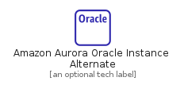
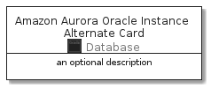

# AmazonAuroraOracleInstanceAlternate


```text
aws-20210131/Resource/Database/AmazonAuroraOracleInstanceAlternate
```

```text
include('aws-20210131/Resource/Database/AmazonAuroraOracleInstanceAlternate')
```


| Illustration | AmazonAuroraOracleInstanceAlternate | AmazonAuroraOracleInstanceAlternateCard | AmazonAuroraOracleInstanceAlternateGroup |
| :---: | :---: | :---: | :---: |
|  |  |  |  |


## AmazonAuroraOracleInstanceAlternate

### Load remotely
```plantuml
@startuml
' configures the library
!global $LIB_BASE_LOCATION="https://github.com/tmorin/plantuml-libs/distribution"

' loads the library's bootstrap
!include $LIB_BASE_LOCATION/bootstrap.puml

' loads the package bootstrap
include('aws-20210131/bootstrap')

' loads the Item which embeds the element AmazonAuroraOracleInstanceAlternate
include('aws-20210131/Resource/Database/AmazonAuroraOracleInstanceAlternate')

' renders the element
AmazonAuroraOracleInstanceAlternate('AmazonAuroraOracleInstanceAlternate', 'Amazon Aurora Oracle Instance Alternate', 'an optional tech label')
@enduml
```

### Load locally
```plantuml
@startuml
' configures the library
!global $INCLUSION_MODE="local"
!global $LIB_BASE_LOCATION="../../.."

' loads the library's bootstrap
!include $LIB_BASE_LOCATION/bootstrap.puml

' loads the package bootstrap
include('aws-20210131/bootstrap')

' loads the Item which embeds the element AmazonAuroraOracleInstanceAlternate
include('aws-20210131/Resource/Database/AmazonAuroraOracleInstanceAlternate')

' renders the element
AmazonAuroraOracleInstanceAlternate('AmazonAuroraOracleInstanceAlternate', 'Amazon Aurora Oracle Instance Alternate', 'an optional tech label')
@enduml
```

## AmazonAuroraOracleInstanceAlternateCard

### Load remotely
```plantuml
@startuml
' configures the library
!global $LIB_BASE_LOCATION="https://github.com/tmorin/plantuml-libs/distribution"

' loads the library's bootstrap
!include $LIB_BASE_LOCATION/bootstrap.puml

' loads the package bootstrap
include('aws-20210131/bootstrap')

' loads the Item which embeds the element AmazonAuroraOracleInstanceAlternateCard
include('aws-20210131/Resource/Database/AmazonAuroraOracleInstanceAlternate')

' renders the element
AmazonAuroraOracleInstanceAlternateCard('AmazonAuroraOracleInstanceAlternateCard', 'Amazon Aurora Oracle Instance Alternate Card', 'an optional description')
@enduml
```

### Load locally
```plantuml
@startuml
' configures the library
!global $INCLUSION_MODE="local"
!global $LIB_BASE_LOCATION="../../.."

' loads the library's bootstrap
!include $LIB_BASE_LOCATION/bootstrap.puml

' loads the package bootstrap
include('aws-20210131/bootstrap')

' loads the Item which embeds the element AmazonAuroraOracleInstanceAlternateCard
include('aws-20210131/Resource/Database/AmazonAuroraOracleInstanceAlternate')

' renders the element
AmazonAuroraOracleInstanceAlternateCard('AmazonAuroraOracleInstanceAlternateCard', 'Amazon Aurora Oracle Instance Alternate Card', 'an optional description')
@enduml
```

## AmazonAuroraOracleInstanceAlternateGroup

### Load remotely
```plantuml
@startuml
' configures the library
!global $LIB_BASE_LOCATION="https://github.com/tmorin/plantuml-libs/distribution"

' loads the library's bootstrap
!include $LIB_BASE_LOCATION/bootstrap.puml

' loads the package bootstrap
include('aws-20210131/bootstrap')

' loads the Item which embeds the element AmazonAuroraOracleInstanceAlternateGroup
include('aws-20210131/Resource/Database/AmazonAuroraOracleInstanceAlternate')

' renders the element
AmazonAuroraOracleInstanceAlternateGroup('AmazonAuroraOracleInstanceAlternateGroup', 'Amazon Aurora Oracle Instance Alternate Group', 'an optional tech label') {
    note as note
        the content of the group
    end note
}
@enduml
```

### Load locally
```plantuml
@startuml
' configures the library
!global $INCLUSION_MODE="local"
!global $LIB_BASE_LOCATION="../../.."

' loads the library's bootstrap
!include $LIB_BASE_LOCATION/bootstrap.puml

' loads the package bootstrap
include('aws-20210131/bootstrap')

' loads the Item which embeds the element AmazonAuroraOracleInstanceAlternateGroup
include('aws-20210131/Resource/Database/AmazonAuroraOracleInstanceAlternate')

' renders the element
AmazonAuroraOracleInstanceAlternateGroup('AmazonAuroraOracleInstanceAlternateGroup', 'Amazon Aurora Oracle Instance Alternate Group', 'an optional tech label') {
    note as note
        the content of the group
    end note
}
@enduml
```

