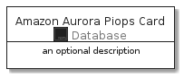
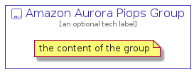

# AmazonAuroraPiops


```text
aws-20210131/Resource/Database/AmazonAuroraPiops
```

```text
include('aws-20210131/Resource/Database/AmazonAuroraPiops')
```


| Illustration | AmazonAuroraPiops | AmazonAuroraPiopsCard | AmazonAuroraPiopsGroup |
| :---: | :---: | :---: | :---: |
|  |  |  |  |


## AmazonAuroraPiops

### Load remotely
```plantuml
@startuml
' configures the library
!global $LIB_BASE_LOCATION="https://github.com/tmorin/plantuml-libs/distribution"

' loads the library's bootstrap
!include $LIB_BASE_LOCATION/bootstrap.puml

' loads the package bootstrap
include('aws-20210131/bootstrap')

' loads the Item which embeds the element AmazonAuroraPiops
include('aws-20210131/Resource/Database/AmazonAuroraPiops')

' renders the element
AmazonAuroraPiops('AmazonAuroraPiops', 'Amazon Aurora Piops', 'an optional tech label')
@enduml
```

### Load locally
```plantuml
@startuml
' configures the library
!global $INCLUSION_MODE="local"
!global $LIB_BASE_LOCATION="../../.."

' loads the library's bootstrap
!include $LIB_BASE_LOCATION/bootstrap.puml

' loads the package bootstrap
include('aws-20210131/bootstrap')

' loads the Item which embeds the element AmazonAuroraPiops
include('aws-20210131/Resource/Database/AmazonAuroraPiops')

' renders the element
AmazonAuroraPiops('AmazonAuroraPiops', 'Amazon Aurora Piops', 'an optional tech label')
@enduml
```

## AmazonAuroraPiopsCard

### Load remotely
```plantuml
@startuml
' configures the library
!global $LIB_BASE_LOCATION="https://github.com/tmorin/plantuml-libs/distribution"

' loads the library's bootstrap
!include $LIB_BASE_LOCATION/bootstrap.puml

' loads the package bootstrap
include('aws-20210131/bootstrap')

' loads the Item which embeds the element AmazonAuroraPiopsCard
include('aws-20210131/Resource/Database/AmazonAuroraPiops')

' renders the element
AmazonAuroraPiopsCard('AmazonAuroraPiopsCard', 'Amazon Aurora Piops Card', 'an optional description')
@enduml
```

### Load locally
```plantuml
@startuml
' configures the library
!global $INCLUSION_MODE="local"
!global $LIB_BASE_LOCATION="../../.."

' loads the library's bootstrap
!include $LIB_BASE_LOCATION/bootstrap.puml

' loads the package bootstrap
include('aws-20210131/bootstrap')

' loads the Item which embeds the element AmazonAuroraPiopsCard
include('aws-20210131/Resource/Database/AmazonAuroraPiops')

' renders the element
AmazonAuroraPiopsCard('AmazonAuroraPiopsCard', 'Amazon Aurora Piops Card', 'an optional description')
@enduml
```

## AmazonAuroraPiopsGroup

### Load remotely
```plantuml
@startuml
' configures the library
!global $LIB_BASE_LOCATION="https://github.com/tmorin/plantuml-libs/distribution"

' loads the library's bootstrap
!include $LIB_BASE_LOCATION/bootstrap.puml

' loads the package bootstrap
include('aws-20210131/bootstrap')

' loads the Item which embeds the element AmazonAuroraPiopsGroup
include('aws-20210131/Resource/Database/AmazonAuroraPiops')

' renders the element
AmazonAuroraPiopsGroup('AmazonAuroraPiopsGroup', 'Amazon Aurora Piops Group', 'an optional tech label') {
    note as note
        the content of the group
    end note
}
@enduml
```

### Load locally
```plantuml
@startuml
' configures the library
!global $INCLUSION_MODE="local"
!global $LIB_BASE_LOCATION="../../.."

' loads the library's bootstrap
!include $LIB_BASE_LOCATION/bootstrap.puml

' loads the package bootstrap
include('aws-20210131/bootstrap')

' loads the Item which embeds the element AmazonAuroraPiopsGroup
include('aws-20210131/Resource/Database/AmazonAuroraPiops')

' renders the element
AmazonAuroraPiopsGroup('AmazonAuroraPiopsGroup', 'Amazon Aurora Piops Group', 'an optional tech label') {
    note as note
        the content of the group
    end note
}
@enduml
```

