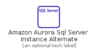
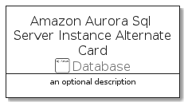

# AmazonAuroraSqlServerInstanceAlternate


```text
aws-20210131/Resource/Database/AmazonAuroraSqlServerInstanceAlternate
```

```text
include('aws-20210131/Resource/Database/AmazonAuroraSqlServerInstanceAlternate')
```


| Illustration | AmazonAuroraSqlServerInstanceAlternate | AmazonAuroraSqlServerInstanceAlternateCard | AmazonAuroraSqlServerInstanceAlternateGroup |
| :---: | :---: | :---: | :---: |
|  |  |  |  |


## AmazonAuroraSqlServerInstanceAlternate

### Load remotely
```plantuml
@startuml
' configures the library
!global $LIB_BASE_LOCATION="https://github.com/tmorin/plantuml-libs/distribution"

' loads the library's bootstrap
!include $LIB_BASE_LOCATION/bootstrap.puml

' loads the package bootstrap
include('aws-20210131/bootstrap')

' loads the Item which embeds the element AmazonAuroraSqlServerInstanceAlternate
include('aws-20210131/Resource/Database/AmazonAuroraSqlServerInstanceAlternate')

' renders the element
AmazonAuroraSqlServerInstanceAlternate('AmazonAuroraSqlServerInstanceAlternate', 'Amazon Aurora Sql Server Instance Alternate', 'an optional tech label')
@enduml
```

### Load locally
```plantuml
@startuml
' configures the library
!global $INCLUSION_MODE="local"
!global $LIB_BASE_LOCATION="../../.."

' loads the library's bootstrap
!include $LIB_BASE_LOCATION/bootstrap.puml

' loads the package bootstrap
include('aws-20210131/bootstrap')

' loads the Item which embeds the element AmazonAuroraSqlServerInstanceAlternate
include('aws-20210131/Resource/Database/AmazonAuroraSqlServerInstanceAlternate')

' renders the element
AmazonAuroraSqlServerInstanceAlternate('AmazonAuroraSqlServerInstanceAlternate', 'Amazon Aurora Sql Server Instance Alternate', 'an optional tech label')
@enduml
```

## AmazonAuroraSqlServerInstanceAlternateCard

### Load remotely
```plantuml
@startuml
' configures the library
!global $LIB_BASE_LOCATION="https://github.com/tmorin/plantuml-libs/distribution"

' loads the library's bootstrap
!include $LIB_BASE_LOCATION/bootstrap.puml

' loads the package bootstrap
include('aws-20210131/bootstrap')

' loads the Item which embeds the element AmazonAuroraSqlServerInstanceAlternateCard
include('aws-20210131/Resource/Database/AmazonAuroraSqlServerInstanceAlternate')

' renders the element
AmazonAuroraSqlServerInstanceAlternateCard('AmazonAuroraSqlServerInstanceAlternateCard', 'Amazon Aurora Sql Server Instance Alternate Card', 'an optional description')
@enduml
```

### Load locally
```plantuml
@startuml
' configures the library
!global $INCLUSION_MODE="local"
!global $LIB_BASE_LOCATION="../../.."

' loads the library's bootstrap
!include $LIB_BASE_LOCATION/bootstrap.puml

' loads the package bootstrap
include('aws-20210131/bootstrap')

' loads the Item which embeds the element AmazonAuroraSqlServerInstanceAlternateCard
include('aws-20210131/Resource/Database/AmazonAuroraSqlServerInstanceAlternate')

' renders the element
AmazonAuroraSqlServerInstanceAlternateCard('AmazonAuroraSqlServerInstanceAlternateCard', 'Amazon Aurora Sql Server Instance Alternate Card', 'an optional description')
@enduml
```

## AmazonAuroraSqlServerInstanceAlternateGroup

### Load remotely
```plantuml
@startuml
' configures the library
!global $LIB_BASE_LOCATION="https://github.com/tmorin/plantuml-libs/distribution"

' loads the library's bootstrap
!include $LIB_BASE_LOCATION/bootstrap.puml

' loads the package bootstrap
include('aws-20210131/bootstrap')

' loads the Item which embeds the element AmazonAuroraSqlServerInstanceAlternateGroup
include('aws-20210131/Resource/Database/AmazonAuroraSqlServerInstanceAlternate')

' renders the element
AmazonAuroraSqlServerInstanceAlternateGroup('AmazonAuroraSqlServerInstanceAlternateGroup', 'Amazon Aurora Sql Server Instance Alternate Group', 'an optional tech label') {
    note as note
        the content of the group
    end note
}
@enduml
```

### Load locally
```plantuml
@startuml
' configures the library
!global $INCLUSION_MODE="local"
!global $LIB_BASE_LOCATION="../../.."

' loads the library's bootstrap
!include $LIB_BASE_LOCATION/bootstrap.puml

' loads the package bootstrap
include('aws-20210131/bootstrap')

' loads the Item which embeds the element AmazonAuroraSqlServerInstanceAlternateGroup
include('aws-20210131/Resource/Database/AmazonAuroraSqlServerInstanceAlternate')

' renders the element
AmazonAuroraSqlServerInstanceAlternateGroup('AmazonAuroraSqlServerInstanceAlternateGroup', 'Amazon Aurora Sql Server Instance Alternate Group', 'an optional tech label') {
    note as note
        the content of the group
    end note
}
@enduml
```

