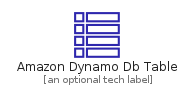
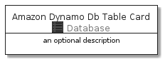
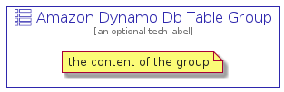

# AmazonDynamoDbTable


```text
aws-20210131/Resource/Database/AmazonDynamoDbTable
```

```text
include('aws-20210131/Resource/Database/AmazonDynamoDbTable')
```


| Illustration | AmazonDynamoDbTable | AmazonDynamoDbTableCard | AmazonDynamoDbTableGroup |
| :---: | :---: | :---: | :---: |
|  |  |  |  |


## AmazonDynamoDbTable

### Load remotely
```plantuml
@startuml
' configures the library
!global $LIB_BASE_LOCATION="https://github.com/tmorin/plantuml-libs/distribution"

' loads the library's bootstrap
!include $LIB_BASE_LOCATION/bootstrap.puml

' loads the package bootstrap
include('aws-20210131/bootstrap')

' loads the Item which embeds the element AmazonDynamoDbTable
include('aws-20210131/Resource/Database/AmazonDynamoDbTable')

' renders the element
AmazonDynamoDbTable('AmazonDynamoDbTable', 'Amazon Dynamo Db Table', 'an optional tech label')
@enduml
```

### Load locally
```plantuml
@startuml
' configures the library
!global $INCLUSION_MODE="local"
!global $LIB_BASE_LOCATION="../../.."

' loads the library's bootstrap
!include $LIB_BASE_LOCATION/bootstrap.puml

' loads the package bootstrap
include('aws-20210131/bootstrap')

' loads the Item which embeds the element AmazonDynamoDbTable
include('aws-20210131/Resource/Database/AmazonDynamoDbTable')

' renders the element
AmazonDynamoDbTable('AmazonDynamoDbTable', 'Amazon Dynamo Db Table', 'an optional tech label')
@enduml
```

## AmazonDynamoDbTableCard

### Load remotely
```plantuml
@startuml
' configures the library
!global $LIB_BASE_LOCATION="https://github.com/tmorin/plantuml-libs/distribution"

' loads the library's bootstrap
!include $LIB_BASE_LOCATION/bootstrap.puml

' loads the package bootstrap
include('aws-20210131/bootstrap')

' loads the Item which embeds the element AmazonDynamoDbTableCard
include('aws-20210131/Resource/Database/AmazonDynamoDbTable')

' renders the element
AmazonDynamoDbTableCard('AmazonDynamoDbTableCard', 'Amazon Dynamo Db Table Card', 'an optional description')
@enduml
```

### Load locally
```plantuml
@startuml
' configures the library
!global $INCLUSION_MODE="local"
!global $LIB_BASE_LOCATION="../../.."

' loads the library's bootstrap
!include $LIB_BASE_LOCATION/bootstrap.puml

' loads the package bootstrap
include('aws-20210131/bootstrap')

' loads the Item which embeds the element AmazonDynamoDbTableCard
include('aws-20210131/Resource/Database/AmazonDynamoDbTable')

' renders the element
AmazonDynamoDbTableCard('AmazonDynamoDbTableCard', 'Amazon Dynamo Db Table Card', 'an optional description')
@enduml
```

## AmazonDynamoDbTableGroup

### Load remotely
```plantuml
@startuml
' configures the library
!global $LIB_BASE_LOCATION="https://github.com/tmorin/plantuml-libs/distribution"

' loads the library's bootstrap
!include $LIB_BASE_LOCATION/bootstrap.puml

' loads the package bootstrap
include('aws-20210131/bootstrap')

' loads the Item which embeds the element AmazonDynamoDbTableGroup
include('aws-20210131/Resource/Database/AmazonDynamoDbTable')

' renders the element
AmazonDynamoDbTableGroup('AmazonDynamoDbTableGroup', 'Amazon Dynamo Db Table Group', 'an optional tech label') {
    note as note
        the content of the group
    end note
}
@enduml
```

### Load locally
```plantuml
@startuml
' configures the library
!global $INCLUSION_MODE="local"
!global $LIB_BASE_LOCATION="../../.."

' loads the library's bootstrap
!include $LIB_BASE_LOCATION/bootstrap.puml

' loads the package bootstrap
include('aws-20210131/bootstrap')

' loads the Item which embeds the element AmazonDynamoDbTableGroup
include('aws-20210131/Resource/Database/AmazonDynamoDbTable')

' renders the element
AmazonDynamoDbTableGroup('AmazonDynamoDbTableGroup', 'Amazon Dynamo Db Table Group', 'an optional tech label') {
    note as note
        the content of the group
    end note
}
@enduml
```

