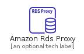
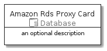
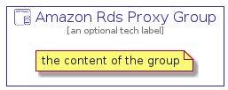

# AmazonRdsProxy


```text
aws-20210131/Resource/Database/AmazonRdsProxy
```

```text
include('aws-20210131/Resource/Database/AmazonRdsProxy')
```


| Illustration | AmazonRdsProxy | AmazonRdsProxyCard | AmazonRdsProxyGroup |
| :---: | :---: | :---: | :---: |
|  |  |  |  |


## AmazonRdsProxy

### Load remotely
```plantuml
@startuml
' configures the library
!global $LIB_BASE_LOCATION="https://github.com/tmorin/plantuml-libs/distribution"

' loads the library's bootstrap
!include $LIB_BASE_LOCATION/bootstrap.puml

' loads the package bootstrap
include('aws-20210131/bootstrap')

' loads the Item which embeds the element AmazonRdsProxy
include('aws-20210131/Resource/Database/AmazonRdsProxy')

' renders the element
AmazonRdsProxy('AmazonRdsProxy', 'Amazon Rds Proxy', 'an optional tech label')
@enduml
```

### Load locally
```plantuml
@startuml
' configures the library
!global $INCLUSION_MODE="local"
!global $LIB_BASE_LOCATION="../../.."

' loads the library's bootstrap
!include $LIB_BASE_LOCATION/bootstrap.puml

' loads the package bootstrap
include('aws-20210131/bootstrap')

' loads the Item which embeds the element AmazonRdsProxy
include('aws-20210131/Resource/Database/AmazonRdsProxy')

' renders the element
AmazonRdsProxy('AmazonRdsProxy', 'Amazon Rds Proxy', 'an optional tech label')
@enduml
```

## AmazonRdsProxyCard

### Load remotely
```plantuml
@startuml
' configures the library
!global $LIB_BASE_LOCATION="https://github.com/tmorin/plantuml-libs/distribution"

' loads the library's bootstrap
!include $LIB_BASE_LOCATION/bootstrap.puml

' loads the package bootstrap
include('aws-20210131/bootstrap')

' loads the Item which embeds the element AmazonRdsProxyCard
include('aws-20210131/Resource/Database/AmazonRdsProxy')

' renders the element
AmazonRdsProxyCard('AmazonRdsProxyCard', 'Amazon Rds Proxy Card', 'an optional description')
@enduml
```

### Load locally
```plantuml
@startuml
' configures the library
!global $INCLUSION_MODE="local"
!global $LIB_BASE_LOCATION="../../.."

' loads the library's bootstrap
!include $LIB_BASE_LOCATION/bootstrap.puml

' loads the package bootstrap
include('aws-20210131/bootstrap')

' loads the Item which embeds the element AmazonRdsProxyCard
include('aws-20210131/Resource/Database/AmazonRdsProxy')

' renders the element
AmazonRdsProxyCard('AmazonRdsProxyCard', 'Amazon Rds Proxy Card', 'an optional description')
@enduml
```

## AmazonRdsProxyGroup

### Load remotely
```plantuml
@startuml
' configures the library
!global $LIB_BASE_LOCATION="https://github.com/tmorin/plantuml-libs/distribution"

' loads the library's bootstrap
!include $LIB_BASE_LOCATION/bootstrap.puml

' loads the package bootstrap
include('aws-20210131/bootstrap')

' loads the Item which embeds the element AmazonRdsProxyGroup
include('aws-20210131/Resource/Database/AmazonRdsProxy')

' renders the element
AmazonRdsProxyGroup('AmazonRdsProxyGroup', 'Amazon Rds Proxy Group', 'an optional tech label') {
    note as note
        the content of the group
    end note
}
@enduml
```

### Load locally
```plantuml
@startuml
' configures the library
!global $INCLUSION_MODE="local"
!global $LIB_BASE_LOCATION="../../.."

' loads the library's bootstrap
!include $LIB_BASE_LOCATION/bootstrap.puml

' loads the package bootstrap
include('aws-20210131/bootstrap')

' loads the Item which embeds the element AmazonRdsProxyGroup
include('aws-20210131/Resource/Database/AmazonRdsProxy')

' renders the element
AmazonRdsProxyGroup('AmazonRdsProxyGroup', 'Amazon Rds Proxy Group', 'an optional tech label') {
    note as note
        the content of the group
    end note
}
@enduml
```

