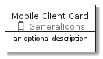
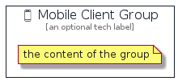

# MobileClient


```text
aws-20210131/Resource/GeneralIcons/MobileClient
```

```text
include('aws-20210131/Resource/GeneralIcons/MobileClient')
```


| Illustration | MobileClient | MobileClientCard | MobileClientGroup |
| :---: | :---: | :---: | :---: |
|  |  |  |  |


## MobileClient

### Load remotely
```plantuml
@startuml
' configures the library
!global $LIB_BASE_LOCATION="https://github.com/tmorin/plantuml-libs/distribution"

' loads the library's bootstrap
!include $LIB_BASE_LOCATION/bootstrap.puml

' loads the package bootstrap
include('aws-20210131/bootstrap')

' loads the Item which embeds the element MobileClient
include('aws-20210131/Resource/GeneralIcons/MobileClient')

' renders the element
MobileClient('MobileClient', 'Mobile Client', 'an optional tech label')
@enduml
```

### Load locally
```plantuml
@startuml
' configures the library
!global $INCLUSION_MODE="local"
!global $LIB_BASE_LOCATION="../../.."

' loads the library's bootstrap
!include $LIB_BASE_LOCATION/bootstrap.puml

' loads the package bootstrap
include('aws-20210131/bootstrap')

' loads the Item which embeds the element MobileClient
include('aws-20210131/Resource/GeneralIcons/MobileClient')

' renders the element
MobileClient('MobileClient', 'Mobile Client', 'an optional tech label')
@enduml
```

## MobileClientCard

### Load remotely
```plantuml
@startuml
' configures the library
!global $LIB_BASE_LOCATION="https://github.com/tmorin/plantuml-libs/distribution"

' loads the library's bootstrap
!include $LIB_BASE_LOCATION/bootstrap.puml

' loads the package bootstrap
include('aws-20210131/bootstrap')

' loads the Item which embeds the element MobileClientCard
include('aws-20210131/Resource/GeneralIcons/MobileClient')

' renders the element
MobileClientCard('MobileClientCard', 'Mobile Client Card', 'an optional description')
@enduml
```

### Load locally
```plantuml
@startuml
' configures the library
!global $INCLUSION_MODE="local"
!global $LIB_BASE_LOCATION="../../.."

' loads the library's bootstrap
!include $LIB_BASE_LOCATION/bootstrap.puml

' loads the package bootstrap
include('aws-20210131/bootstrap')

' loads the Item which embeds the element MobileClientCard
include('aws-20210131/Resource/GeneralIcons/MobileClient')

' renders the element
MobileClientCard('MobileClientCard', 'Mobile Client Card', 'an optional description')
@enduml
```

## MobileClientGroup

### Load remotely
```plantuml
@startuml
' configures the library
!global $LIB_BASE_LOCATION="https://github.com/tmorin/plantuml-libs/distribution"

' loads the library's bootstrap
!include $LIB_BASE_LOCATION/bootstrap.puml

' loads the package bootstrap
include('aws-20210131/bootstrap')

' loads the Item which embeds the element MobileClientGroup
include('aws-20210131/Resource/GeneralIcons/MobileClient')

' renders the element
MobileClientGroup('MobileClientGroup', 'Mobile Client Group', 'an optional tech label') {
    note as note
        the content of the group
    end note
}
@enduml
```

### Load locally
```plantuml
@startuml
' configures the library
!global $INCLUSION_MODE="local"
!global $LIB_BASE_LOCATION="../../.."

' loads the library's bootstrap
!include $LIB_BASE_LOCATION/bootstrap.puml

' loads the package bootstrap
include('aws-20210131/bootstrap')

' loads the Item which embeds the element MobileClientGroup
include('aws-20210131/Resource/GeneralIcons/MobileClient')

' renders the element
MobileClientGroup('MobileClientGroup', 'Mobile Client Group', 'an optional tech label') {
    note as note
        the content of the group
    end note
}
@enduml
```

