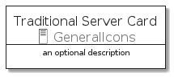
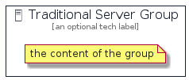

# TraditionalServer


```text
aws-20210131/Resource/GeneralIcons/TraditionalServer
```

```text
include('aws-20210131/Resource/GeneralIcons/TraditionalServer')
```


| Illustration | TraditionalServer | TraditionalServerCard | TraditionalServerGroup |
| :---: | :---: | :---: | :---: |
|  |  |  |  |


## TraditionalServer

### Load remotely
```plantuml
@startuml
' configures the library
!global $LIB_BASE_LOCATION="https://github.com/tmorin/plantuml-libs/distribution"

' loads the library's bootstrap
!include $LIB_BASE_LOCATION/bootstrap.puml

' loads the package bootstrap
include('aws-20210131/bootstrap')

' loads the Item which embeds the element TraditionalServer
include('aws-20210131/Resource/GeneralIcons/TraditionalServer')

' renders the element
TraditionalServer('TraditionalServer', 'Traditional Server', 'an optional tech label')
@enduml
```

### Load locally
```plantuml
@startuml
' configures the library
!global $INCLUSION_MODE="local"
!global $LIB_BASE_LOCATION="../../.."

' loads the library's bootstrap
!include $LIB_BASE_LOCATION/bootstrap.puml

' loads the package bootstrap
include('aws-20210131/bootstrap')

' loads the Item which embeds the element TraditionalServer
include('aws-20210131/Resource/GeneralIcons/TraditionalServer')

' renders the element
TraditionalServer('TraditionalServer', 'Traditional Server', 'an optional tech label')
@enduml
```

## TraditionalServerCard

### Load remotely
```plantuml
@startuml
' configures the library
!global $LIB_BASE_LOCATION="https://github.com/tmorin/plantuml-libs/distribution"

' loads the library's bootstrap
!include $LIB_BASE_LOCATION/bootstrap.puml

' loads the package bootstrap
include('aws-20210131/bootstrap')

' loads the Item which embeds the element TraditionalServerCard
include('aws-20210131/Resource/GeneralIcons/TraditionalServer')

' renders the element
TraditionalServerCard('TraditionalServerCard', 'Traditional Server Card', 'an optional description')
@enduml
```

### Load locally
```plantuml
@startuml
' configures the library
!global $INCLUSION_MODE="local"
!global $LIB_BASE_LOCATION="../../.."

' loads the library's bootstrap
!include $LIB_BASE_LOCATION/bootstrap.puml

' loads the package bootstrap
include('aws-20210131/bootstrap')

' loads the Item which embeds the element TraditionalServerCard
include('aws-20210131/Resource/GeneralIcons/TraditionalServer')

' renders the element
TraditionalServerCard('TraditionalServerCard', 'Traditional Server Card', 'an optional description')
@enduml
```

## TraditionalServerGroup

### Load remotely
```plantuml
@startuml
' configures the library
!global $LIB_BASE_LOCATION="https://github.com/tmorin/plantuml-libs/distribution"

' loads the library's bootstrap
!include $LIB_BASE_LOCATION/bootstrap.puml

' loads the package bootstrap
include('aws-20210131/bootstrap')

' loads the Item which embeds the element TraditionalServerGroup
include('aws-20210131/Resource/GeneralIcons/TraditionalServer')

' renders the element
TraditionalServerGroup('TraditionalServerGroup', 'Traditional Server Group', 'an optional tech label') {
    note as note
        the content of the group
    end note
}
@enduml
```

### Load locally
```plantuml
@startuml
' configures the library
!global $INCLUSION_MODE="local"
!global $LIB_BASE_LOCATION="../../.."

' loads the library's bootstrap
!include $LIB_BASE_LOCATION/bootstrap.puml

' loads the package bootstrap
include('aws-20210131/bootstrap')

' loads the Item which embeds the element TraditionalServerGroup
include('aws-20210131/Resource/GeneralIcons/TraditionalServer')

' renders the element
TraditionalServerGroup('TraditionalServerGroup', 'Traditional Server Group', 'an optional tech label') {
    note as note
        the content of the group
    end note
}
@enduml
```

