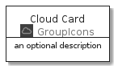
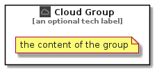

# Cloud


```text
aws-20210131/Resource/GroupIcons/Cloud
```

```text
include('aws-20210131/Resource/GroupIcons/Cloud')
```


| Illustration | Cloud | CloudCard | CloudGroup |
| :---: | :---: | :---: | :---: |
|  |  |  |  |


## Cloud

### Load remotely
```plantuml
@startuml
' configures the library
!global $LIB_BASE_LOCATION="https://github.com/tmorin/plantuml-libs/distribution"

' loads the library's bootstrap
!include $LIB_BASE_LOCATION/bootstrap.puml

' loads the package bootstrap
include('aws-20210131/bootstrap')

' loads the Item which embeds the element Cloud
include('aws-20210131/Resource/GroupIcons/Cloud')

' renders the element
Cloud('Cloud', 'Cloud', 'an optional tech label')
@enduml
```

### Load locally
```plantuml
@startuml
' configures the library
!global $INCLUSION_MODE="local"
!global $LIB_BASE_LOCATION="../../.."

' loads the library's bootstrap
!include $LIB_BASE_LOCATION/bootstrap.puml

' loads the package bootstrap
include('aws-20210131/bootstrap')

' loads the Item which embeds the element Cloud
include('aws-20210131/Resource/GroupIcons/Cloud')

' renders the element
Cloud('Cloud', 'Cloud', 'an optional tech label')
@enduml
```

## CloudCard

### Load remotely
```plantuml
@startuml
' configures the library
!global $LIB_BASE_LOCATION="https://github.com/tmorin/plantuml-libs/distribution"

' loads the library's bootstrap
!include $LIB_BASE_LOCATION/bootstrap.puml

' loads the package bootstrap
include('aws-20210131/bootstrap')

' loads the Item which embeds the element CloudCard
include('aws-20210131/Resource/GroupIcons/Cloud')

' renders the element
CloudCard('CloudCard', 'Cloud Card', 'an optional description')
@enduml
```

### Load locally
```plantuml
@startuml
' configures the library
!global $INCLUSION_MODE="local"
!global $LIB_BASE_LOCATION="../../.."

' loads the library's bootstrap
!include $LIB_BASE_LOCATION/bootstrap.puml

' loads the package bootstrap
include('aws-20210131/bootstrap')

' loads the Item which embeds the element CloudCard
include('aws-20210131/Resource/GroupIcons/Cloud')

' renders the element
CloudCard('CloudCard', 'Cloud Card', 'an optional description')
@enduml
```

## CloudGroup

### Load remotely
```plantuml
@startuml
' configures the library
!global $LIB_BASE_LOCATION="https://github.com/tmorin/plantuml-libs/distribution"

' loads the library's bootstrap
!include $LIB_BASE_LOCATION/bootstrap.puml

' loads the package bootstrap
include('aws-20210131/bootstrap')

' loads the Item which embeds the element CloudGroup
include('aws-20210131/Resource/GroupIcons/Cloud')

' renders the element
CloudGroup('CloudGroup', 'Cloud Group', 'an optional tech label') {
    note as note
        the content of the group
    end note
}
@enduml
```

### Load locally
```plantuml
@startuml
' configures the library
!global $INCLUSION_MODE="local"
!global $LIB_BASE_LOCATION="../../.."

' loads the library's bootstrap
!include $LIB_BASE_LOCATION/bootstrap.puml

' loads the package bootstrap
include('aws-20210131/bootstrap')

' loads the Item which embeds the element CloudGroup
include('aws-20210131/Resource/GroupIcons/Cloud')

' renders the element
CloudGroup('CloudGroup', 'Cloud Group', 'an optional tech label') {
    note as note
        the content of the group
    end note
}
@enduml
```

