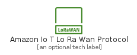
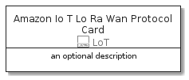

# AmazonIoTLoRaWanProtocol


```text
aws-20210131/Resource/LoT/AmazonIoTLoRaWanProtocol
```

```text
include('aws-20210131/Resource/LoT/AmazonIoTLoRaWanProtocol')
```


| Illustration | AmazonIoTLoRaWanProtocol | AmazonIoTLoRaWanProtocolCard | AmazonIoTLoRaWanProtocolGroup |
| :---: | :---: | :---: | :---: |
|  |  |  |  |


## AmazonIoTLoRaWanProtocol

### Load remotely
```plantuml
@startuml
' configures the library
!global $LIB_BASE_LOCATION="https://github.com/tmorin/plantuml-libs/distribution"

' loads the library's bootstrap
!include $LIB_BASE_LOCATION/bootstrap.puml

' loads the package bootstrap
include('aws-20210131/bootstrap')

' loads the Item which embeds the element AmazonIoTLoRaWanProtocol
include('aws-20210131/Resource/LoT/AmazonIoTLoRaWanProtocol')

' renders the element
AmazonIoTLoRaWanProtocol('AmazonIoTLoRaWanProtocol', 'Amazon Io T Lo Ra Wan Protocol', 'an optional tech label')
@enduml
```

### Load locally
```plantuml
@startuml
' configures the library
!global $INCLUSION_MODE="local"
!global $LIB_BASE_LOCATION="../../.."

' loads the library's bootstrap
!include $LIB_BASE_LOCATION/bootstrap.puml

' loads the package bootstrap
include('aws-20210131/bootstrap')

' loads the Item which embeds the element AmazonIoTLoRaWanProtocol
include('aws-20210131/Resource/LoT/AmazonIoTLoRaWanProtocol')

' renders the element
AmazonIoTLoRaWanProtocol('AmazonIoTLoRaWanProtocol', 'Amazon Io T Lo Ra Wan Protocol', 'an optional tech label')
@enduml
```

## AmazonIoTLoRaWanProtocolCard

### Load remotely
```plantuml
@startuml
' configures the library
!global $LIB_BASE_LOCATION="https://github.com/tmorin/plantuml-libs/distribution"

' loads the library's bootstrap
!include $LIB_BASE_LOCATION/bootstrap.puml

' loads the package bootstrap
include('aws-20210131/bootstrap')

' loads the Item which embeds the element AmazonIoTLoRaWanProtocolCard
include('aws-20210131/Resource/LoT/AmazonIoTLoRaWanProtocol')

' renders the element
AmazonIoTLoRaWanProtocolCard('AmazonIoTLoRaWanProtocolCard', 'Amazon Io T Lo Ra Wan Protocol Card', 'an optional description')
@enduml
```

### Load locally
```plantuml
@startuml
' configures the library
!global $INCLUSION_MODE="local"
!global $LIB_BASE_LOCATION="../../.."

' loads the library's bootstrap
!include $LIB_BASE_LOCATION/bootstrap.puml

' loads the package bootstrap
include('aws-20210131/bootstrap')

' loads the Item which embeds the element AmazonIoTLoRaWanProtocolCard
include('aws-20210131/Resource/LoT/AmazonIoTLoRaWanProtocol')

' renders the element
AmazonIoTLoRaWanProtocolCard('AmazonIoTLoRaWanProtocolCard', 'Amazon Io T Lo Ra Wan Protocol Card', 'an optional description')
@enduml
```

## AmazonIoTLoRaWanProtocolGroup

### Load remotely
```plantuml
@startuml
' configures the library
!global $LIB_BASE_LOCATION="https://github.com/tmorin/plantuml-libs/distribution"

' loads the library's bootstrap
!include $LIB_BASE_LOCATION/bootstrap.puml

' loads the package bootstrap
include('aws-20210131/bootstrap')

' loads the Item which embeds the element AmazonIoTLoRaWanProtocolGroup
include('aws-20210131/Resource/LoT/AmazonIoTLoRaWanProtocol')

' renders the element
AmazonIoTLoRaWanProtocolGroup('AmazonIoTLoRaWanProtocolGroup', 'Amazon Io T Lo Ra Wan Protocol Group', 'an optional tech label') {
    note as note
        the content of the group
    end note
}
@enduml
```

### Load locally
```plantuml
@startuml
' configures the library
!global $INCLUSION_MODE="local"
!global $LIB_BASE_LOCATION="../../.."

' loads the library's bootstrap
!include $LIB_BASE_LOCATION/bootstrap.puml

' loads the package bootstrap
include('aws-20210131/bootstrap')

' loads the Item which embeds the element AmazonIoTLoRaWanProtocolGroup
include('aws-20210131/Resource/LoT/AmazonIoTLoRaWanProtocol')

' renders the element
AmazonIoTLoRaWanProtocolGroup('AmazonIoTLoRaWanProtocolGroup', 'Amazon Io T Lo Ra Wan Protocol Group', 'an optional tech label') {
    note as note
        the content of the group
    end note
}
@enduml
```

