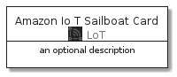
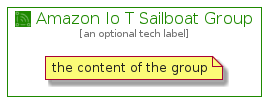

# AmazonIoTSailboat


```text
aws-20210131/Resource/LoT/AmazonIoTSailboat
```

```text
include('aws-20210131/Resource/LoT/AmazonIoTSailboat')
```


| Illustration | AmazonIoTSailboat | AmazonIoTSailboatCard | AmazonIoTSailboatGroup |
| :---: | :---: | :---: | :---: |
|  |  |  |  |


## AmazonIoTSailboat

### Load remotely
```plantuml
@startuml
' configures the library
!global $LIB_BASE_LOCATION="https://github.com/tmorin/plantuml-libs/distribution"

' loads the library's bootstrap
!include $LIB_BASE_LOCATION/bootstrap.puml

' loads the package bootstrap
include('aws-20210131/bootstrap')

' loads the Item which embeds the element AmazonIoTSailboat
include('aws-20210131/Resource/LoT/AmazonIoTSailboat')

' renders the element
AmazonIoTSailboat('AmazonIoTSailboat', 'Amazon Io T Sailboat', 'an optional tech label')
@enduml
```

### Load locally
```plantuml
@startuml
' configures the library
!global $INCLUSION_MODE="local"
!global $LIB_BASE_LOCATION="../../.."

' loads the library's bootstrap
!include $LIB_BASE_LOCATION/bootstrap.puml

' loads the package bootstrap
include('aws-20210131/bootstrap')

' loads the Item which embeds the element AmazonIoTSailboat
include('aws-20210131/Resource/LoT/AmazonIoTSailboat')

' renders the element
AmazonIoTSailboat('AmazonIoTSailboat', 'Amazon Io T Sailboat', 'an optional tech label')
@enduml
```

## AmazonIoTSailboatCard

### Load remotely
```plantuml
@startuml
' configures the library
!global $LIB_BASE_LOCATION="https://github.com/tmorin/plantuml-libs/distribution"

' loads the library's bootstrap
!include $LIB_BASE_LOCATION/bootstrap.puml

' loads the package bootstrap
include('aws-20210131/bootstrap')

' loads the Item which embeds the element AmazonIoTSailboatCard
include('aws-20210131/Resource/LoT/AmazonIoTSailboat')

' renders the element
AmazonIoTSailboatCard('AmazonIoTSailboatCard', 'Amazon Io T Sailboat Card', 'an optional description')
@enduml
```

### Load locally
```plantuml
@startuml
' configures the library
!global $INCLUSION_MODE="local"
!global $LIB_BASE_LOCATION="../../.."

' loads the library's bootstrap
!include $LIB_BASE_LOCATION/bootstrap.puml

' loads the package bootstrap
include('aws-20210131/bootstrap')

' loads the Item which embeds the element AmazonIoTSailboatCard
include('aws-20210131/Resource/LoT/AmazonIoTSailboat')

' renders the element
AmazonIoTSailboatCard('AmazonIoTSailboatCard', 'Amazon Io T Sailboat Card', 'an optional description')
@enduml
```

## AmazonIoTSailboatGroup

### Load remotely
```plantuml
@startuml
' configures the library
!global $LIB_BASE_LOCATION="https://github.com/tmorin/plantuml-libs/distribution"

' loads the library's bootstrap
!include $LIB_BASE_LOCATION/bootstrap.puml

' loads the package bootstrap
include('aws-20210131/bootstrap')

' loads the Item which embeds the element AmazonIoTSailboatGroup
include('aws-20210131/Resource/LoT/AmazonIoTSailboat')

' renders the element
AmazonIoTSailboatGroup('AmazonIoTSailboatGroup', 'Amazon Io T Sailboat Group', 'an optional tech label') {
    note as note
        the content of the group
    end note
}
@enduml
```

### Load locally
```plantuml
@startuml
' configures the library
!global $INCLUSION_MODE="local"
!global $LIB_BASE_LOCATION="../../.."

' loads the library's bootstrap
!include $LIB_BASE_LOCATION/bootstrap.puml

' loads the package bootstrap
include('aws-20210131/bootstrap')

' loads the Item which embeds the element AmazonIoTSailboatGroup
include('aws-20210131/Resource/LoT/AmazonIoTSailboat')

' renders the element
AmazonIoTSailboatGroup('AmazonIoTSailboatGroup', 'Amazon Io T Sailboat Group', 'an optional tech label') {
    note as note
        the content of the group
    end note
}
@enduml
```

