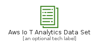
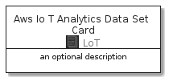
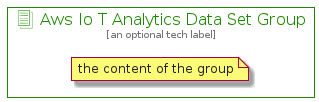

# AwsIoTAnalyticsDataSet


```text
aws-20210131/Resource/LoT/AwsIoTAnalyticsDataSet
```

```text
include('aws-20210131/Resource/LoT/AwsIoTAnalyticsDataSet')
```


| Illustration | AwsIoTAnalyticsDataSet | AwsIoTAnalyticsDataSetCard | AwsIoTAnalyticsDataSetGroup |
| :---: | :---: | :---: | :---: |
|  |  |  |  |


## AwsIoTAnalyticsDataSet

### Load remotely
```plantuml
@startuml
' configures the library
!global $LIB_BASE_LOCATION="https://github.com/tmorin/plantuml-libs/distribution"

' loads the library's bootstrap
!include $LIB_BASE_LOCATION/bootstrap.puml

' loads the package bootstrap
include('aws-20210131/bootstrap')

' loads the Item which embeds the element AwsIoTAnalyticsDataSet
include('aws-20210131/Resource/LoT/AwsIoTAnalyticsDataSet')

' renders the element
AwsIoTAnalyticsDataSet('AwsIoTAnalyticsDataSet', 'Aws Io T Analytics Data Set', 'an optional tech label')
@enduml
```

### Load locally
```plantuml
@startuml
' configures the library
!global $INCLUSION_MODE="local"
!global $LIB_BASE_LOCATION="../../.."

' loads the library's bootstrap
!include $LIB_BASE_LOCATION/bootstrap.puml

' loads the package bootstrap
include('aws-20210131/bootstrap')

' loads the Item which embeds the element AwsIoTAnalyticsDataSet
include('aws-20210131/Resource/LoT/AwsIoTAnalyticsDataSet')

' renders the element
AwsIoTAnalyticsDataSet('AwsIoTAnalyticsDataSet', 'Aws Io T Analytics Data Set', 'an optional tech label')
@enduml
```

## AwsIoTAnalyticsDataSetCard

### Load remotely
```plantuml
@startuml
' configures the library
!global $LIB_BASE_LOCATION="https://github.com/tmorin/plantuml-libs/distribution"

' loads the library's bootstrap
!include $LIB_BASE_LOCATION/bootstrap.puml

' loads the package bootstrap
include('aws-20210131/bootstrap')

' loads the Item which embeds the element AwsIoTAnalyticsDataSetCard
include('aws-20210131/Resource/LoT/AwsIoTAnalyticsDataSet')

' renders the element
AwsIoTAnalyticsDataSetCard('AwsIoTAnalyticsDataSetCard', 'Aws Io T Analytics Data Set Card', 'an optional description')
@enduml
```

### Load locally
```plantuml
@startuml
' configures the library
!global $INCLUSION_MODE="local"
!global $LIB_BASE_LOCATION="../../.."

' loads the library's bootstrap
!include $LIB_BASE_LOCATION/bootstrap.puml

' loads the package bootstrap
include('aws-20210131/bootstrap')

' loads the Item which embeds the element AwsIoTAnalyticsDataSetCard
include('aws-20210131/Resource/LoT/AwsIoTAnalyticsDataSet')

' renders the element
AwsIoTAnalyticsDataSetCard('AwsIoTAnalyticsDataSetCard', 'Aws Io T Analytics Data Set Card', 'an optional description')
@enduml
```

## AwsIoTAnalyticsDataSetGroup

### Load remotely
```plantuml
@startuml
' configures the library
!global $LIB_BASE_LOCATION="https://github.com/tmorin/plantuml-libs/distribution"

' loads the library's bootstrap
!include $LIB_BASE_LOCATION/bootstrap.puml

' loads the package bootstrap
include('aws-20210131/bootstrap')

' loads the Item which embeds the element AwsIoTAnalyticsDataSetGroup
include('aws-20210131/Resource/LoT/AwsIoTAnalyticsDataSet')

' renders the element
AwsIoTAnalyticsDataSetGroup('AwsIoTAnalyticsDataSetGroup', 'Aws Io T Analytics Data Set Group', 'an optional tech label') {
    note as note
        the content of the group
    end note
}
@enduml
```

### Load locally
```plantuml
@startuml
' configures the library
!global $INCLUSION_MODE="local"
!global $LIB_BASE_LOCATION="../../.."

' loads the library's bootstrap
!include $LIB_BASE_LOCATION/bootstrap.puml

' loads the package bootstrap
include('aws-20210131/bootstrap')

' loads the Item which embeds the element AwsIoTAnalyticsDataSetGroup
include('aws-20210131/Resource/LoT/AwsIoTAnalyticsDataSet')

' renders the element
AwsIoTAnalyticsDataSetGroup('AwsIoTAnalyticsDataSetGroup', 'Aws Io T Analytics Data Set Group', 'an optional tech label') {
    note as note
        the content of the group
    end note
}
@enduml
```

