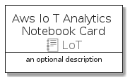
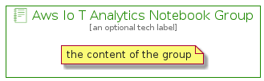

# AwsIoTAnalyticsNotebook


```text
aws-20210131/Resource/LoT/AwsIoTAnalyticsNotebook
```

```text
include('aws-20210131/Resource/LoT/AwsIoTAnalyticsNotebook')
```


| Illustration | AwsIoTAnalyticsNotebook | AwsIoTAnalyticsNotebookCard | AwsIoTAnalyticsNotebookGroup |
| :---: | :---: | :---: | :---: |
|  |  |  |  |


## AwsIoTAnalyticsNotebook

### Load remotely
```plantuml
@startuml
' configures the library
!global $LIB_BASE_LOCATION="https://github.com/tmorin/plantuml-libs/distribution"

' loads the library's bootstrap
!include $LIB_BASE_LOCATION/bootstrap.puml

' loads the package bootstrap
include('aws-20210131/bootstrap')

' loads the Item which embeds the element AwsIoTAnalyticsNotebook
include('aws-20210131/Resource/LoT/AwsIoTAnalyticsNotebook')

' renders the element
AwsIoTAnalyticsNotebook('AwsIoTAnalyticsNotebook', 'Aws Io T Analytics Notebook', 'an optional tech label')
@enduml
```

### Load locally
```plantuml
@startuml
' configures the library
!global $INCLUSION_MODE="local"
!global $LIB_BASE_LOCATION="../../.."

' loads the library's bootstrap
!include $LIB_BASE_LOCATION/bootstrap.puml

' loads the package bootstrap
include('aws-20210131/bootstrap')

' loads the Item which embeds the element AwsIoTAnalyticsNotebook
include('aws-20210131/Resource/LoT/AwsIoTAnalyticsNotebook')

' renders the element
AwsIoTAnalyticsNotebook('AwsIoTAnalyticsNotebook', 'Aws Io T Analytics Notebook', 'an optional tech label')
@enduml
```

## AwsIoTAnalyticsNotebookCard

### Load remotely
```plantuml
@startuml
' configures the library
!global $LIB_BASE_LOCATION="https://github.com/tmorin/plantuml-libs/distribution"

' loads the library's bootstrap
!include $LIB_BASE_LOCATION/bootstrap.puml

' loads the package bootstrap
include('aws-20210131/bootstrap')

' loads the Item which embeds the element AwsIoTAnalyticsNotebookCard
include('aws-20210131/Resource/LoT/AwsIoTAnalyticsNotebook')

' renders the element
AwsIoTAnalyticsNotebookCard('AwsIoTAnalyticsNotebookCard', 'Aws Io T Analytics Notebook Card', 'an optional description')
@enduml
```

### Load locally
```plantuml
@startuml
' configures the library
!global $INCLUSION_MODE="local"
!global $LIB_BASE_LOCATION="../../.."

' loads the library's bootstrap
!include $LIB_BASE_LOCATION/bootstrap.puml

' loads the package bootstrap
include('aws-20210131/bootstrap')

' loads the Item which embeds the element AwsIoTAnalyticsNotebookCard
include('aws-20210131/Resource/LoT/AwsIoTAnalyticsNotebook')

' renders the element
AwsIoTAnalyticsNotebookCard('AwsIoTAnalyticsNotebookCard', 'Aws Io T Analytics Notebook Card', 'an optional description')
@enduml
```

## AwsIoTAnalyticsNotebookGroup

### Load remotely
```plantuml
@startuml
' configures the library
!global $LIB_BASE_LOCATION="https://github.com/tmorin/plantuml-libs/distribution"

' loads the library's bootstrap
!include $LIB_BASE_LOCATION/bootstrap.puml

' loads the package bootstrap
include('aws-20210131/bootstrap')

' loads the Item which embeds the element AwsIoTAnalyticsNotebookGroup
include('aws-20210131/Resource/LoT/AwsIoTAnalyticsNotebook')

' renders the element
AwsIoTAnalyticsNotebookGroup('AwsIoTAnalyticsNotebookGroup', 'Aws Io T Analytics Notebook Group', 'an optional tech label') {
    note as note
        the content of the group
    end note
}
@enduml
```

### Load locally
```plantuml
@startuml
' configures the library
!global $INCLUSION_MODE="local"
!global $LIB_BASE_LOCATION="../../.."

' loads the library's bootstrap
!include $LIB_BASE_LOCATION/bootstrap.puml

' loads the package bootstrap
include('aws-20210131/bootstrap')

' loads the Item which embeds the element AwsIoTAnalyticsNotebookGroup
include('aws-20210131/Resource/LoT/AwsIoTAnalyticsNotebook')

' renders the element
AwsIoTAnalyticsNotebookGroup('AwsIoTAnalyticsNotebookGroup', 'Aws Io T Analytics Notebook Group', 'an optional tech label') {
    note as note
        the content of the group
    end note
}
@enduml
```

