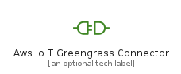
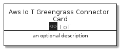
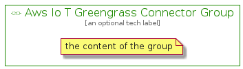

# AwsIoTGreengrassConnector


```text
aws-20210131/Resource/LoT/AwsIoTGreengrassConnector
```

```text
include('aws-20210131/Resource/LoT/AwsIoTGreengrassConnector')
```


| Illustration | AwsIoTGreengrassConnector | AwsIoTGreengrassConnectorCard | AwsIoTGreengrassConnectorGroup |
| :---: | :---: | :---: | :---: |
|  |  |  |  |


## AwsIoTGreengrassConnector

### Load remotely
```plantuml
@startuml
' configures the library
!global $LIB_BASE_LOCATION="https://github.com/tmorin/plantuml-libs/distribution"

' loads the library's bootstrap
!include $LIB_BASE_LOCATION/bootstrap.puml

' loads the package bootstrap
include('aws-20210131/bootstrap')

' loads the Item which embeds the element AwsIoTGreengrassConnector
include('aws-20210131/Resource/LoT/AwsIoTGreengrassConnector')

' renders the element
AwsIoTGreengrassConnector('AwsIoTGreengrassConnector', 'Aws Io T Greengrass Connector', 'an optional tech label')
@enduml
```

### Load locally
```plantuml
@startuml
' configures the library
!global $INCLUSION_MODE="local"
!global $LIB_BASE_LOCATION="../../.."

' loads the library's bootstrap
!include $LIB_BASE_LOCATION/bootstrap.puml

' loads the package bootstrap
include('aws-20210131/bootstrap')

' loads the Item which embeds the element AwsIoTGreengrassConnector
include('aws-20210131/Resource/LoT/AwsIoTGreengrassConnector')

' renders the element
AwsIoTGreengrassConnector('AwsIoTGreengrassConnector', 'Aws Io T Greengrass Connector', 'an optional tech label')
@enduml
```

## AwsIoTGreengrassConnectorCard

### Load remotely
```plantuml
@startuml
' configures the library
!global $LIB_BASE_LOCATION="https://github.com/tmorin/plantuml-libs/distribution"

' loads the library's bootstrap
!include $LIB_BASE_LOCATION/bootstrap.puml

' loads the package bootstrap
include('aws-20210131/bootstrap')

' loads the Item which embeds the element AwsIoTGreengrassConnectorCard
include('aws-20210131/Resource/LoT/AwsIoTGreengrassConnector')

' renders the element
AwsIoTGreengrassConnectorCard('AwsIoTGreengrassConnectorCard', 'Aws Io T Greengrass Connector Card', 'an optional description')
@enduml
```

### Load locally
```plantuml
@startuml
' configures the library
!global $INCLUSION_MODE="local"
!global $LIB_BASE_LOCATION="../../.."

' loads the library's bootstrap
!include $LIB_BASE_LOCATION/bootstrap.puml

' loads the package bootstrap
include('aws-20210131/bootstrap')

' loads the Item which embeds the element AwsIoTGreengrassConnectorCard
include('aws-20210131/Resource/LoT/AwsIoTGreengrassConnector')

' renders the element
AwsIoTGreengrassConnectorCard('AwsIoTGreengrassConnectorCard', 'Aws Io T Greengrass Connector Card', 'an optional description')
@enduml
```

## AwsIoTGreengrassConnectorGroup

### Load remotely
```plantuml
@startuml
' configures the library
!global $LIB_BASE_LOCATION="https://github.com/tmorin/plantuml-libs/distribution"

' loads the library's bootstrap
!include $LIB_BASE_LOCATION/bootstrap.puml

' loads the package bootstrap
include('aws-20210131/bootstrap')

' loads the Item which embeds the element AwsIoTGreengrassConnectorGroup
include('aws-20210131/Resource/LoT/AwsIoTGreengrassConnector')

' renders the element
AwsIoTGreengrassConnectorGroup('AwsIoTGreengrassConnectorGroup', 'Aws Io T Greengrass Connector Group', 'an optional tech label') {
    note as note
        the content of the group
    end note
}
@enduml
```

### Load locally
```plantuml
@startuml
' configures the library
!global $INCLUSION_MODE="local"
!global $LIB_BASE_LOCATION="../../.."

' loads the library's bootstrap
!include $LIB_BASE_LOCATION/bootstrap.puml

' loads the package bootstrap
include('aws-20210131/bootstrap')

' loads the Item which embeds the element AwsIoTGreengrassConnectorGroup
include('aws-20210131/Resource/LoT/AwsIoTGreengrassConnector')

' renders the element
AwsIoTGreengrassConnectorGroup('AwsIoTGreengrassConnectorGroup', 'Aws Io T Greengrass Connector Group', 'an optional tech label') {
    note as note
        the content of the group
    end note
}
@enduml
```

