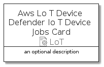

# AwsLoTDeviceDefenderIoTDeviceJobs


```text
aws-20210131/Resource/LoT/AwsLoTDeviceDefenderIoTDeviceJobs
```

```text
include('aws-20210131/Resource/LoT/AwsLoTDeviceDefenderIoTDeviceJobs')
```


| Illustration | AwsLoTDeviceDefenderIoTDeviceJobs | AwsLoTDeviceDefenderIoTDeviceJobsCard | AwsLoTDeviceDefenderIoTDeviceJobsGroup |
| :---: | :---: | :---: | :---: |
|  |  |  |  |


## AwsLoTDeviceDefenderIoTDeviceJobs

### Load remotely
```plantuml
@startuml
' configures the library
!global $LIB_BASE_LOCATION="https://github.com/tmorin/plantuml-libs/distribution"

' loads the library's bootstrap
!include $LIB_BASE_LOCATION/bootstrap.puml

' loads the package bootstrap
include('aws-20210131/bootstrap')

' loads the Item which embeds the element AwsLoTDeviceDefenderIoTDeviceJobs
include('aws-20210131/Resource/LoT/AwsLoTDeviceDefenderIoTDeviceJobs')

' renders the element
AwsLoTDeviceDefenderIoTDeviceJobs('AwsLoTDeviceDefenderIoTDeviceJobs', 'Aws Lo T Device Defender Io T Device Jobs', 'an optional tech label')
@enduml
```

### Load locally
```plantuml
@startuml
' configures the library
!global $INCLUSION_MODE="local"
!global $LIB_BASE_LOCATION="../../.."

' loads the library's bootstrap
!include $LIB_BASE_LOCATION/bootstrap.puml

' loads the package bootstrap
include('aws-20210131/bootstrap')

' loads the Item which embeds the element AwsLoTDeviceDefenderIoTDeviceJobs
include('aws-20210131/Resource/LoT/AwsLoTDeviceDefenderIoTDeviceJobs')

' renders the element
AwsLoTDeviceDefenderIoTDeviceJobs('AwsLoTDeviceDefenderIoTDeviceJobs', 'Aws Lo T Device Defender Io T Device Jobs', 'an optional tech label')
@enduml
```

## AwsLoTDeviceDefenderIoTDeviceJobsCard

### Load remotely
```plantuml
@startuml
' configures the library
!global $LIB_BASE_LOCATION="https://github.com/tmorin/plantuml-libs/distribution"

' loads the library's bootstrap
!include $LIB_BASE_LOCATION/bootstrap.puml

' loads the package bootstrap
include('aws-20210131/bootstrap')

' loads the Item which embeds the element AwsLoTDeviceDefenderIoTDeviceJobsCard
include('aws-20210131/Resource/LoT/AwsLoTDeviceDefenderIoTDeviceJobs')

' renders the element
AwsLoTDeviceDefenderIoTDeviceJobsCard('AwsLoTDeviceDefenderIoTDeviceJobsCard', 'Aws Lo T Device Defender Io T Device Jobs Card', 'an optional description')
@enduml
```

### Load locally
```plantuml
@startuml
' configures the library
!global $INCLUSION_MODE="local"
!global $LIB_BASE_LOCATION="../../.."

' loads the library's bootstrap
!include $LIB_BASE_LOCATION/bootstrap.puml

' loads the package bootstrap
include('aws-20210131/bootstrap')

' loads the Item which embeds the element AwsLoTDeviceDefenderIoTDeviceJobsCard
include('aws-20210131/Resource/LoT/AwsLoTDeviceDefenderIoTDeviceJobs')

' renders the element
AwsLoTDeviceDefenderIoTDeviceJobsCard('AwsLoTDeviceDefenderIoTDeviceJobsCard', 'Aws Lo T Device Defender Io T Device Jobs Card', 'an optional description')
@enduml
```

## AwsLoTDeviceDefenderIoTDeviceJobsGroup

### Load remotely
```plantuml
@startuml
' configures the library
!global $LIB_BASE_LOCATION="https://github.com/tmorin/plantuml-libs/distribution"

' loads the library's bootstrap
!include $LIB_BASE_LOCATION/bootstrap.puml

' loads the package bootstrap
include('aws-20210131/bootstrap')

' loads the Item which embeds the element AwsLoTDeviceDefenderIoTDeviceJobsGroup
include('aws-20210131/Resource/LoT/AwsLoTDeviceDefenderIoTDeviceJobs')

' renders the element
AwsLoTDeviceDefenderIoTDeviceJobsGroup('AwsLoTDeviceDefenderIoTDeviceJobsGroup', 'Aws Lo T Device Defender Io T Device Jobs Group', 'an optional tech label') {
    note as note
        the content of the group
    end note
}
@enduml
```

### Load locally
```plantuml
@startuml
' configures the library
!global $INCLUSION_MODE="local"
!global $LIB_BASE_LOCATION="../../.."

' loads the library's bootstrap
!include $LIB_BASE_LOCATION/bootstrap.puml

' loads the package bootstrap
include('aws-20210131/bootstrap')

' loads the Item which embeds the element AwsLoTDeviceDefenderIoTDeviceJobsGroup
include('aws-20210131/Resource/LoT/AwsLoTDeviceDefenderIoTDeviceJobs')

' renders the element
AwsLoTDeviceDefenderIoTDeviceJobsGroup('AwsLoTDeviceDefenderIoTDeviceJobsGroup', 'Aws Lo T Device Defender Io T Device Jobs Group', 'an optional tech label') {
    note as note
        the content of the group
    end note
}
@enduml
```

