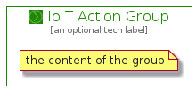

# IoTAction


```text
aws-20210131/Resource/LoT/IoTAction
```

```text
include('aws-20210131/Resource/LoT/IoTAction')
```


| Illustration | IoTAction | IoTActionCard | IoTActionGroup |
| :---: | :---: | :---: | :---: |
|  |  |  |  |


## IoTAction

### Load remotely
```plantuml
@startuml
' configures the library
!global $LIB_BASE_LOCATION="https://github.com/tmorin/plantuml-libs/distribution"

' loads the library's bootstrap
!include $LIB_BASE_LOCATION/bootstrap.puml

' loads the package bootstrap
include('aws-20210131/bootstrap')

' loads the Item which embeds the element IoTAction
include('aws-20210131/Resource/LoT/IoTAction')

' renders the element
IoTAction('IoTAction', 'Io T Action', 'an optional tech label')
@enduml
```

### Load locally
```plantuml
@startuml
' configures the library
!global $INCLUSION_MODE="local"
!global $LIB_BASE_LOCATION="../../.."

' loads the library's bootstrap
!include $LIB_BASE_LOCATION/bootstrap.puml

' loads the package bootstrap
include('aws-20210131/bootstrap')

' loads the Item which embeds the element IoTAction
include('aws-20210131/Resource/LoT/IoTAction')

' renders the element
IoTAction('IoTAction', 'Io T Action', 'an optional tech label')
@enduml
```

## IoTActionCard

### Load remotely
```plantuml
@startuml
' configures the library
!global $LIB_BASE_LOCATION="https://github.com/tmorin/plantuml-libs/distribution"

' loads the library's bootstrap
!include $LIB_BASE_LOCATION/bootstrap.puml

' loads the package bootstrap
include('aws-20210131/bootstrap')

' loads the Item which embeds the element IoTActionCard
include('aws-20210131/Resource/LoT/IoTAction')

' renders the element
IoTActionCard('IoTActionCard', 'Io T Action Card', 'an optional description')
@enduml
```

### Load locally
```plantuml
@startuml
' configures the library
!global $INCLUSION_MODE="local"
!global $LIB_BASE_LOCATION="../../.."

' loads the library's bootstrap
!include $LIB_BASE_LOCATION/bootstrap.puml

' loads the package bootstrap
include('aws-20210131/bootstrap')

' loads the Item which embeds the element IoTActionCard
include('aws-20210131/Resource/LoT/IoTAction')

' renders the element
IoTActionCard('IoTActionCard', 'Io T Action Card', 'an optional description')
@enduml
```

## IoTActionGroup

### Load remotely
```plantuml
@startuml
' configures the library
!global $LIB_BASE_LOCATION="https://github.com/tmorin/plantuml-libs/distribution"

' loads the library's bootstrap
!include $LIB_BASE_LOCATION/bootstrap.puml

' loads the package bootstrap
include('aws-20210131/bootstrap')

' loads the Item which embeds the element IoTActionGroup
include('aws-20210131/Resource/LoT/IoTAction')

' renders the element
IoTActionGroup('IoTActionGroup', 'Io T Action Group', 'an optional tech label') {
    note as note
        the content of the group
    end note
}
@enduml
```

### Load locally
```plantuml
@startuml
' configures the library
!global $INCLUSION_MODE="local"
!global $LIB_BASE_LOCATION="../../.."

' loads the library's bootstrap
!include $LIB_BASE_LOCATION/bootstrap.puml

' loads the package bootstrap
include('aws-20210131/bootstrap')

' loads the Item which embeds the element IoTActionGroup
include('aws-20210131/Resource/LoT/IoTAction')

' renders the element
IoTActionGroup('IoTActionGroup', 'Io T Action Group', 'an optional tech label') {
    note as note
        the content of the group
    end note
}
@enduml
```

