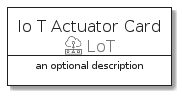
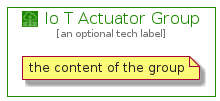

# IoTActuator


```text
aws-20210131/Resource/LoT/IoTActuator
```

```text
include('aws-20210131/Resource/LoT/IoTActuator')
```


| Illustration | IoTActuator | IoTActuatorCard | IoTActuatorGroup |
| :---: | :---: | :---: | :---: |
|  |  |  |  |


## IoTActuator

### Load remotely
```plantuml
@startuml
' configures the library
!global $LIB_BASE_LOCATION="https://github.com/tmorin/plantuml-libs/distribution"

' loads the library's bootstrap
!include $LIB_BASE_LOCATION/bootstrap.puml

' loads the package bootstrap
include('aws-20210131/bootstrap')

' loads the Item which embeds the element IoTActuator
include('aws-20210131/Resource/LoT/IoTActuator')

' renders the element
IoTActuator('IoTActuator', 'Io T Actuator', 'an optional tech label')
@enduml
```

### Load locally
```plantuml
@startuml
' configures the library
!global $INCLUSION_MODE="local"
!global $LIB_BASE_LOCATION="../../.."

' loads the library's bootstrap
!include $LIB_BASE_LOCATION/bootstrap.puml

' loads the package bootstrap
include('aws-20210131/bootstrap')

' loads the Item which embeds the element IoTActuator
include('aws-20210131/Resource/LoT/IoTActuator')

' renders the element
IoTActuator('IoTActuator', 'Io T Actuator', 'an optional tech label')
@enduml
```

## IoTActuatorCard

### Load remotely
```plantuml
@startuml
' configures the library
!global $LIB_BASE_LOCATION="https://github.com/tmorin/plantuml-libs/distribution"

' loads the library's bootstrap
!include $LIB_BASE_LOCATION/bootstrap.puml

' loads the package bootstrap
include('aws-20210131/bootstrap')

' loads the Item which embeds the element IoTActuatorCard
include('aws-20210131/Resource/LoT/IoTActuator')

' renders the element
IoTActuatorCard('IoTActuatorCard', 'Io T Actuator Card', 'an optional description')
@enduml
```

### Load locally
```plantuml
@startuml
' configures the library
!global $INCLUSION_MODE="local"
!global $LIB_BASE_LOCATION="../../.."

' loads the library's bootstrap
!include $LIB_BASE_LOCATION/bootstrap.puml

' loads the package bootstrap
include('aws-20210131/bootstrap')

' loads the Item which embeds the element IoTActuatorCard
include('aws-20210131/Resource/LoT/IoTActuator')

' renders the element
IoTActuatorCard('IoTActuatorCard', 'Io T Actuator Card', 'an optional description')
@enduml
```

## IoTActuatorGroup

### Load remotely
```plantuml
@startuml
' configures the library
!global $LIB_BASE_LOCATION="https://github.com/tmorin/plantuml-libs/distribution"

' loads the library's bootstrap
!include $LIB_BASE_LOCATION/bootstrap.puml

' loads the package bootstrap
include('aws-20210131/bootstrap')

' loads the Item which embeds the element IoTActuatorGroup
include('aws-20210131/Resource/LoT/IoTActuator')

' renders the element
IoTActuatorGroup('IoTActuatorGroup', 'Io T Actuator Group', 'an optional tech label') {
    note as note
        the content of the group
    end note
}
@enduml
```

### Load locally
```plantuml
@startuml
' configures the library
!global $INCLUSION_MODE="local"
!global $LIB_BASE_LOCATION="../../.."

' loads the library's bootstrap
!include $LIB_BASE_LOCATION/bootstrap.puml

' loads the package bootstrap
include('aws-20210131/bootstrap')

' loads the Item which embeds the element IoTActuatorGroup
include('aws-20210131/Resource/LoT/IoTActuator')

' renders the element
IoTActuatorGroup('IoTActuatorGroup', 'Io T Actuator Group', 'an optional tech label') {
    note as note
        the content of the group
    end note
}
@enduml
```

