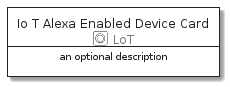
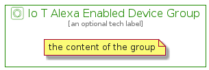

# IoTAlexaEnabledDevice


```text
aws-20210131/Resource/LoT/IoTAlexaEnabledDevice
```

```text
include('aws-20210131/Resource/LoT/IoTAlexaEnabledDevice')
```


| Illustration | IoTAlexaEnabledDevice | IoTAlexaEnabledDeviceCard | IoTAlexaEnabledDeviceGroup |
| :---: | :---: | :---: | :---: |
|  |  |  |  |


## IoTAlexaEnabledDevice

### Load remotely
```plantuml
@startuml
' configures the library
!global $LIB_BASE_LOCATION="https://github.com/tmorin/plantuml-libs/distribution"

' loads the library's bootstrap
!include $LIB_BASE_LOCATION/bootstrap.puml

' loads the package bootstrap
include('aws-20210131/bootstrap')

' loads the Item which embeds the element IoTAlexaEnabledDevice
include('aws-20210131/Resource/LoT/IoTAlexaEnabledDevice')

' renders the element
IoTAlexaEnabledDevice('IoTAlexaEnabledDevice', 'Io T Alexa Enabled Device', 'an optional tech label')
@enduml
```

### Load locally
```plantuml
@startuml
' configures the library
!global $INCLUSION_MODE="local"
!global $LIB_BASE_LOCATION="../../.."

' loads the library's bootstrap
!include $LIB_BASE_LOCATION/bootstrap.puml

' loads the package bootstrap
include('aws-20210131/bootstrap')

' loads the Item which embeds the element IoTAlexaEnabledDevice
include('aws-20210131/Resource/LoT/IoTAlexaEnabledDevice')

' renders the element
IoTAlexaEnabledDevice('IoTAlexaEnabledDevice', 'Io T Alexa Enabled Device', 'an optional tech label')
@enduml
```

## IoTAlexaEnabledDeviceCard

### Load remotely
```plantuml
@startuml
' configures the library
!global $LIB_BASE_LOCATION="https://github.com/tmorin/plantuml-libs/distribution"

' loads the library's bootstrap
!include $LIB_BASE_LOCATION/bootstrap.puml

' loads the package bootstrap
include('aws-20210131/bootstrap')

' loads the Item which embeds the element IoTAlexaEnabledDeviceCard
include('aws-20210131/Resource/LoT/IoTAlexaEnabledDevice')

' renders the element
IoTAlexaEnabledDeviceCard('IoTAlexaEnabledDeviceCard', 'Io T Alexa Enabled Device Card', 'an optional description')
@enduml
```

### Load locally
```plantuml
@startuml
' configures the library
!global $INCLUSION_MODE="local"
!global $LIB_BASE_LOCATION="../../.."

' loads the library's bootstrap
!include $LIB_BASE_LOCATION/bootstrap.puml

' loads the package bootstrap
include('aws-20210131/bootstrap')

' loads the Item which embeds the element IoTAlexaEnabledDeviceCard
include('aws-20210131/Resource/LoT/IoTAlexaEnabledDevice')

' renders the element
IoTAlexaEnabledDeviceCard('IoTAlexaEnabledDeviceCard', 'Io T Alexa Enabled Device Card', 'an optional description')
@enduml
```

## IoTAlexaEnabledDeviceGroup

### Load remotely
```plantuml
@startuml
' configures the library
!global $LIB_BASE_LOCATION="https://github.com/tmorin/plantuml-libs/distribution"

' loads the library's bootstrap
!include $LIB_BASE_LOCATION/bootstrap.puml

' loads the package bootstrap
include('aws-20210131/bootstrap')

' loads the Item which embeds the element IoTAlexaEnabledDeviceGroup
include('aws-20210131/Resource/LoT/IoTAlexaEnabledDevice')

' renders the element
IoTAlexaEnabledDeviceGroup('IoTAlexaEnabledDeviceGroup', 'Io T Alexa Enabled Device Group', 'an optional tech label') {
    note as note
        the content of the group
    end note
}
@enduml
```

### Load locally
```plantuml
@startuml
' configures the library
!global $INCLUSION_MODE="local"
!global $LIB_BASE_LOCATION="../../.."

' loads the library's bootstrap
!include $LIB_BASE_LOCATION/bootstrap.puml

' loads the package bootstrap
include('aws-20210131/bootstrap')

' loads the Item which embeds the element IoTAlexaEnabledDeviceGroup
include('aws-20210131/Resource/LoT/IoTAlexaEnabledDevice')

' renders the element
IoTAlexaEnabledDeviceGroup('IoTAlexaEnabledDeviceGroup', 'Io T Alexa Enabled Device Group', 'an optional tech label') {
    note as note
        the content of the group
    end note
}
@enduml
```

