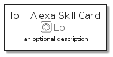

# IoTAlexaSkill


```text
aws-20210131/Resource/LoT/IoTAlexaSkill
```

```text
include('aws-20210131/Resource/LoT/IoTAlexaSkill')
```


| Illustration | IoTAlexaSkill | IoTAlexaSkillCard | IoTAlexaSkillGroup |
| :---: | :---: | :---: | :---: |
|  |  |  |  |


## IoTAlexaSkill

### Load remotely
```plantuml
@startuml
' configures the library
!global $LIB_BASE_LOCATION="https://github.com/tmorin/plantuml-libs/distribution"

' loads the library's bootstrap
!include $LIB_BASE_LOCATION/bootstrap.puml

' loads the package bootstrap
include('aws-20210131/bootstrap')

' loads the Item which embeds the element IoTAlexaSkill
include('aws-20210131/Resource/LoT/IoTAlexaSkill')

' renders the element
IoTAlexaSkill('IoTAlexaSkill', 'Io T Alexa Skill', 'an optional tech label')
@enduml
```

### Load locally
```plantuml
@startuml
' configures the library
!global $INCLUSION_MODE="local"
!global $LIB_BASE_LOCATION="../../.."

' loads the library's bootstrap
!include $LIB_BASE_LOCATION/bootstrap.puml

' loads the package bootstrap
include('aws-20210131/bootstrap')

' loads the Item which embeds the element IoTAlexaSkill
include('aws-20210131/Resource/LoT/IoTAlexaSkill')

' renders the element
IoTAlexaSkill('IoTAlexaSkill', 'Io T Alexa Skill', 'an optional tech label')
@enduml
```

## IoTAlexaSkillCard

### Load remotely
```plantuml
@startuml
' configures the library
!global $LIB_BASE_LOCATION="https://github.com/tmorin/plantuml-libs/distribution"

' loads the library's bootstrap
!include $LIB_BASE_LOCATION/bootstrap.puml

' loads the package bootstrap
include('aws-20210131/bootstrap')

' loads the Item which embeds the element IoTAlexaSkillCard
include('aws-20210131/Resource/LoT/IoTAlexaSkill')

' renders the element
IoTAlexaSkillCard('IoTAlexaSkillCard', 'Io T Alexa Skill Card', 'an optional description')
@enduml
```

### Load locally
```plantuml
@startuml
' configures the library
!global $INCLUSION_MODE="local"
!global $LIB_BASE_LOCATION="../../.."

' loads the library's bootstrap
!include $LIB_BASE_LOCATION/bootstrap.puml

' loads the package bootstrap
include('aws-20210131/bootstrap')

' loads the Item which embeds the element IoTAlexaSkillCard
include('aws-20210131/Resource/LoT/IoTAlexaSkill')

' renders the element
IoTAlexaSkillCard('IoTAlexaSkillCard', 'Io T Alexa Skill Card', 'an optional description')
@enduml
```

## IoTAlexaSkillGroup

### Load remotely
```plantuml
@startuml
' configures the library
!global $LIB_BASE_LOCATION="https://github.com/tmorin/plantuml-libs/distribution"

' loads the library's bootstrap
!include $LIB_BASE_LOCATION/bootstrap.puml

' loads the package bootstrap
include('aws-20210131/bootstrap')

' loads the Item which embeds the element IoTAlexaSkillGroup
include('aws-20210131/Resource/LoT/IoTAlexaSkill')

' renders the element
IoTAlexaSkillGroup('IoTAlexaSkillGroup', 'Io T Alexa Skill Group', 'an optional tech label') {
    note as note
        the content of the group
    end note
}
@enduml
```

### Load locally
```plantuml
@startuml
' configures the library
!global $INCLUSION_MODE="local"
!global $LIB_BASE_LOCATION="../../.."

' loads the library's bootstrap
!include $LIB_BASE_LOCATION/bootstrap.puml

' loads the package bootstrap
include('aws-20210131/bootstrap')

' loads the Item which embeds the element IoTAlexaSkillGroup
include('aws-20210131/Resource/LoT/IoTAlexaSkill')

' renders the element
IoTAlexaSkillGroup('IoTAlexaSkillGroup', 'Io T Alexa Skill Group', 'an optional tech label') {
    note as note
        the content of the group
    end note
}
@enduml
```

