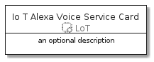
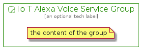

# IoTAlexaVoiceService


```text
aws-20210131/Resource/LoT/IoTAlexaVoiceService
```

```text
include('aws-20210131/Resource/LoT/IoTAlexaVoiceService')
```


| Illustration | IoTAlexaVoiceService | IoTAlexaVoiceServiceCard | IoTAlexaVoiceServiceGroup |
| :---: | :---: | :---: | :---: |
|  |  |  |  |


## IoTAlexaVoiceService

### Load remotely
```plantuml
@startuml
' configures the library
!global $LIB_BASE_LOCATION="https://github.com/tmorin/plantuml-libs/distribution"

' loads the library's bootstrap
!include $LIB_BASE_LOCATION/bootstrap.puml

' loads the package bootstrap
include('aws-20210131/bootstrap')

' loads the Item which embeds the element IoTAlexaVoiceService
include('aws-20210131/Resource/LoT/IoTAlexaVoiceService')

' renders the element
IoTAlexaVoiceService('IoTAlexaVoiceService', 'Io T Alexa Voice Service', 'an optional tech label')
@enduml
```

### Load locally
```plantuml
@startuml
' configures the library
!global $INCLUSION_MODE="local"
!global $LIB_BASE_LOCATION="../../.."

' loads the library's bootstrap
!include $LIB_BASE_LOCATION/bootstrap.puml

' loads the package bootstrap
include('aws-20210131/bootstrap')

' loads the Item which embeds the element IoTAlexaVoiceService
include('aws-20210131/Resource/LoT/IoTAlexaVoiceService')

' renders the element
IoTAlexaVoiceService('IoTAlexaVoiceService', 'Io T Alexa Voice Service', 'an optional tech label')
@enduml
```

## IoTAlexaVoiceServiceCard

### Load remotely
```plantuml
@startuml
' configures the library
!global $LIB_BASE_LOCATION="https://github.com/tmorin/plantuml-libs/distribution"

' loads the library's bootstrap
!include $LIB_BASE_LOCATION/bootstrap.puml

' loads the package bootstrap
include('aws-20210131/bootstrap')

' loads the Item which embeds the element IoTAlexaVoiceServiceCard
include('aws-20210131/Resource/LoT/IoTAlexaVoiceService')

' renders the element
IoTAlexaVoiceServiceCard('IoTAlexaVoiceServiceCard', 'Io T Alexa Voice Service Card', 'an optional description')
@enduml
```

### Load locally
```plantuml
@startuml
' configures the library
!global $INCLUSION_MODE="local"
!global $LIB_BASE_LOCATION="../../.."

' loads the library's bootstrap
!include $LIB_BASE_LOCATION/bootstrap.puml

' loads the package bootstrap
include('aws-20210131/bootstrap')

' loads the Item which embeds the element IoTAlexaVoiceServiceCard
include('aws-20210131/Resource/LoT/IoTAlexaVoiceService')

' renders the element
IoTAlexaVoiceServiceCard('IoTAlexaVoiceServiceCard', 'Io T Alexa Voice Service Card', 'an optional description')
@enduml
```

## IoTAlexaVoiceServiceGroup

### Load remotely
```plantuml
@startuml
' configures the library
!global $LIB_BASE_LOCATION="https://github.com/tmorin/plantuml-libs/distribution"

' loads the library's bootstrap
!include $LIB_BASE_LOCATION/bootstrap.puml

' loads the package bootstrap
include('aws-20210131/bootstrap')

' loads the Item which embeds the element IoTAlexaVoiceServiceGroup
include('aws-20210131/Resource/LoT/IoTAlexaVoiceService')

' renders the element
IoTAlexaVoiceServiceGroup('IoTAlexaVoiceServiceGroup', 'Io T Alexa Voice Service Group', 'an optional tech label') {
    note as note
        the content of the group
    end note
}
@enduml
```

### Load locally
```plantuml
@startuml
' configures the library
!global $INCLUSION_MODE="local"
!global $LIB_BASE_LOCATION="../../.."

' loads the library's bootstrap
!include $LIB_BASE_LOCATION/bootstrap.puml

' loads the package bootstrap
include('aws-20210131/bootstrap')

' loads the Item which embeds the element IoTAlexaVoiceServiceGroup
include('aws-20210131/Resource/LoT/IoTAlexaVoiceService')

' renders the element
IoTAlexaVoiceServiceGroup('IoTAlexaVoiceServiceGroup', 'Io T Alexa Voice Service Group', 'an optional tech label') {
    note as note
        the content of the group
    end note
}
@enduml
```

