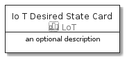

# IoTDesiredState


```text
aws-20210131/Resource/LoT/IoTDesiredState
```

```text
include('aws-20210131/Resource/LoT/IoTDesiredState')
```


| Illustration | IoTDesiredState | IoTDesiredStateCard | IoTDesiredStateGroup |
| :---: | :---: | :---: | :---: |
|  |  |  |  |


## IoTDesiredState

### Load remotely
```plantuml
@startuml
' configures the library
!global $LIB_BASE_LOCATION="https://github.com/tmorin/plantuml-libs/distribution"

' loads the library's bootstrap
!include $LIB_BASE_LOCATION/bootstrap.puml

' loads the package bootstrap
include('aws-20210131/bootstrap')

' loads the Item which embeds the element IoTDesiredState
include('aws-20210131/Resource/LoT/IoTDesiredState')

' renders the element
IoTDesiredState('IoTDesiredState', 'Io T Desired State', 'an optional tech label')
@enduml
```

### Load locally
```plantuml
@startuml
' configures the library
!global $INCLUSION_MODE="local"
!global $LIB_BASE_LOCATION="../../.."

' loads the library's bootstrap
!include $LIB_BASE_LOCATION/bootstrap.puml

' loads the package bootstrap
include('aws-20210131/bootstrap')

' loads the Item which embeds the element IoTDesiredState
include('aws-20210131/Resource/LoT/IoTDesiredState')

' renders the element
IoTDesiredState('IoTDesiredState', 'Io T Desired State', 'an optional tech label')
@enduml
```

## IoTDesiredStateCard

### Load remotely
```plantuml
@startuml
' configures the library
!global $LIB_BASE_LOCATION="https://github.com/tmorin/plantuml-libs/distribution"

' loads the library's bootstrap
!include $LIB_BASE_LOCATION/bootstrap.puml

' loads the package bootstrap
include('aws-20210131/bootstrap')

' loads the Item which embeds the element IoTDesiredStateCard
include('aws-20210131/Resource/LoT/IoTDesiredState')

' renders the element
IoTDesiredStateCard('IoTDesiredStateCard', 'Io T Desired State Card', 'an optional description')
@enduml
```

### Load locally
```plantuml
@startuml
' configures the library
!global $INCLUSION_MODE="local"
!global $LIB_BASE_LOCATION="../../.."

' loads the library's bootstrap
!include $LIB_BASE_LOCATION/bootstrap.puml

' loads the package bootstrap
include('aws-20210131/bootstrap')

' loads the Item which embeds the element IoTDesiredStateCard
include('aws-20210131/Resource/LoT/IoTDesiredState')

' renders the element
IoTDesiredStateCard('IoTDesiredStateCard', 'Io T Desired State Card', 'an optional description')
@enduml
```

## IoTDesiredStateGroup

### Load remotely
```plantuml
@startuml
' configures the library
!global $LIB_BASE_LOCATION="https://github.com/tmorin/plantuml-libs/distribution"

' loads the library's bootstrap
!include $LIB_BASE_LOCATION/bootstrap.puml

' loads the package bootstrap
include('aws-20210131/bootstrap')

' loads the Item which embeds the element IoTDesiredStateGroup
include('aws-20210131/Resource/LoT/IoTDesiredState')

' renders the element
IoTDesiredStateGroup('IoTDesiredStateGroup', 'Io T Desired State Group', 'an optional tech label') {
    note as note
        the content of the group
    end note
}
@enduml
```

### Load locally
```plantuml
@startuml
' configures the library
!global $INCLUSION_MODE="local"
!global $LIB_BASE_LOCATION="../../.."

' loads the library's bootstrap
!include $LIB_BASE_LOCATION/bootstrap.puml

' loads the package bootstrap
include('aws-20210131/bootstrap')

' loads the Item which embeds the element IoTDesiredStateGroup
include('aws-20210131/Resource/LoT/IoTDesiredState')

' renders the element
IoTDesiredStateGroup('IoTDesiredStateGroup', 'Io T Desired State Group', 'an optional tech label') {
    note as note
        the content of the group
    end note
}
@enduml
```

