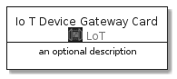
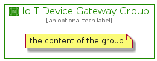

# IoTDeviceGateway


```text
aws-20210131/Resource/LoT/IoTDeviceGateway
```

```text
include('aws-20210131/Resource/LoT/IoTDeviceGateway')
```


| Illustration | IoTDeviceGateway | IoTDeviceGatewayCard | IoTDeviceGatewayGroup |
| :---: | :---: | :---: | :---: |
|  |  |  |  |


## IoTDeviceGateway

### Load remotely
```plantuml
@startuml
' configures the library
!global $LIB_BASE_LOCATION="https://github.com/tmorin/plantuml-libs/distribution"

' loads the library's bootstrap
!include $LIB_BASE_LOCATION/bootstrap.puml

' loads the package bootstrap
include('aws-20210131/bootstrap')

' loads the Item which embeds the element IoTDeviceGateway
include('aws-20210131/Resource/LoT/IoTDeviceGateway')

' renders the element
IoTDeviceGateway('IoTDeviceGateway', 'Io T Device Gateway', 'an optional tech label')
@enduml
```

### Load locally
```plantuml
@startuml
' configures the library
!global $INCLUSION_MODE="local"
!global $LIB_BASE_LOCATION="../../.."

' loads the library's bootstrap
!include $LIB_BASE_LOCATION/bootstrap.puml

' loads the package bootstrap
include('aws-20210131/bootstrap')

' loads the Item which embeds the element IoTDeviceGateway
include('aws-20210131/Resource/LoT/IoTDeviceGateway')

' renders the element
IoTDeviceGateway('IoTDeviceGateway', 'Io T Device Gateway', 'an optional tech label')
@enduml
```

## IoTDeviceGatewayCard

### Load remotely
```plantuml
@startuml
' configures the library
!global $LIB_BASE_LOCATION="https://github.com/tmorin/plantuml-libs/distribution"

' loads the library's bootstrap
!include $LIB_BASE_LOCATION/bootstrap.puml

' loads the package bootstrap
include('aws-20210131/bootstrap')

' loads the Item which embeds the element IoTDeviceGatewayCard
include('aws-20210131/Resource/LoT/IoTDeviceGateway')

' renders the element
IoTDeviceGatewayCard('IoTDeviceGatewayCard', 'Io T Device Gateway Card', 'an optional description')
@enduml
```

### Load locally
```plantuml
@startuml
' configures the library
!global $INCLUSION_MODE="local"
!global $LIB_BASE_LOCATION="../../.."

' loads the library's bootstrap
!include $LIB_BASE_LOCATION/bootstrap.puml

' loads the package bootstrap
include('aws-20210131/bootstrap')

' loads the Item which embeds the element IoTDeviceGatewayCard
include('aws-20210131/Resource/LoT/IoTDeviceGateway')

' renders the element
IoTDeviceGatewayCard('IoTDeviceGatewayCard', 'Io T Device Gateway Card', 'an optional description')
@enduml
```

## IoTDeviceGatewayGroup

### Load remotely
```plantuml
@startuml
' configures the library
!global $LIB_BASE_LOCATION="https://github.com/tmorin/plantuml-libs/distribution"

' loads the library's bootstrap
!include $LIB_BASE_LOCATION/bootstrap.puml

' loads the package bootstrap
include('aws-20210131/bootstrap')

' loads the Item which embeds the element IoTDeviceGatewayGroup
include('aws-20210131/Resource/LoT/IoTDeviceGateway')

' renders the element
IoTDeviceGatewayGroup('IoTDeviceGatewayGroup', 'Io T Device Gateway Group', 'an optional tech label') {
    note as note
        the content of the group
    end note
}
@enduml
```

### Load locally
```plantuml
@startuml
' configures the library
!global $INCLUSION_MODE="local"
!global $LIB_BASE_LOCATION="../../.."

' loads the library's bootstrap
!include $LIB_BASE_LOCATION/bootstrap.puml

' loads the package bootstrap
include('aws-20210131/bootstrap')

' loads the Item which embeds the element IoTDeviceGatewayGroup
include('aws-20210131/Resource/LoT/IoTDeviceGateway')

' renders the element
IoTDeviceGatewayGroup('IoTDeviceGatewayGroup', 'Io T Device Gateway Group', 'an optional tech label') {
    note as note
        the content of the group
    end note
}
@enduml
```

