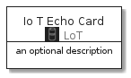
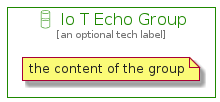

# IoTEcho


```text
aws-20210131/Resource/LoT/IoTEcho
```

```text
include('aws-20210131/Resource/LoT/IoTEcho')
```


| Illustration | IoTEcho | IoTEchoCard | IoTEchoGroup |
| :---: | :---: | :---: | :---: |
|  |  |  |  |


## IoTEcho

### Load remotely
```plantuml
@startuml
' configures the library
!global $LIB_BASE_LOCATION="https://github.com/tmorin/plantuml-libs/distribution"

' loads the library's bootstrap
!include $LIB_BASE_LOCATION/bootstrap.puml

' loads the package bootstrap
include('aws-20210131/bootstrap')

' loads the Item which embeds the element IoTEcho
include('aws-20210131/Resource/LoT/IoTEcho')

' renders the element
IoTEcho('IoTEcho', 'Io T Echo', 'an optional tech label')
@enduml
```

### Load locally
```plantuml
@startuml
' configures the library
!global $INCLUSION_MODE="local"
!global $LIB_BASE_LOCATION="../../.."

' loads the library's bootstrap
!include $LIB_BASE_LOCATION/bootstrap.puml

' loads the package bootstrap
include('aws-20210131/bootstrap')

' loads the Item which embeds the element IoTEcho
include('aws-20210131/Resource/LoT/IoTEcho')

' renders the element
IoTEcho('IoTEcho', 'Io T Echo', 'an optional tech label')
@enduml
```

## IoTEchoCard

### Load remotely
```plantuml
@startuml
' configures the library
!global $LIB_BASE_LOCATION="https://github.com/tmorin/plantuml-libs/distribution"

' loads the library's bootstrap
!include $LIB_BASE_LOCATION/bootstrap.puml

' loads the package bootstrap
include('aws-20210131/bootstrap')

' loads the Item which embeds the element IoTEchoCard
include('aws-20210131/Resource/LoT/IoTEcho')

' renders the element
IoTEchoCard('IoTEchoCard', 'Io T Echo Card', 'an optional description')
@enduml
```

### Load locally
```plantuml
@startuml
' configures the library
!global $INCLUSION_MODE="local"
!global $LIB_BASE_LOCATION="../../.."

' loads the library's bootstrap
!include $LIB_BASE_LOCATION/bootstrap.puml

' loads the package bootstrap
include('aws-20210131/bootstrap')

' loads the Item which embeds the element IoTEchoCard
include('aws-20210131/Resource/LoT/IoTEcho')

' renders the element
IoTEchoCard('IoTEchoCard', 'Io T Echo Card', 'an optional description')
@enduml
```

## IoTEchoGroup

### Load remotely
```plantuml
@startuml
' configures the library
!global $LIB_BASE_LOCATION="https://github.com/tmorin/plantuml-libs/distribution"

' loads the library's bootstrap
!include $LIB_BASE_LOCATION/bootstrap.puml

' loads the package bootstrap
include('aws-20210131/bootstrap')

' loads the Item which embeds the element IoTEchoGroup
include('aws-20210131/Resource/LoT/IoTEcho')

' renders the element
IoTEchoGroup('IoTEchoGroup', 'Io T Echo Group', 'an optional tech label') {
    note as note
        the content of the group
    end note
}
@enduml
```

### Load locally
```plantuml
@startuml
' configures the library
!global $INCLUSION_MODE="local"
!global $LIB_BASE_LOCATION="../../.."

' loads the library's bootstrap
!include $LIB_BASE_LOCATION/bootstrap.puml

' loads the package bootstrap
include('aws-20210131/bootstrap')

' loads the Item which embeds the element IoTEchoGroup
include('aws-20210131/Resource/LoT/IoTEcho')

' renders the element
IoTEchoGroup('IoTEchoGroup', 'Io T Echo Group', 'an optional tech label') {
    note as note
        the content of the group
    end note
}
@enduml
```

