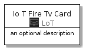
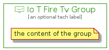

# IoTFireTv


```text
aws-20210131/Resource/LoT/IoTFireTv
```

```text
include('aws-20210131/Resource/LoT/IoTFireTv')
```


| Illustration | IoTFireTv | IoTFireTvCard | IoTFireTvGroup |
| :---: | :---: | :---: | :---: |
|  |  |  |  |


## IoTFireTv

### Load remotely
```plantuml
@startuml
' configures the library
!global $LIB_BASE_LOCATION="https://github.com/tmorin/plantuml-libs/distribution"

' loads the library's bootstrap
!include $LIB_BASE_LOCATION/bootstrap.puml

' loads the package bootstrap
include('aws-20210131/bootstrap')

' loads the Item which embeds the element IoTFireTv
include('aws-20210131/Resource/LoT/IoTFireTv')

' renders the element
IoTFireTv('IoTFireTv', 'Io T Fire Tv', 'an optional tech label')
@enduml
```

### Load locally
```plantuml
@startuml
' configures the library
!global $INCLUSION_MODE="local"
!global $LIB_BASE_LOCATION="../../.."

' loads the library's bootstrap
!include $LIB_BASE_LOCATION/bootstrap.puml

' loads the package bootstrap
include('aws-20210131/bootstrap')

' loads the Item which embeds the element IoTFireTv
include('aws-20210131/Resource/LoT/IoTFireTv')

' renders the element
IoTFireTv('IoTFireTv', 'Io T Fire Tv', 'an optional tech label')
@enduml
```

## IoTFireTvCard

### Load remotely
```plantuml
@startuml
' configures the library
!global $LIB_BASE_LOCATION="https://github.com/tmorin/plantuml-libs/distribution"

' loads the library's bootstrap
!include $LIB_BASE_LOCATION/bootstrap.puml

' loads the package bootstrap
include('aws-20210131/bootstrap')

' loads the Item which embeds the element IoTFireTvCard
include('aws-20210131/Resource/LoT/IoTFireTv')

' renders the element
IoTFireTvCard('IoTFireTvCard', 'Io T Fire Tv Card', 'an optional description')
@enduml
```

### Load locally
```plantuml
@startuml
' configures the library
!global $INCLUSION_MODE="local"
!global $LIB_BASE_LOCATION="../../.."

' loads the library's bootstrap
!include $LIB_BASE_LOCATION/bootstrap.puml

' loads the package bootstrap
include('aws-20210131/bootstrap')

' loads the Item which embeds the element IoTFireTvCard
include('aws-20210131/Resource/LoT/IoTFireTv')

' renders the element
IoTFireTvCard('IoTFireTvCard', 'Io T Fire Tv Card', 'an optional description')
@enduml
```

## IoTFireTvGroup

### Load remotely
```plantuml
@startuml
' configures the library
!global $LIB_BASE_LOCATION="https://github.com/tmorin/plantuml-libs/distribution"

' loads the library's bootstrap
!include $LIB_BASE_LOCATION/bootstrap.puml

' loads the package bootstrap
include('aws-20210131/bootstrap')

' loads the Item which embeds the element IoTFireTvGroup
include('aws-20210131/Resource/LoT/IoTFireTv')

' renders the element
IoTFireTvGroup('IoTFireTvGroup', 'Io T Fire Tv Group', 'an optional tech label') {
    note as note
        the content of the group
    end note
}
@enduml
```

### Load locally
```plantuml
@startuml
' configures the library
!global $INCLUSION_MODE="local"
!global $LIB_BASE_LOCATION="../../.."

' loads the library's bootstrap
!include $LIB_BASE_LOCATION/bootstrap.puml

' loads the package bootstrap
include('aws-20210131/bootstrap')

' loads the Item which embeds the element IoTFireTvGroup
include('aws-20210131/Resource/LoT/IoTFireTv')

' renders the element
IoTFireTvGroup('IoTFireTvGroup', 'Io T Fire Tv Group', 'an optional tech label') {
    note as note
        the content of the group
    end note
}
@enduml
```

