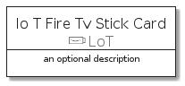
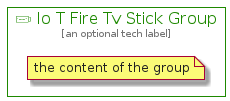

# IoTFireTvStick


```text
aws-20210131/Resource/LoT/IoTFireTvStick
```

```text
include('aws-20210131/Resource/LoT/IoTFireTvStick')
```


| Illustration | IoTFireTvStick | IoTFireTvStickCard | IoTFireTvStickGroup |
| :---: | :---: | :---: | :---: |
|  |  |  |  |


## IoTFireTvStick

### Load remotely
```plantuml
@startuml
' configures the library
!global $LIB_BASE_LOCATION="https://github.com/tmorin/plantuml-libs/distribution"

' loads the library's bootstrap
!include $LIB_BASE_LOCATION/bootstrap.puml

' loads the package bootstrap
include('aws-20210131/bootstrap')

' loads the Item which embeds the element IoTFireTvStick
include('aws-20210131/Resource/LoT/IoTFireTvStick')

' renders the element
IoTFireTvStick('IoTFireTvStick', 'Io T Fire Tv Stick', 'an optional tech label')
@enduml
```

### Load locally
```plantuml
@startuml
' configures the library
!global $INCLUSION_MODE="local"
!global $LIB_BASE_LOCATION="../../.."

' loads the library's bootstrap
!include $LIB_BASE_LOCATION/bootstrap.puml

' loads the package bootstrap
include('aws-20210131/bootstrap')

' loads the Item which embeds the element IoTFireTvStick
include('aws-20210131/Resource/LoT/IoTFireTvStick')

' renders the element
IoTFireTvStick('IoTFireTvStick', 'Io T Fire Tv Stick', 'an optional tech label')
@enduml
```

## IoTFireTvStickCard

### Load remotely
```plantuml
@startuml
' configures the library
!global $LIB_BASE_LOCATION="https://github.com/tmorin/plantuml-libs/distribution"

' loads the library's bootstrap
!include $LIB_BASE_LOCATION/bootstrap.puml

' loads the package bootstrap
include('aws-20210131/bootstrap')

' loads the Item which embeds the element IoTFireTvStickCard
include('aws-20210131/Resource/LoT/IoTFireTvStick')

' renders the element
IoTFireTvStickCard('IoTFireTvStickCard', 'Io T Fire Tv Stick Card', 'an optional description')
@enduml
```

### Load locally
```plantuml
@startuml
' configures the library
!global $INCLUSION_MODE="local"
!global $LIB_BASE_LOCATION="../../.."

' loads the library's bootstrap
!include $LIB_BASE_LOCATION/bootstrap.puml

' loads the package bootstrap
include('aws-20210131/bootstrap')

' loads the Item which embeds the element IoTFireTvStickCard
include('aws-20210131/Resource/LoT/IoTFireTvStick')

' renders the element
IoTFireTvStickCard('IoTFireTvStickCard', 'Io T Fire Tv Stick Card', 'an optional description')
@enduml
```

## IoTFireTvStickGroup

### Load remotely
```plantuml
@startuml
' configures the library
!global $LIB_BASE_LOCATION="https://github.com/tmorin/plantuml-libs/distribution"

' loads the library's bootstrap
!include $LIB_BASE_LOCATION/bootstrap.puml

' loads the package bootstrap
include('aws-20210131/bootstrap')

' loads the Item which embeds the element IoTFireTvStickGroup
include('aws-20210131/Resource/LoT/IoTFireTvStick')

' renders the element
IoTFireTvStickGroup('IoTFireTvStickGroup', 'Io T Fire Tv Stick Group', 'an optional tech label') {
    note as note
        the content of the group
    end note
}
@enduml
```

### Load locally
```plantuml
@startuml
' configures the library
!global $INCLUSION_MODE="local"
!global $LIB_BASE_LOCATION="../../.."

' loads the library's bootstrap
!include $LIB_BASE_LOCATION/bootstrap.puml

' loads the package bootstrap
include('aws-20210131/bootstrap')

' loads the Item which embeds the element IoTFireTvStickGroup
include('aws-20210131/Resource/LoT/IoTFireTvStick')

' renders the element
IoTFireTvStickGroup('IoTFireTvStickGroup', 'Io T Fire Tv Stick Group', 'an optional tech label') {
    note as note
        the content of the group
    end note
}
@enduml
```

