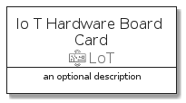

# IoTHardwareBoard


```text
aws-20210131/Resource/LoT/IoTHardwareBoard
```

```text
include('aws-20210131/Resource/LoT/IoTHardwareBoard')
```


| Illustration | IoTHardwareBoard | IoTHardwareBoardCard | IoTHardwareBoardGroup |
| :---: | :---: | :---: | :---: |
|  |  |  |  |


## IoTHardwareBoard

### Load remotely
```plantuml
@startuml
' configures the library
!global $LIB_BASE_LOCATION="https://github.com/tmorin/plantuml-libs/distribution"

' loads the library's bootstrap
!include $LIB_BASE_LOCATION/bootstrap.puml

' loads the package bootstrap
include('aws-20210131/bootstrap')

' loads the Item which embeds the element IoTHardwareBoard
include('aws-20210131/Resource/LoT/IoTHardwareBoard')

' renders the element
IoTHardwareBoard('IoTHardwareBoard', 'Io T Hardware Board', 'an optional tech label')
@enduml
```

### Load locally
```plantuml
@startuml
' configures the library
!global $INCLUSION_MODE="local"
!global $LIB_BASE_LOCATION="../../.."

' loads the library's bootstrap
!include $LIB_BASE_LOCATION/bootstrap.puml

' loads the package bootstrap
include('aws-20210131/bootstrap')

' loads the Item which embeds the element IoTHardwareBoard
include('aws-20210131/Resource/LoT/IoTHardwareBoard')

' renders the element
IoTHardwareBoard('IoTHardwareBoard', 'Io T Hardware Board', 'an optional tech label')
@enduml
```

## IoTHardwareBoardCard

### Load remotely
```plantuml
@startuml
' configures the library
!global $LIB_BASE_LOCATION="https://github.com/tmorin/plantuml-libs/distribution"

' loads the library's bootstrap
!include $LIB_BASE_LOCATION/bootstrap.puml

' loads the package bootstrap
include('aws-20210131/bootstrap')

' loads the Item which embeds the element IoTHardwareBoardCard
include('aws-20210131/Resource/LoT/IoTHardwareBoard')

' renders the element
IoTHardwareBoardCard('IoTHardwareBoardCard', 'Io T Hardware Board Card', 'an optional description')
@enduml
```

### Load locally
```plantuml
@startuml
' configures the library
!global $INCLUSION_MODE="local"
!global $LIB_BASE_LOCATION="../../.."

' loads the library's bootstrap
!include $LIB_BASE_LOCATION/bootstrap.puml

' loads the package bootstrap
include('aws-20210131/bootstrap')

' loads the Item which embeds the element IoTHardwareBoardCard
include('aws-20210131/Resource/LoT/IoTHardwareBoard')

' renders the element
IoTHardwareBoardCard('IoTHardwareBoardCard', 'Io T Hardware Board Card', 'an optional description')
@enduml
```

## IoTHardwareBoardGroup

### Load remotely
```plantuml
@startuml
' configures the library
!global $LIB_BASE_LOCATION="https://github.com/tmorin/plantuml-libs/distribution"

' loads the library's bootstrap
!include $LIB_BASE_LOCATION/bootstrap.puml

' loads the package bootstrap
include('aws-20210131/bootstrap')

' loads the Item which embeds the element IoTHardwareBoardGroup
include('aws-20210131/Resource/LoT/IoTHardwareBoard')

' renders the element
IoTHardwareBoardGroup('IoTHardwareBoardGroup', 'Io T Hardware Board Group', 'an optional tech label') {
    note as note
        the content of the group
    end note
}
@enduml
```

### Load locally
```plantuml
@startuml
' configures the library
!global $INCLUSION_MODE="local"
!global $LIB_BASE_LOCATION="../../.."

' loads the library's bootstrap
!include $LIB_BASE_LOCATION/bootstrap.puml

' loads the package bootstrap
include('aws-20210131/bootstrap')

' loads the Item which embeds the element IoTHardwareBoardGroup
include('aws-20210131/Resource/LoT/IoTHardwareBoard')

' renders the element
IoTHardwareBoardGroup('IoTHardwareBoardGroup', 'Io T Hardware Board Group', 'an optional tech label') {
    note as note
        the content of the group
    end note
}
@enduml
```

