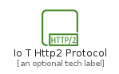
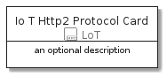
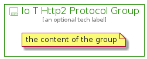

# IoTHttp2Protocol


```text
aws-20210131/Resource/LoT/IoTHttp2Protocol
```

```text
include('aws-20210131/Resource/LoT/IoTHttp2Protocol')
```


| Illustration | IoTHttp2Protocol | IoTHttp2ProtocolCard | IoTHttp2ProtocolGroup |
| :---: | :---: | :---: | :---: |
|  |  |  |  |


## IoTHttp2Protocol

### Load remotely
```plantuml
@startuml
' configures the library
!global $LIB_BASE_LOCATION="https://github.com/tmorin/plantuml-libs/distribution"

' loads the library's bootstrap
!include $LIB_BASE_LOCATION/bootstrap.puml

' loads the package bootstrap
include('aws-20210131/bootstrap')

' loads the Item which embeds the element IoTHttp2Protocol
include('aws-20210131/Resource/LoT/IoTHttp2Protocol')

' renders the element
IoTHttp2Protocol('IoTHttp2Protocol', 'Io T Http2 Protocol', 'an optional tech label')
@enduml
```

### Load locally
```plantuml
@startuml
' configures the library
!global $INCLUSION_MODE="local"
!global $LIB_BASE_LOCATION="../../.."

' loads the library's bootstrap
!include $LIB_BASE_LOCATION/bootstrap.puml

' loads the package bootstrap
include('aws-20210131/bootstrap')

' loads the Item which embeds the element IoTHttp2Protocol
include('aws-20210131/Resource/LoT/IoTHttp2Protocol')

' renders the element
IoTHttp2Protocol('IoTHttp2Protocol', 'Io T Http2 Protocol', 'an optional tech label')
@enduml
```

## IoTHttp2ProtocolCard

### Load remotely
```plantuml
@startuml
' configures the library
!global $LIB_BASE_LOCATION="https://github.com/tmorin/plantuml-libs/distribution"

' loads the library's bootstrap
!include $LIB_BASE_LOCATION/bootstrap.puml

' loads the package bootstrap
include('aws-20210131/bootstrap')

' loads the Item which embeds the element IoTHttp2ProtocolCard
include('aws-20210131/Resource/LoT/IoTHttp2Protocol')

' renders the element
IoTHttp2ProtocolCard('IoTHttp2ProtocolCard', 'Io T Http2 Protocol Card', 'an optional description')
@enduml
```

### Load locally
```plantuml
@startuml
' configures the library
!global $INCLUSION_MODE="local"
!global $LIB_BASE_LOCATION="../../.."

' loads the library's bootstrap
!include $LIB_BASE_LOCATION/bootstrap.puml

' loads the package bootstrap
include('aws-20210131/bootstrap')

' loads the Item which embeds the element IoTHttp2ProtocolCard
include('aws-20210131/Resource/LoT/IoTHttp2Protocol')

' renders the element
IoTHttp2ProtocolCard('IoTHttp2ProtocolCard', 'Io T Http2 Protocol Card', 'an optional description')
@enduml
```

## IoTHttp2ProtocolGroup

### Load remotely
```plantuml
@startuml
' configures the library
!global $LIB_BASE_LOCATION="https://github.com/tmorin/plantuml-libs/distribution"

' loads the library's bootstrap
!include $LIB_BASE_LOCATION/bootstrap.puml

' loads the package bootstrap
include('aws-20210131/bootstrap')

' loads the Item which embeds the element IoTHttp2ProtocolGroup
include('aws-20210131/Resource/LoT/IoTHttp2Protocol')

' renders the element
IoTHttp2ProtocolGroup('IoTHttp2ProtocolGroup', 'Io T Http2 Protocol Group', 'an optional tech label') {
    note as note
        the content of the group
    end note
}
@enduml
```

### Load locally
```plantuml
@startuml
' configures the library
!global $INCLUSION_MODE="local"
!global $LIB_BASE_LOCATION="../../.."

' loads the library's bootstrap
!include $LIB_BASE_LOCATION/bootstrap.puml

' loads the package bootstrap
include('aws-20210131/bootstrap')

' loads the Item which embeds the element IoTHttp2ProtocolGroup
include('aws-20210131/Resource/LoT/IoTHttp2Protocol')

' renders the element
IoTHttp2ProtocolGroup('IoTHttp2ProtocolGroup', 'Io T Http2 Protocol Group', 'an optional tech label') {
    note as note
        the content of the group
    end note
}
@enduml
```

