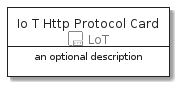
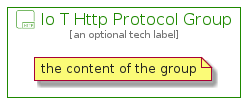

# IoTHttpProtocol


```text
aws-20210131/Resource/LoT/IoTHttpProtocol
```

```text
include('aws-20210131/Resource/LoT/IoTHttpProtocol')
```


| Illustration | IoTHttpProtocol | IoTHttpProtocolCard | IoTHttpProtocolGroup |
| :---: | :---: | :---: | :---: |
|  |  |  |  |


## IoTHttpProtocol

### Load remotely
```plantuml
@startuml
' configures the library
!global $LIB_BASE_LOCATION="https://github.com/tmorin/plantuml-libs/distribution"

' loads the library's bootstrap
!include $LIB_BASE_LOCATION/bootstrap.puml

' loads the package bootstrap
include('aws-20210131/bootstrap')

' loads the Item which embeds the element IoTHttpProtocol
include('aws-20210131/Resource/LoT/IoTHttpProtocol')

' renders the element
IoTHttpProtocol('IoTHttpProtocol', 'Io T Http Protocol', 'an optional tech label')
@enduml
```

### Load locally
```plantuml
@startuml
' configures the library
!global $INCLUSION_MODE="local"
!global $LIB_BASE_LOCATION="../../.."

' loads the library's bootstrap
!include $LIB_BASE_LOCATION/bootstrap.puml

' loads the package bootstrap
include('aws-20210131/bootstrap')

' loads the Item which embeds the element IoTHttpProtocol
include('aws-20210131/Resource/LoT/IoTHttpProtocol')

' renders the element
IoTHttpProtocol('IoTHttpProtocol', 'Io T Http Protocol', 'an optional tech label')
@enduml
```

## IoTHttpProtocolCard

### Load remotely
```plantuml
@startuml
' configures the library
!global $LIB_BASE_LOCATION="https://github.com/tmorin/plantuml-libs/distribution"

' loads the library's bootstrap
!include $LIB_BASE_LOCATION/bootstrap.puml

' loads the package bootstrap
include('aws-20210131/bootstrap')

' loads the Item which embeds the element IoTHttpProtocolCard
include('aws-20210131/Resource/LoT/IoTHttpProtocol')

' renders the element
IoTHttpProtocolCard('IoTHttpProtocolCard', 'Io T Http Protocol Card', 'an optional description')
@enduml
```

### Load locally
```plantuml
@startuml
' configures the library
!global $INCLUSION_MODE="local"
!global $LIB_BASE_LOCATION="../../.."

' loads the library's bootstrap
!include $LIB_BASE_LOCATION/bootstrap.puml

' loads the package bootstrap
include('aws-20210131/bootstrap')

' loads the Item which embeds the element IoTHttpProtocolCard
include('aws-20210131/Resource/LoT/IoTHttpProtocol')

' renders the element
IoTHttpProtocolCard('IoTHttpProtocolCard', 'Io T Http Protocol Card', 'an optional description')
@enduml
```

## IoTHttpProtocolGroup

### Load remotely
```plantuml
@startuml
' configures the library
!global $LIB_BASE_LOCATION="https://github.com/tmorin/plantuml-libs/distribution"

' loads the library's bootstrap
!include $LIB_BASE_LOCATION/bootstrap.puml

' loads the package bootstrap
include('aws-20210131/bootstrap')

' loads the Item which embeds the element IoTHttpProtocolGroup
include('aws-20210131/Resource/LoT/IoTHttpProtocol')

' renders the element
IoTHttpProtocolGroup('IoTHttpProtocolGroup', 'Io T Http Protocol Group', 'an optional tech label') {
    note as note
        the content of the group
    end note
}
@enduml
```

### Load locally
```plantuml
@startuml
' configures the library
!global $INCLUSION_MODE="local"
!global $LIB_BASE_LOCATION="../../.."

' loads the library's bootstrap
!include $LIB_BASE_LOCATION/bootstrap.puml

' loads the package bootstrap
include('aws-20210131/bootstrap')

' loads the Item which embeds the element IoTHttpProtocolGroup
include('aws-20210131/Resource/LoT/IoTHttpProtocol')

' renders the element
IoTHttpProtocolGroup('IoTHttpProtocolGroup', 'Io T Http Protocol Group', 'an optional tech label') {
    note as note
        the content of the group
    end note
}
@enduml
```

